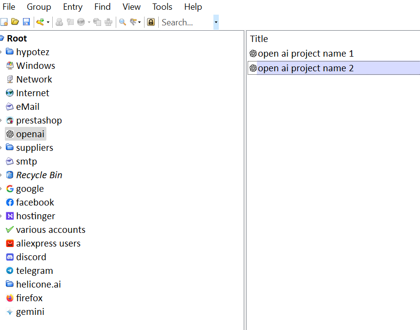

# Service Folder

This is a service folder containing sample files:

- `credentials.kdbx` — a password database in the KeePass format.
- `password.txt` — a text file containing the password.
- JSON files for Google API.

## Data Format in `credentials.kdbx`

The `credentials.kdbx` file serves as a password database in the KeePass format. It contains sensitive credentials used for various APIs and services. Below are the main groups and fields expected in the database:

### Groups and Their Contents

1. **Suppliers > Aliexpress > API**
   - `api_key`: API key for accessing the Aliexpress API.
   - `secret`: Secret key for the Aliexpress API.
   - `tracking_id`: Tracking ID.
   - `email`: Email address for the Aliexpress account.
   - `password`: Password for the Aliexpress account.

2. **OpenAI**
   - `api_key`: API key for accessing OpenAI.
   - Additional properties may be defined for specific project settings.

3. **Gemini**
   - `api_key`: API key for accessing Gemini.

4. **Discord**
   - `application_id`: Discord application ID.
   - `public_key`: Public key for the Discord application.
   - `bot_token`: Discord bot token.

5. **Telegram**
   - Tokens and settings for the Telegram bot.

6. **Prestashop**
   - **Translations**
     - `server`: Database server address.
     - `port`: Port for connecting to the database.
     - `database`: Name of the database.
     - `user`: Username for connecting to the database.
     - `password`: Password for connecting to the database.
   - **Clients**
     - Each client stores its connection parameters.

7. **SMTP**
   - Each entry contains SMTP server parameters:
     - `server`: SMTP server address.
     - `port`: SMTP server port.
     - `user`: Username for SMTP.
     - `password`: Password for SMTP.

8. **Facebook**
   - Each entry contains:
     - `app_id`: Facebook application ID.
     - `app_secret`: Facebook application secret.
     - `access_token`: Access token for working with the Facebook API.

9. **Google API (GAPI)**
   - `api_key`: API key for accessing Google API.

### Important Notes

- The `password.txt` file contains a single line with the password for accessing the `credentials.kdbx` database. It is essential that the **first line** contains **only** the password. 
- It is recommended to delete the `password.txt` file from computers that can be accessed by unauthorized users.
- When changing the database password manually, the `password.txt` file must also be updated manually. **This is MANDATORY!**
- Ensure that the structure and group names match the expected format so that the application can correctly load the sensitive data.

For a visual representation of the KeePass structure, please refer to the following image: .
 

 