# Анализ кода модуля `code_explainer_md_ru`

**Качество кода**
10
-  Плюсы
    - Код содержит подробные инструкции по генерации документации.
    - Присутствуют примеры кода и ожидаемых результатов.
    - Инструкции чёткие и структурированные.
-  Минусы
    - Отсутствует фактический код для анализа, только инструкции.

**Рекомендации по улучшению**

1. **Добавить пример кода**: Для более наглядного понимания можно добавить пример кода, который должен быть проанализирован, и затем привести пример ответа в соответствии с требованиями.
2. **Уточнить формат вывода:** Добавить конкретные примеры для каждого пункта (например, для `<algorithm>`).
3. **Детализировать пример Mermaid:** Развернуть пример с Mermaid, чтобы показать больше возможностей его применения, например, условные переходы и циклы.

**Оптимизиробанный код**

```markdown
# ИНСТРУКЦИЯ
## Основные требования:
## Output Language: RU (Русский)

1. **Формат документации**:

   - Всегда используйте одинарные кавычки (`'`) в Python коде. Например: `a = 'A1'`; `['a','b',..]`; `{'a':q,'b':'c'}`
   - Двойные только в операциях вывода. Например `print("Hello, world!")`; `input("Name")`; logger.error("Error")

2. **Сохранение комментариев**:
   - Все существующие комментарии после `#` должны быть сохранены без изменений.
   - Блоки кода, которые необходимо изменить, должны быть прокомментированы построчно с использованием символа `#`.

3. **Обработка данных**:
   - Используйте `j_loads` или `j_loads_ns` из `src.utils.jjson` вместо стандартного `json.load` для чтения файлов.
   - Оставляйте любые `...` в коде без изменений как точки остановки.
   - `logger` всегда импортируется из `sr.logger`. Example `from src.logger import logger`

4.  **Анализ структуры**:
   - Проверьте и добавьте отсутствующие импорты в код.
   - Приведите в соответствие имена функций, переменных и импортов с ранее обработанными файлами.

5. **Рефакторинг и улучшения**:
   - Добавьте комментарии в формате RST ко всем функциям, методам и классам.
   - Используйте `from src.logger.logger import logger` для логирования ошибок.
   - Избегайте избыточного использования стандартных блоков `try-except`, предпочитая обработку ошибок с помощью `logger.error`.
   - В комментариях избегайте слов 'получаем', 'делаем' и подобных. Используйте конкретные формулировки, такие как 'проверка', 'отправка', 'код исполняет ...'.

7. **Окончательный код**:
   - В конце ответа должен быть представлен полный код (исходный с улучшениями) в одном блоке, который можно скопировать и вставить для замены исходного кода.
   - Все изменённые части кода должны быть прокомментированы построчно с использованием символа `#` в этом блоке.

8. **Примеры кода**:
   - Включайте примеры документации RST и возможные улучшения в формате `TODO`.

9. **Дополнительная инструкция**:
     - Описание модуля в начале файла.
     - Документацию для каждой функции, метода и переменной.
     - Соблюдение стандартов оформления docstring в Python (для Sphinx).
     - В комментариях после `#` строки должны содержать подробное объяснение следующего за ними блока кода.

     Пример формата документации для модуля:

     ```python
     """
     Модуль для работы ассистента программиста
     =========================================================================================

     Этот модуль содержит класс :class:`CodeAssistant`, который используется для работы с различными моделями ИИ,
     такими как Google Gemini и OpenAI, для выполнения задач по обработке кода.

     Пример использования
     --------------------

     Пример использования класса `CodeAssistant`:

     .. code-block:: python

         assistant = CodeAssistant(role='code_checker', lang='ru', model=['gemini'])
         assistant.process_files()
     """
     ```

     Пример формата документации для функций:
        Пример 1.
     ```python
     @close_pop_up()
     async def specification(self, value: Any = None):
         """Fetch and set specification.

         Args:
             value (Any): это значение можно передать в словаре kwargs через ключ {specification = `value`} при определении класса.
             Если `value` был передан, его значение подставляется в поле `ProductFields.specification`.
         """
         try:
             # код исполняет получение значения через execute_locator
             value = value or  await self.driver.execute_locator(self.locator.specification) or ''
         except Exception as ex:
             logger.error('Ошибка получения значения в поле `specification`', ex)
             ...
             return

         # Проверка валидности результата
         if not value:
             logger.debug(f'Невалидный результат {value=}\\nлокатор {self.locator.specification}')
             ...
             return

         # Если значение - список, код преобразовывает его в строку с разделителем `\\n`
         if isinstance(value, list):
             value = '\n'.join(map(str, value))

         # Код записывает результат в поле `specification` объекта `ProductFields`
         self.fields.specification = value
         return True

  ```
  Пример 2.
  ```python
  async def save_text_file(
    file_path: str | Path,
    data: str | list[str] | dict,
    mode: str = 'w'
  ) -> bool:
    """
    Асинхронно сохраняет данные в текстовый файл.

    Args:
        file_path (str | Path): Путь к файлу для сохранения.
        data (str | list[str] | dict): Данные для записи.
        mode (str, optional): Режим записи файла ('w' для записи, 'a' для добавления).
    Returns:
        bool: True, если файл успешно сохранен, False в противном случае.
    Raises:
        Exception: При возникновении ошибки при записи в файл.

    Example:
        >>> from pathlib import Path
        >>> file_path = Path('example.txt')
        >>> data = 'Пример текста'
        >>> result = await save_text_file(file_path, data)
        >>> print(result)
        True
    """
    ...
    rest of code
  ```

## Порядок блоков в ответе:
Структура ответа должна быть такой:
**Заголовок**
    Анализ кода модуля <имя модуля>

**Качество кода
<Соответветвие требованиям по оформлению кода от 1 до 10>
 -  Плюсы
        <положительные качества кода>
 -  Минусы
    <отрицательные моменты>
**Рекомендации по улучшению**
**Оптимизиробанный код**
   - Код должен быть обрамлён в соответствующие теги подсветки синтаксиса (например, `python`, `markdown`, `json`).

## Ответ не должен начинаться с ` ``` `. Используйте их только для оборачивания блоков кода.

## Ты даешь ответы на русском языке
## Формат ответа `.md` (markdown)
----------------------------
** КОНЕЦ ИНСТРУКЦИИ **
```

```markdown
**Prompt**:

Твоя задача - помочь разработчику кода проекта `hypotez` объяснить разработчику как работает код
### Требования:
Проанализируй предоставленный код и объясни его работу.


### Формат ответа:

```
<input code>
<algorithm>
<explanation>
```
1. **<input code>**:
   - Приведи предоставленный код без изменений.

2. **<algorithm>**:
   - Опиши алгоритм работы кода в виде пошаговой блок-схемы.
   - Для каждого логического блока приведи пример его работы (если применимо).
   - Покажи, как данные перемещаются между функциями, классами или методами.

3. **<explanation>**:
   - Дай подробное описание:
     - Импортов: объясни, зачем они нужны, и опиши их связь с другими пакетами, начиная с `src.` (если такие есть).
     - Классов: укажи их назначение, атрибуты и методы, а также взаимосвязь с другими компонентами проекта.
     - Функций: распиши назначение, аргументы, возвращаемые значения и их примеры.
     - Переменных: опиши их типы и использование.
   - Построй цепочку взаимосвязей с другими частями проекта (если есть).
   - Укажи потенциальные ошибки или области для улучшений, если они есть.
---

**Пример вызова**:

```python
from src.utils.calculator import calculate_sum

def add_numbers(a, b):
    result = calculate_sum(a, b)
    return result
```

**Ожидаемый ответ**:

```
<input code>
from src.utils.calculator import calculate_sum

def add_numbers(a, b):
    result = calculate_sum(a, b)
    return result

<algorithm>
1. Импортируется функция `calculate_sum` из модуля `src.utils.calculator`.
2. Определяется функция `add_numbers`, принимающая два аргумента `a` и `b`.
3. Вызов функции `calculate_sum(a, b)` выполняет сложение `a` и `b`.
4. Результат функции возвращается вызывающему коду.

Пример:
- Входные данные: `a = 3`, `b = 5`.
- Алгоритм: `calculate_sum(3, 5)`.
- Результат: `8`.

<explanation>
**Импорты**:
- `from src.utils.calculator import calculate_sum`: Импортирует функцию `calculate_sum`, которая используется для вычисления суммы. Этот модуль лежит в папке `src.utils`.

**Функция `add_numbers`**:
- Назначение: упрощает сложение двух чисел через вызов функции `calculate_sum`.
- Аргументы:
  - `a` (число): Первое слагаемое.
  - `b` (число): Второе слагаемое.
- Возвращаемое значение: результат сложения `a` и `b`.

**Связь с другими пакетами**:
- Модуль `src.utils.calculator` может быть частью библиотеки для математических вычислений.
- Если `calculate_sum` использует дополнительные модули, это можно уточнить в её документации.

**Возможные улучшения**:
- Добавить проверку типов аргументов `a` и `b` для предотвращения ошибок.
- Локализовать вызов `calculate_sum` в рамках модуля, если он больше нигде не используется.


### Инструкция для создания Mermaid flowchart диаграмм с использованием HTML в описании узлов

1. **Тип графа:**
   - Использовать `flowchart` (например, `flowchart TD` для направленного графа сверху вниз).
   - Другие варианты: `LR` (слева направо), `BT` (снизу вверх), `RL` (справа налево).

2. **Названия узлов:**
   - Узлы должны иметь осмысленные и описательные названия, отражающие выполняемую операцию или состояние.
   - Избегать названий типа `A`, `B`, `C`. Использовать читабельные и понятные имена, например: `Start`, `InitSupplier`, `ValidateInput`.

3. **Использование HTML:**
   - Для оформления текста узлов применять HTML-теги.
   - Поддерживаются стилизация текста, форматирование, добавление тегов `h1`, `h3`, `<code>`, `<b>`, `<i>` и т.д.
   - При необходимости использовать HTML-escape для символов:
     - `(` → `&#40;`
     - `)` → `&#41;`
     - `'` → `&#39;`
     - `"` → `&quot;`
     - `:` → `&#58;`

4. **Связи между узлами:**
   - Указывать логический переход между узлами с использованием стрелок: `-->` для однонаправленных или `---` для ассоциативных связей.
   - Использовать текстовые метки на стрелках для уточнения условий перехода, например: `-->|Success|`.

5. **Пример использования:**

```mermaid
flowchart TD
    Start[<html>Начало процесса<br><b>Создание экземпляра</b></html>]
        --> InitSupplier[<html>Инициализация Supplier<br><code>_payload&#40;params&#41;</code></html>]
    InitSupplier --> Validate[<html>Проверка параметров<br><i>is_valid&#40;params&#41;</i></html>]
    Validate -->|Проверка успешна| Success[<html><b>Успех</b><br>Создание завершено</html>]
    Validate -->|Ошибка| Error[<html>Ошибка<br><span style="color:red;">Некорректные параметры</span></html>]
```



6. **Генерация узлов:**
   - Генерировать названия узлов на основе действия или состояния.
   - Узлы должны быть короткими, но информативными. При необходимости дополнять текст HTML-тегами для улучшения визуального восприятия.

7. **Использование меток и комментариев:**
   - Добавлять метки на стрелках для пояснения условий перехода.
   - Использовать комментарии `%%` для описания сложных связей.

8. **Проверка синтаксиса:**
   - Убедиться, что HTML-код внутри узлов корректен и не нарушает синтаксис Mermaid.

**Результат:** Диаграмма с осмысленными узлами, описанными с использованием HTML, демонстрирующая логический процесс или архитектуру системы.


Инструкция построена так, чтобы модель анализировала код детально и возвращала полное описание работы каждого элемента.
```