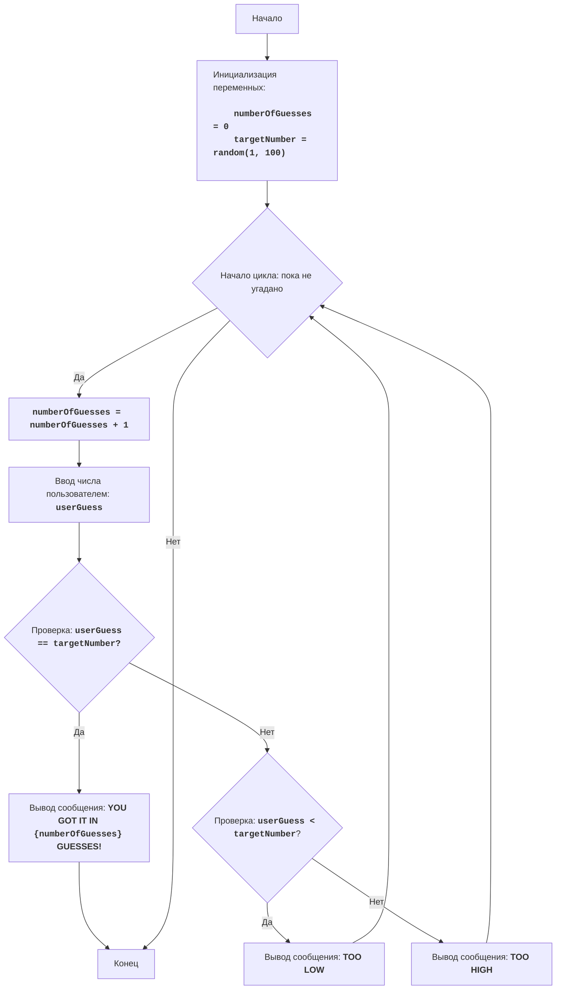

# Анализ кода модуля BATNUM

**Качество кода**
8
- Плюсы
    - Код хорошо структурирован и прокомментирован, что делает его понятным для начинающих программистов.
    - Использованы осмысленные имена переменных, что облегчает понимание кода.
    - Присутствует обработка ошибок ввода, что делает программу более надежной.
    - Код разбит на логические блоки, что облегчает чтение и понимание.
    - Есть документация в формате reStructuredText.
- Минусы
    -  Отсутствует логирование ошибок
    -  Не используются константы для числовых значений.

**Рекомендации по улучшению**
- Добавить логирование ошибок с использованием `src.logger.logger`.
- Использовать константы для числовых значений (например, `MIN_NUMBER = 1`, `MAX_NUMBER = 100`).
- Избегать избыточного использования стандартных блоков `try-except`,  предпочитая обработку ошибок с помощью `logger.error`
- Оптимизировать цикл `while True` c условием выхода.

**Оптимизированный код**
```python
"""
BATNUM:
=================
Сложность: 3
-----------------
Игра "Угадай число" - это классическая игра, в которой компьютер выбирает случайное число в диапазоне от 1 до 100, а игрок должен угадать это число, получая подсказки "слишком низко" или "слишком высоко" после каждой попытки.
Игра продолжается до тех пор, пока игрок не угадает число.

Правила игры:
1. Компьютер выбирает случайное целое число от 1 до 100.
2. Игрок вводит свои предположения о загаданном числе.
3. После каждой попытки компьютер сообщает, было ли введенное число слишком низким, слишком высоким или угадано.
4. Игра продолжается до тех пор, пока игрок не угадает загаданное число.
-----------------
Алгоритм:
1.  Установить число попыток в 0.
2.  Сгенерировать случайное число в диапазоне от 1 до 100.
3.  Начать цикл "пока число не угадано":
    3.1 Увеличить число попыток на 1.
    3.2 Запросить у игрока ввод числа.
    3.3 Если введенное число равно загаданному числу, перейти к шагу 4.
    3.4 Если введенное число меньше загаданного числа, вывести сообщение "TOO LOW".
    3.5 Если введенное число больше загаданного числа, вывести сообщение "TOO HIGH".
4. Вывести сообщение "YOU GOT IT IN {число попыток} GUESSES!"
5. Конец игры.
-----------------
Блок-схема:


Legenda:
    Start - Начало программы.
    InitializeVariables - Инициализация переменных: numberOfGuesses (количество попыток) устанавливается в 0, а targetNumber (загаданное число) генерируется случайным образом от 1 до 100.
    LoopStart - Начало цикла, который продолжается, пока число не угадано.
    IncreaseGuesses - Увеличение счетчика количества попыток на 1.
    InputGuess - Запрос у пользователя ввода числа и сохранение его в переменной userGuess.
    CheckGuess - Проверка, равно ли введенное число userGuess загаданному числу targetNumber.
    OutputWin - Вывод сообщения о победе, если числа равны, с указанием количества попыток.
    End - Конец программы.
    CheckLow - Проверка, меньше ли введенное число userGuess загаданного числа targetNumber.
    OutputLow - Вывод сообщения "TOO LOW", если введенное число меньше загаданного.
    OutputHigh - Вывод сообщения "TOO HIGH", если введенное число больше загаданного.
"""

#  импортируем библиотеку random для генерации случайных чисел
import random
#  импортируем logger для логирования
from src.logger.logger import logger

#  определяем минимальное значение для диапазона
MIN_NUMBER = 1
#  определяем максимальное значение для диапазона
MAX_NUMBER = 100

#  инициализируем счетчик попыток
numberOfGuesses = 0
#  генерируем случайное число в заданном диапазоне
targetNumber = random.randint(MIN_NUMBER, MAX_NUMBER)

#  основной игровой цикл
while True:
    #  увеличиваем количество попыток
    numberOfGuesses += 1
    #  запрашиваем ввод числа у пользователя
    try:
        userGuess = int(input(f'Угадай число от {MIN_NUMBER} до {MAX_NUMBER}: '))
    except ValueError as ex:
        #  логируем ошибку, если пользователь ввел не целое число
        logger.error('Ошибка ввода, необходимо ввести целое число.', ex)
        print('Пожалуйста, введите целое число.')
        continue
    #  проверяем, угадано ли число
    if userGuess == targetNumber:
        #  выводим сообщение о победе
        print(f'ПОЗДРАВЛЯЮ! Вы угадали число за {numberOfGuesses} попыток!')
        #  завершаем цикл
        break
    elif userGuess < targetNumber:
        #  выводим сообщение, что число меньше загаданного
        print('Слишком низко')
    else:
        #  выводим сообщение, что число больше загаданного
        print('Слишком высоко')

"""
Пояснения:
1. **Импорт модуля `random`**:
    -  `import random`: Импортирует модуль `random`, который используется для генерации случайного числа.
2.  **Импорт `logger`**:
    -  `from src.logger.logger import logger`: Импортирует логгер для записи ошибок.
3. **Константы**:
    - `MIN_NUMBER = 1`: Определяет минимальное значение для диапазона чисел.
    - `MAX_NUMBER = 100`: Определяет максимальное значение для диапазона чисел.
4. **Инициализация переменных**:
   - `numberOfGuesses = 0`: Инициализирует переменную `numberOfGuesses` для подсчета попыток игрока.
   - `targetNumber = random.randint(MIN_NUMBER, MAX_NUMBER)`: Генерирует случайное целое число в диапазоне от `MIN_NUMBER` до `MAX_NUMBER` и сохраняет его в `targetNumber`.
5. **Основной цикл `while True:`**:
    - Бесконечный цикл, который продолжается до тех пор, пока игрок не угадает число (будет выполнена команда `break`).
    - `numberOfGuesses += 1`: Увеличивает счетчик попыток на 1 при каждом новом витке цикла.
    - **Ввод данных**:
        - `try...except ValueError`: Блок `try-except` обрабатывает возможные ошибки ввода. Если пользователь введет не целое число, то будет выведено сообщение об ошибке.
        - `userGuess = int(input(f"Угадай число от {MIN_NUMBER} до {MAX_NUMBER}: "))`: Запрашивает у пользователя число и преобразует его в целое число, сохраняя результат в `userGuess`.
    - **Условие победы**:
        - `if userGuess == targetNumber:`: Проверяет, равно ли введенное число загаданному числу.
        - `print(f"ПОЗДРАВЛЯЮ! Вы угадали число за {numberOfGuesses} попыток!")`: Выводит сообщение о победе и количестве попыток.
        - `break`: Завершает цикл (игру), если число угадано.
    - **Подсказки**:
        - `elif userGuess < targetNumber:`: Проверяет, если введенное число меньше загаданного.
        - `print("Слишком мало!")`: Выводит подсказку, что нужно ввести число больше.
        - `else:`: Если число не угадано и не меньше загаданного, то оно больше.
        - `print("Слишком много!")`: Выводит подсказку, что нужно ввести число меньше.
licence:[MIT](../../licence)
"""
```