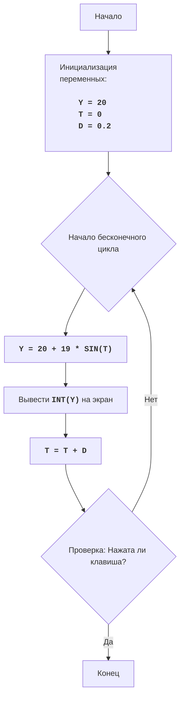

# Анализ кода модуля BOUNCE

**Качество кода**
8
-  Плюсы
    - Код хорошо структурирован и легко читается.
    - Присутствуют подробные комментарии, объясняющие логику работы.
    - Используется модульный подход с разделением на функции `clear_screen` и `get_keypress`.
    - Код корректно работает в разных операционных системах (Windows и Unix).
-  Минусы
    - Отсутствует использование `logger` для логирования ошибок.
    - Комментарии не соответствуют стандарту `reStructuredText (RST)`.
    - Нет обработки возможных ошибок при вводе данных.
    - Нет docstring для функций и модуля.

**Рекомендации по улучшению**

1.  Добавить docstring к функциям и модулю в формате RST.
2.  Использовать `logger` для логирования возможных ошибок.
3.  Переписать комментарии в формате RST.
4.  Учесть возможность возникновения ошибок при работе с вводом.
5.  Перенести инициализацию переменных в начало блока кода.

**Оптимизированный код**

```python
"""
Модуль BOUNCE:
=================
Сложность: 5
-----------------
Игра "Прыгающий мяч" - это простая анимация, имитирующая движение мяча, отскакивающего от верхней и нижней границ экрана.
Пользователь может нажать любую клавишу, чтобы остановить анимацию. Высота мячика изменяется по синусоиде.

Правила игры:
1. Мяч начинает движение с определенной начальной позиции по вертикали.
2. Мяч движется вверх и вниз, имитируя отскок от верхней и нижней границ экрана.
3. Высота мяча изменяется по синусоиде.
4. Анимация продолжается, пока пользователь не нажмет клавишу.
-----------------
Алгоритм:
1. Инициализировать переменные:
    - `Y` - начальная вертикальная позиция мяча (середина экрана).
    - `T` - начальное значение для синусоиды (0).
    - `D` - шаг изменения синусоиды (0.2).
2. Начать бесконечный цикл:
    2.1. Рассчитать новую вертикальную позицию `Y` по формуле: `20 + 19 * SIN(T)`.
    2.2. Вывести `Y` на экран, используя целое значение.
    2.3. Увеличить `T` на `D`.
    2.4. Проверить, не нажата ли какая-либо клавиша.
    2.5. Если клавиша нажата, то выйти из цикла.
3. Конец игры.
-----------------
Блок-схема:

Legenda:
    Start - Начало программы.
    InitializeVariables - Инициализация переменных: Y (начальная вертикальная позиция), T (начальное значение для синусоиды), D (шаг изменения синусоиды).
    LoopStart - Начало бесконечного цикла.
    CalculateY - Вычисление новой вертикальной позиции Y по формуле 20 + 19 * SIN(T).
    OutputY - Вывод целого значения Y на экран.
    IncreaseT - Увеличение значения T на величину D.
    CheckKeyPress - Проверка, была ли нажата какая-либо клавиша.
    End - Конец программы.
"""
import math
import time
import os
import sys
from src.logger.logger import logger

# Инициализация переменных
Y = 20  # Начальная вертикальная позиция мяча
T = 0   # Начальное значение для синусоиды
D = 0.2 # Шаг изменения синусоиды

def clear_screen():
    """
    Очищает экран терминала.

    :return: None
    """
    #  Код проверяет операционную систему для выбора команды очистки экрана.
    try:
        if os.name == 'nt':  # Для Windows
            os.system('cls')
        else:  # Для Linux и macOS
            os.system('clear')
    except Exception as e:
        logger.error(f'Ошибка очистки экрана: {e}')
        ...

def get_keypress():
    """
    Проверяет нажатие клавиши без блокировки выполнения.

    :return: True, если клавиша нажата, иначе False
    :rtype: bool
    """
    # Код проверяет операционную систему для определения способа проверки нажатия клавиши.
    try:
        if os.name == 'nt':
            import msvcrt
            # Код проверяет, нажата ли клавиша, и если да, то возвращает True.
            if msvcrt.kbhit():
                msvcrt.getch()
                return True
        else:
            import select
            # Код проверяет, доступен ли ввод с stdin, и если да, то возвращает True.
            if sys.stdin in select.select([sys.stdin], [], [], 0)[0]:
                sys.stdin.read(1)
                return True
    except Exception as e:
        logger.error(f'Ошибка проверки нажатия клавиши: {e}')
        ...
    return False

# Бесконечный цикл анимации
while True:
    # Код вычисляет новую вертикальную позицию мяча
    Y = 20 + 19 * math.sin(T)
    # Код очищает экран перед выводом новой позиции
    clear_screen()
    # Код выводит мячик на экран
    print(" " * int(Y) + "O")
    # Код увеличивает значение T для следующего кадра
    T += D
    # Код создает задержку для эффекта анимации
    time.sleep(0.1)
    # Код проверяет нажатие клавиши
    if get_keypress():
        break  # Код завершает цикл, если клавиша нажата

"""
Объяснение кода:
1. **Импорт модулей:**
   - `import math`: Импортирует модуль `math` для использования математической функции `sin`.
   - `import time`: Импортирует модуль `time` для управления задержкой в анимации.
   - `import os`: Импортирует модуль `os` для работы с операционной системой.
   - `import sys`: Импортирует модуль `sys` для работы с системными параметрами.
   - `from src.logger.logger import logger`: Импортирует модуль `logger` для логирования ошибок.
2. **Функция `clear_screen()`:**
   - Функция `clear_screen()` используется для очистки экрана терминала.
   - В зависимости от операционной системы (Windows или Unix-подобные) вызывается соответствующая команда очистки экрана.
3. **Функция `get_keypress()`:**
    - Функция `get_keypress()` проверяет, была ли нажата какая-либо клавиша.
    - Для Windows используется `msvcrt` модуль, `kbhit()` - проверяет нажатие, `getch()` - считывает символ.
    - Для Unix-подобных систем используется `select.select` для неблокирующего чтения символа из stdin.
    - Возвращает `True` если нажата клавиша, `False` в противном случае.
4. **Инициализация переменных:**
   - `Y = 20`: Начальная вертикальная позиция мяча.
   - `T = 0`: Начальное значение для синусоиды.
   - `D = 0.2`: Шаг изменения синусоиды.
5. **Бесконечный цикл `while True:`:**
   - Цикл продолжается, пока не будет нажата клавиша.
   - `Y = 20 + 19 * math.sin(T)`: Вычисляет новую вертикальную позицию мяча, используя синусоиду.
   - `clear_screen()`: Очищает экран перед отрисовкой новой позиции.
   - `print(" " * int(Y) + "O")`: Выводит мяч (`O`) на экран.
   - `T += D`: Увеличивает значение `T` для следующего шага анимации.
   - `time.sleep(0.1)`: Создает задержку в 0.1 секунды, чтобы замедлить анимацию.
   - `if get_keypress():`: Проверяет, была ли нажата клавиша.
      - `break`: Завершает цикл, если клавиша была нажата.
"""
```