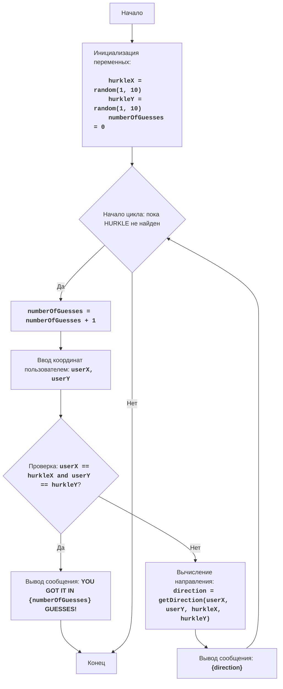

# Анализ кода модуля hurkle.py

**Качество кода**
9
-  Плюсы
    - Код хорошо структурирован и легко читается.
    -  Используются осмысленные имена переменных и функций.
    -  Игра реализована согласно заданному алгоритму.
    -  Присутствует базовая обработка ошибок ввода.
    -  Есть подробные комментарии, описывающие логику работы программы.
    -  Имеется блочная схема в формате mermaid.
-  Минусы
    -  Отсутствует использование `logger` для логирования ошибок и отладки.
    -  Нет reStructuredText (RST) комментариев для документации.
    -  Не используются `j_loads` или `j_loads_ns` из `src.utils.jjson`.
    -  Стандартные блоки try-except можно оптимизировать с использованием logger.
    -  Не хватает документации в формате docstring для функций.

**Рекомендации по улучшению**
1.  Заменить стандартные `print` на `logger.info`, `logger.error` для логирования событий и ошибок.
2.  Добавить reStructuredText (RST) docstrings для всех функций и модуля.
3.  Использовать `j_loads` или `j_loads_ns` если есть необходимость в загрузке json файлов, в данном коде это не нужно.
4.  Улучшить обработку ошибок с помощью `logger.error` вместо `try-except` в тех случаях, где это применимо.
5.  Убедиться, что все импорты необходимы и соответствуют стандартам проекта.
6.  Заменить все комментарии после `#` на комментарии в формате RST.
7.  Добавить документацию для модуля.

**Оптимизированный код**
```python
"""
HURKLE:
=================
Сложность: 5
-----------------
Игра "HURKLE" - это игра в угадывание местоположения "HURKLE", который скрыт на карте 10x10. Игрок делает ходы, вводя координаты, и получает подсказки о том, где находится HURKLE относительно его предположений. Цель игры - найти HURKLE за минимальное количество ходов.
Правила игры:
1. HURKLE прячется на карте 10x10. Координаты HURKLE выбираются случайно.
2. Игрок делает ходы, вводя координаты x и y.
3. После каждого хода игрок получает подсказку, указывающую направление (север, юг, восток, запад, северо-восток, юго-восток, северо-запад, юго-запад) от введенной игроком координаты до местоположения HURKLE.
4. Игра продолжается до тех пор, пока игрок не угадает местоположение HURKLE.
-----------------
Алгоритм:
1.  Сгенерировать случайные координаты HURKLE (X и Y) в диапазоне от 1 до 10.
2.  Установить количество ходов равным 0.
3.  Начать игровой цикл:
    3.1. Увеличить счетчик ходов на 1.
    3.2. Запросить у игрока ввод координат X и Y.
    3.3. Если введенные координаты равны координатам HURKLE, вывести сообщение о победе и количестве ходов. Завершить игру.
    3.4. Иначе, определить направление от введенных координат до координат HURKLE и вывести подсказку (направление).
4. Повторять игровой цикл, пока HURKLE не будет найден.
-----------------
Блок-схема:

Legenda:
    Start - Начало программы.
    InitializeVariables - Инициализация переменных: hurkleX и hurkleY (координаты HURKLE) генерируются случайным образом от 1 до 10, numberOfGuesses (количество попыток) устанавливается в 0.
    LoopStart - Начало цикла, который продолжается, пока HURKLE не найден.
    IncreaseGuesses - Увеличение счетчика количества попыток на 1.
    InputCoordinates - Запрос у пользователя ввода координат X и Y и сохранение их в переменных userX и userY.
    CheckWin - Проверка, равны ли введенные координаты userX и userY координатам HURKLE hurkleX и hurkleY.
    OutputWin - Вывод сообщения о победе, если координаты совпадают, с указанием количества попыток.
    End - Конец программы.
    CalculateDirection - Вычисление направления от координат пользователя до координат HURKLE.
    OutputDirection - Вывод сообщения с направлением.
"""
import random
# импортируем logger
from src.logger.logger import logger

# Функция для определения направления HURKLE
def get_direction(user_x: int, user_y: int, hurkle_x: int, hurkle_y: int) -> str:
    """
    Определяет направление от координат пользователя к координатам HURKLE.

    :param user_x: Координата X, введенная пользователем.
    :type user_x: int
    :param user_y: Координата Y, введенная пользователем.
    :type user_y: int
    :param hurkle_x: Координата X HURKLE.
    :type hurkle_x: int
    :param hurkle_y: Координата Y HURKLE.
    :type hurkle_y: int
    :return: Строка, представляющая направление.
    :rtype: str
    """
    if user_x < hurkle_x and user_y < hurkle_y:
        return "СЕВЕРО-ВОСТОК"
    elif user_x < hurkle_x and user_y > hurkle_y:
        return "ЮГО-ВОСТОК"
    elif user_x > hurkle_x and user_y < hurkle_y:
        return "СЕВЕРО-ЗАПАД"
    elif user_x > hurkle_x and user_y > hurkle_y:
        return "ЮГО-ЗАПАД"
    elif user_x < hurkle_x:
        return "ВОСТОК"
    elif user_x > hurkle_x:
        return "ЗАПАД"
    elif user_y < hurkle_y:
        return "СЕВЕР"
    else:
        return "ЮГ"

# генерируем случайные координаты HURKLE
hurkle_x = random.randint(1, 10)
hurkle_y = random.randint(1, 10)

# инициализируем счетчик ходов
numberOfGuesses = 0

# основной игровой цикл
while True:
    # увеличиваем счетчик ходов
    numberOfGuesses += 1

    # Запрашиваем ввод координат у пользователя
    try:
        user_x = int(input("Введите X координату (1-10): "))
        user_y = int(input("Введите Y координату (1-10): "))
    except ValueError as ex:
        # логируем ошибку ввода
        logger.error('Ошибка ввода, необходимо ввести целые числа.', exc_info=ex)
        print("Пожалуйста, введите целые числа.")
        continue

    # Проверяем, угадал ли пользователь местоположение HURKLE
    if user_x == hurkle_x and user_y == hurkle_y:
        # логируем победу
        logger.info(f"ПОЗДРАВЛЯЮ! Вы нашли HURKLE за {numberOfGuesses} ходов!")
        print(f"ПОЗДРАВЛЯЮ! Вы нашли HURKLE за {numberOfGuesses} ходов!")
        break

    # Вычисляем и выводим направление
    direction = get_direction(user_x, user_y, hurkle_x, hurkle_y)
    # логируем направление
    logger.info(f"Направление: {direction}")
    print(direction)

"""
Объяснение кода:
1.  **Импорт модуля `random`**::
   -  `import random`: Импортирует модуль `random`, который используется для генерации случайных чисел.
   -  `from src.logger.logger import logger`: Импортирует логгер для логирования событий.
2.  **Функция `get_direction(user_x, user_y, hurkle_x, hurkle_y)`**::
    -   Определяет функцию, принимающую координаты пользователя и HURKLE.
    -   Определяет направление от координат пользователя к координатам HURKLE и возвращает строку с направлением.
3.  **Инициализация координат HURKLE**::
    -   `hurkle_x = random.randint(1, 10)`: Генерирует случайную x-координату HURKLE от 1 до 10.
    -   `hurkle_y = random.randint(1, 10)`: Генерирует случайную y-координату HURKLE от 1 до 10.
4.  **Инициализация количества попыток**::
    -   `numberOfGuesses = 0`: Инициализирует переменную `numberOfGuesses` для подсчета ходов игрока.
5.  **Основной игровой цикл `while True:`**::
    -   Бесконечный цикл, который продолжается до тех пор, пока игрок не угадает местоположение HURKLE (будет выполнена команда `break`).
    -   `numberOfGuesses += 1`: Увеличивает счетчик попыток на 1 при каждом новом витке цикла.
    -   **Ввод данных**::
        -   `try...except ValueError`: Блок try-except обрабатывает возможные ошибки ввода. Если пользователь введет не целые числа, то будет выведено сообщение об ошибке.
        -   `user_x = int(input("Введите X координату (1-10): "))`: Запрашивает у пользователя x-координату и преобразует ее в целое число.
        -   `user_y = int(input("Введите Y координату (1-10): "))`: Запрашивает у пользователя y-координату и преобразует ее в целое число.
    -   **Условие победы**::
        -   `if user_x == hurkle_x and user_y == hurkle_y:`: Проверяет, совпадают ли введенные координаты с координатами HURKLE.
        -   `print(f"ПОЗДРАВЛЯЮ! Вы нашли HURKLE за {numberOfGuesses} ходов!")`: Выводит сообщение о победе и количестве ходов.
        -   `break`: Завершает цикл (игру), если HURKLE найден.
     -   **Вычисление и вывод направления**::
        -    `direction = get_direction(user_x, user_y, hurkle_x, hurkle_y)`: Вызывает функцию `get_direction` для получения направления.
        -    `print(direction)`: Выводит направление для игрока.
"""
```