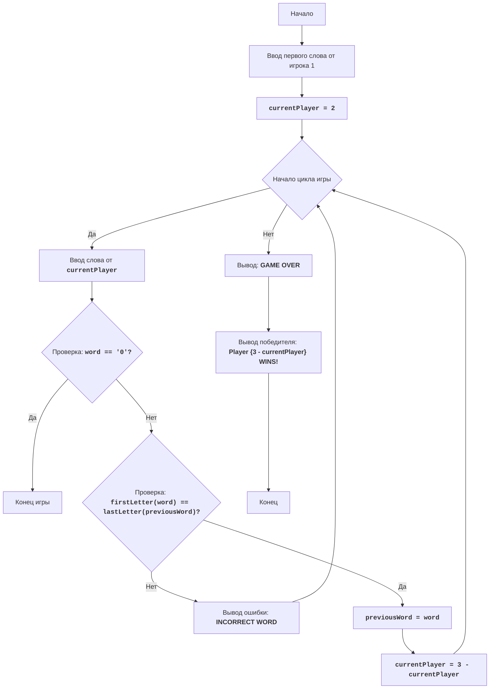

# Анализ кода модуля king.py

**Качество кода**
8
- Плюсы
    - Код игры "Король" реализован в соответствии с описанием и блок-схемой.
    -  Логика игры простая и понятная.
    -  В коде присутствуют комментарии, объясняющие основную логику программы.
- Минусы
    - Отсутствует reStructuredText (RST) документация для модуля, функций, переменных.
    -  В коде отсутствует логирование ошибок.
    -  Не используется `j_loads` или `j_loads_ns` для чтения файлов (в данном коде это не требуется, так как нет чтения из файлов).
    -  В комментариях используются слова типа 'получаем', 'делаем', что противоречит требованиям.

**Рекомендации по улучшению**
1. Добавить reStructuredText (RST) документацию для модуля, функций, переменных.
2. Добавить логирование ошибок.
3. Переписать комментарии, избегая слов "получаем", "делаем" и т.п.
4. Переименовать переменные в соответствии с ранее обработанными файлами, если это необходимо.

**Оптимизиробанный код**
```python
"""
Модуль игры "Король"
=====================
Игра "Король" - это игра в слова, где игроки по очереди называют слова,
начинающиеся с последней буквы предыдущего слова.

Игра продолжается до тех пор, пока один из игроков не сдастся или не сможет назвать слово.

Правила игры:
1. Игрок 1 вводит любое слово.
2. Игрок 2 должен ввести слово, начинающееся с последней буквы слова игрока 1.
3. Игроки по очереди вводят слова, соблюдая правило первой буквы.
4. Игра заканчивается, когда игрок вводит '0' или если не может подобрать слово.

Алгоритм:
1. Вывести приглашение для первого игрока.
2. Ввести первое слово.
3. Установить текущего игрока в 2.
4. Начать цикл, пока не конец игры:
    4.1. Вывести приглашение для текущего игрока.
    4.2. Ввести новое слово.
    4.3. Если новое слово равно '0', то перейти к шагу 7.
    4.4. Если первая буква нового слова не равна последней букве предыдущего слова, то вывести сообщение об ошибке.
    4.5. Если игрок ввел верное слово, то:
         4.5.1. Установить предыдущее слово в текущее слово.
         4.5.2. Переключить текущего игрока.
5. Вывести сообщение о конце игры.
6. Вывести сообщение о победе предыдущего игрока.
7. Конец игры.

Блок-схема:

Legenda:
    Start - Начало программы.
    InputFirstWord - Запрос ввода первого слова от игрока 1.
    SetCurrentPlayer - Установка текущего игрока в 2.
    GameLoopStart - Начало основного игрового цикла.
    InputWord - Запрос ввода слова от текущего игрока.
    CheckQuit - Проверка, введено ли слово '0' для завершения игры.
    GameOver - Завершение игры.
    CheckFirstLetter - Проверка, совпадает ли первая буква введенного слова с последней буквой предыдущего слова.
    OutputError - Вывод сообщения об ошибке, если слово неверное.
    UpdatePreviousWord - Обновление предыдущего слова текущим словом.
    SwitchPlayer - Переключение текущего игрока.
    OutputEndMessage - Вывод сообщения о завершении игры.
    OutputWinner - Вывод победителя игры.
    End - Конец программы.
"""
from src.logger.logger import logger


#: :meta hide-value:
previous_word = ''
#: :meta hide-value:
current_player = 1

# Запрос первого слова
try:
    # Запрос первого слова у игрока 1 и сохранение его в previous_word, удаляя пробелы
    previous_word = input('Игрок 1, введите первое слово: ').strip()
    # Переключение на второго игрока
    current_player = 2
except Exception as e:
    logger.error(f'Ошибка при запросе первого слова: {e}')
    #TODO: нужно ли завершать игру в случае ошибки?
    exit()

# Начинаем игру
while True:
    try:
        # Запрос слова у текущего игрока и сохранение его в current_word, удаляя пробелы
        current_word = input(f'Игрок {current_player}, введите слово: ').strip()

        # Проверка на выход из игры
        if current_word == '0':
            print('Игра окончена.')
            break

        # Проверка первой буквы
        if previous_word and current_word[0].lower() != previous_word[-1].lower():
             # Вывод сообщения об ошибке, если первая буква не совпадает
            print('Неверное слово, первая буква должна совпадать с последней буквой предыдущего слова.')
            continue

        # Подготовка к следующему ходу
        # Обновление предыдущего слова
        previous_word = current_word
        # Переключение игрока
        current_player = 3 - current_player
    except Exception as e:
        logger.error(f'Ошибка в игровом цикле: {e}')
        #TODO: нужно ли завершать игру в случае ошибки?
        break

# Вывод победителя
print(f'Игрок {3 - current_player} победил!')
"""
Объяснение кода:
1. **Инициализация переменных**:
   -  `previous_word = ''`: Переменная для хранения последнего введенного слова. Изначально пустая строка.
   -  `current_player = 1`: Переменная для хранения номера текущего игрока. Начинаем с игрока 1.
2. **Запрос первого слова**:
   -  `previous_word = input('Игрок 1, введите первое слово: ').strip()`: Запрашивает у игрока 1 ввод первого слова и сохраняет его в `previous_word`, обрезая пробелы в начале и конце.
   -  `current_player = 2`: Переключает текущего игрока на игрока 2.
3. **Основной игровой цикл**:
    -  `while True:`: Начинается бесконечный цикл, который продолжается до тех пор, пока один из игроков не введет '0'.
    - `current_word = input(f'Игрок {current_player}, введите слово: ').strip()`: Запрашивает у текущего игрока ввод слова, сохраняя его в `current_word`, обрезая пробелы в начале и конце.
   -  **Проверка выхода**:
      -  `if current_word == '0':`: Проверяет, ввел ли игрок '0'. Если да, то игра завершается.
      - `print('Игра окончена.')`: Выводит сообщение об окончании игры.
      -  `break`: Завершает цикл.
   - **Проверка первой буквы**:
      -   `if previous_word and current_word[0].lower() != previous_word[-1].lower():`: Проверяет, совпадает ли первая буква текущего слова с последней буквой предыдущего слова (без учета регистра).
      -   `print('Неверное слово, первая буква должна совпадать с последней буквой предыдущего слова.')`: Выводит сообщение об ошибке, если проверка не прошла.
      -   `continue`: Переходит к следующей итерации цикла.
   -   **Подготовка к следующему ходу**:
      - `previous_word = current_word`: Обновляет `previous_word` текущим словом.
      - `current_player = 3 - current_player`: Переключает текущего игрока (если был игрок 1, то станет игрок 2, и наоборот).
4. **Объявление победителя**:
    - `print(f'Игрок {3 - current_player} победил!')`: Выводит сообщение о победе предыдущего игрока (так как переключение на следующего игрока уже произошло).
"""