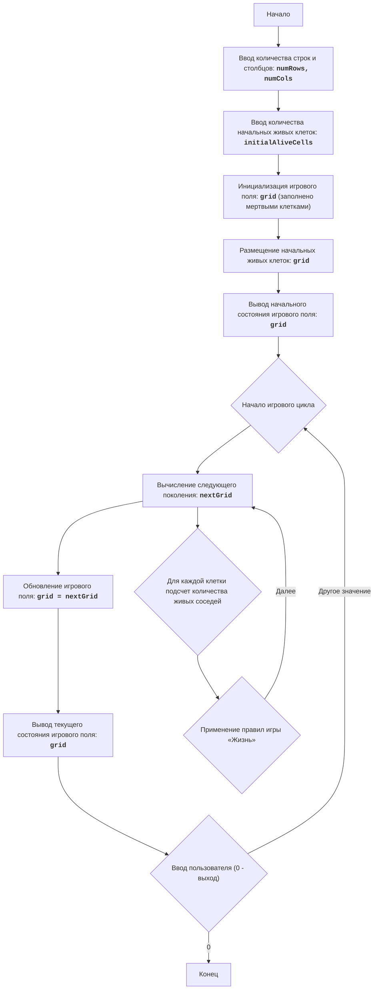

# Анализ кода модуля life_2.py

**Качество кода**
8
- Плюсы
    - Код хорошо структурирован, разбит на функции, каждая из которых выполняет свою задачу.
    - Используются понятные имена функций и переменных.
    - Логика игры "Жизнь" реализована корректно, согласно правилам.
    - Наличие подробного описания модуля, функций и основной логики в комментариях.
    - Применение deepcopy для создания копии игрового поля, что предотвращает нежелательные изменения.
 - Минусы
    - Отсутствует логирование ошибок, что затрудняет отладку.
    - Используются стандартные print для вывода на экран, что не является гибким решением.
    - Нет проверки входных данных на корректность.
    - Не все комментарии оформлены в формате reStructuredText (RST)
    - Не все строки кода, содержащие комментарии, объяснены.
    -  В некоторых функциях отсутствуют docstring
**Рекомендации по улучшению**
1.  **Добавить логирование:** Вместо стандартного `print` использовать `logger` для вывода сообщений и ошибок.
2.  **Обработка ошибок:** Добавить блоки `try-except` для обработки возможных ошибок при вводе данных пользователем.
3.  **Проверка входных данных:** Добавить проверку на корректность введенных пользователем данных (например, что количество строк, столбцов и живых клеток являются целыми положительными числами).
4.  **Форматирование комментариев:** Привести все комментарии к формату reStructuredText (RST).
5.  **Улучшение docstring:** Добавить docstring в функцию `main` и `if __name__ == "__main__":`
6.  **Пояснение кода:** Добавить пояснения к каждой строке кода, которая содержит комментарии.
7. **Использовать j_loads или j_loads_ns**: Для чтения данных из файла использовать `j_loads` или `j_loads_ns` из `src.utils.jjson`. В данном коде это не применимо.

**Оптимизированный код**
```python
"""
LIFE 2:
=================
Сложность: 5
-----------------
Игра "Жизнь 2" - это симуляция клеточного автомата, разработанная Джоном Конвеем. Она представляет собой поле клеток, каждая из которых может быть либо живой, либо мертвой. Состояние клетки в следующем поколении зависит от количества живых соседей в текущем поколении. Игра демонстрирует, как простые правила могут привести к возникновению сложных и интересных паттернов. Игрок может задавать начальную конфигурацию живых клеток и наблюдать за эволюцией этой конфигурации с течением времени.
Правила игры:
1. Игровое поле представлено в виде сетки, где каждая клетка может быть либо живой (обозначена как '*'), либо мертвой (обозначена как пробел ' ').
2. В начале игры игроку предлагается ввести количество строк и столбцов для игрового поля, а также количество живых клеток.
3. После ввода начальных параметров поле заполняется мертвыми клетками, а затем случайным образом размещаются живые клетки, количество которых указал игрок.
4. После инициализации поля программа выводит начальное состояние поля.
5. Итерации продолжаются, пока пользователь не введет "0".
6. Для каждого нового поколения:
     - Каждая живая клетка с 2 или 3 живыми соседями остается живой в следующем поколении.
    - Каждая живая клетка с менее чем 2 живыми соседями умирает в следующем поколении.
    - Каждая живая клетка с более чем 3 живыми соседями умирает в следующем поколении.
    - Каждая мертвая клетка рождается в следующем поколении, если у нее ровно 3 живых соседа.
7. Поле отображается после каждой итерации.
-----------------
Алгоритм:
1. Запросить у пользователя количество строк и столбцов для игрового поля.
2. Запросить у пользователя количество начальных живых клеток.
3. Инициализировать игровое поле как матрицу, заполненную мертвыми клетками (' ').
4. Разместить случайным образом указанное пользователем количество живых клеток ('*') на игровом поле.
5. Вывести начальное состояние игрового поля.
6. Запустить бесконечный цикл:
    6.1 Вычислить следующее поколение клеток:
        6.1.1 Создать новое поле, скопировав текущее поле.
        6.1.2 Для каждой клетки в текущем поле:
           6.1.2.1 Подсчитать количество живых соседей.
           6.1.2.2 Применить правила "Жизни", чтобы определить состояние клетки в новом поле.
        6.1.3 Заменить текущее поле новым полем.
    6.2 Вывести текущее состояние игрового поля.
    6.3 Запросить у пользователя ввод. Если введено "0", завершить игру, иначе продолжить.
-----------------
Блок-схема:

Legenda:
    Start - Начало программы.
    InputRowsCols - Запрос у пользователя количества строк и столбцов для игрового поля.
    InputAliveCells - Запрос у пользователя количества начальных живых клеток.
    InitializeGrid - Инициализация игрового поля в виде матрицы, заполненной мертвыми клетками (пробелами).
    PlaceAliveCells - Размещение заданного количества живых клеток (звездочек) на игровом поле в случайных позициях.
    OutputGrid - Вывод начального состояния игрового поля на экран.
    GameLoopStart - Начало основного игрового цикла.
    ComputeNextGeneration - Вычисление следующего поколения клеток на основе текущего состояния поля и правил игры "Жизнь".
     CalculateNeighbors - Для каждой клетки подсчет количества живых соседей.
     ApplyRules - Применение правил игры «Жизнь» для определения состояния клетки в следующем поколении.
    UpdateGrid - Обновление текущего игрового поля, заменяя его новым поколением.
    OutputCurrentGrid - Вывод текущего состояния игрового поля на экран.
    InputUserContinue - Запрос у пользователя на продолжение игры (любое значение, кроме "0") или выход из игры ("0").
    End - Конец программы.
"""
import random
import copy
from src.logger.logger import logger # импортируем logger

def initialize_grid(num_rows: int, num_cols: int) -> list[list[str]]:
    """
    Создает и инициализирует игровое поле (сетку) с мертвыми клетками.

    :param num_rows: Количество строк в сетке.
    :type num_rows: int
    :param num_cols: Количество столбцов в сетке.
    :type num_cols: int
    :return: Игровое поле, представленное в виде списка списков.
    :rtype: list[list[str]]
    """
    #  Создаем список списков (двумерную матрицу), заполненную пробелами (мертвыми клетками)
    grid = [[' ' for _ in range(num_cols)] for _ in range(num_rows)]
    return grid

def place_alive_cells(grid: list[list[str]], initial_alive_cells: int) -> None:
    """
    Размещает начальные живые клетки на игровом поле случайным образом.

    :param grid: Игровое поле.
    :type grid: list[list[str]]
    :param initial_alive_cells: Количество начальных живых клеток.
    :type initial_alive_cells: int
    :return: None
    """
    #  Определяем количество строк в сетке
    num_rows = len(grid)
    #  Определяем количество столбцов в сетке
    num_cols = len(grid[0])

    placed_cells = 0
    #  Размещаем живые клетки до тех пор, пока не будет размещено нужное количество
    while placed_cells < initial_alive_cells:
        #  Генерируем случайный индекс строки
        row = random.randint(0, num_rows - 1)
        #  Генерируем случайный индекс столбца
        col = random.randint(0, num_cols - 1)
        # Проверяем, что клетка мертва
        if grid[row][col] == ' ':
            # Устанавливаем клетку как живую
            grid[row][col] = '*'
            #  Увеличиваем счетчик размещенных клеток
            placed_cells += 1

def display_grid(grid: list[list[str]]) -> None:
    """
    Выводит текущее состояние игрового поля на экран.

    :param grid: Игровое поле.
    :type grid: list[list[str]]
    :return: None
    """
    #  Выводим каждую строку игрового поля
    for row in grid:
        print(' '.join(row)) #  Соединяем элементы строки пробелами для читаемого вывода
    print()

def count_alive_neighbors(grid: list[list[str]], row: int, col: int) -> int:
    """
    Подсчитывает количество живых соседей у клетки.

    :param grid: Игровое поле.
    :type grid: list[list[str]]
    :param row: Индекс строки клетки.
    :type row: int
    :param col: Индекс столбца клетки.
    :type col: int
    :return: Количество живых соседей.
    :rtype: int
    """
    #  Получаем количество строк в сетке
    num_rows = len(grid)
    #  Получаем количество столбцов в сетке
    num_cols = len(grid[0])
    #  Инициализируем счетчик живых соседей
    alive_neighbors = 0

    #  Проходим по соседним клеткам
    for i in range(max(0, row - 1), min(num_rows, row + 2)): #  Учитываем границы поля
        for j in range(max(0, col - 1), min(num_cols, col + 2)): #  Учитываем границы поля
            #  Проверяем, что это не сама клетка и что она живая
            if (i, j) != (row, col) and grid[i][j] == '*':
                #  Увеличиваем счетчик живых соседей
                alive_neighbors += 1

    return alive_neighbors

def compute_next_generation(grid: list[list[str]]) -> list[list[str]]:
    """
    Вычисляет следующее поколение клеток на основе текущего состояния поля и правил игры "Жизнь".

    :param grid: Текущее игровое поле.
    :type grid: list[list[str]]
    :return: Новое игровое поле, представляющее следующее поколение.
    :rtype: list[list[str]]
    """
    #  Определяем количество строк в сетке
    num_rows = len(grid)
    #  Определяем количество столбцов в сетке
    num_cols = len(grid[0])
    #  Создаем копию текущего поля, чтобы не изменять его в процессе вычислений
    next_grid = copy.deepcopy(grid)

    # Проходим по всем клеткам поля
    for row in range(num_rows):
        for col in range(num_cols):
            #  Высчитываем количество живых соседей
            alive_neighbors = count_alive_neighbors(grid, row, col)
            #  Если клетка живая
            if grid[row][col] == '*':
                #  Если у клетки меньше 2 или больше 3 живых соседей, то она умирает
                if alive_neighbors < 2 or alive_neighbors > 3:
                    next_grid[row][col] = ' ' #  Клетка умирает
            else:
                #  Если у мертвой клетки ровно 3 живых соседа, то она оживает
                if alive_neighbors == 3:
                    next_grid[row][col] = '*' #  Клетка рождается

    return next_grid

def main():
    """
    Основная логика игры.
    """
    #  Запрашиваем у пользователя размер поля
    try:
        num_rows = int(input('Введите количество строк: '))
        num_cols = int(input('Введите количество столбцов: '))
        #  Запрашиваем количество начальных живых клеток
        initial_alive_cells = int(input('Введите количество начальных живых клеток: '))
    except ValueError as ex:
        logger.error('Ошибка ввода данных', exc_info=ex)
        return

    #  Инициализируем и выводим начальное состояние поля
    grid = initialize_grid(num_rows, num_cols)
    place_alive_cells(grid, initial_alive_cells)
    print('Начальное состояние поля:')
    display_grid(grid)

    #  Основной игровой цикл
    while True:
        #  Вычисляем следующее поколение
        next_grid = compute_next_generation(grid)
        grid = next_grid
        #  Отображаем новое состояние поля
        display_grid(grid)

        #  Спрашиваем пользователя, хочет ли он продолжить
        user_input = input('Нажмите Enter для продолжения или введите \'0\' для выхода: ')
        if user_input == '0':
            break
if __name__ == "__main__":
    """
    Точка входа в программу.
    """
    main()
"""
Объяснение кода:
1.  **Импорт модулей**:
    - ``import random``: Импортирует модуль random для генерации случайных чисел.
    - ``import copy``: Импортирует модуль copy для создания глубоких копий списков.
    - ``from src.logger.logger import logger``: Импортируем logger для вывода сообщений и ошибок
2.  **Функция ``initialize_grid(num_rows, num_cols)``**:
    - Создает и инициализирует игровое поле (сетку) с мертвыми клетками (пробелы).
    - ``num_rows`` (int): Количество строк в сетке.
    - ``num_cols`` (int): Количество столбцов в сетке.
    - Возвращает: список списков (двумерный массив), представляющий игровое поле.
3.  **Функция ``place_alive_cells(grid, initial_alive_cells)``**:
    - Размещает начальные живые клетки ('*') на игровом поле случайным образом.
    - ``grid`` (list of lists): Игровое поле.
    - ``initial_alive_cells`` (int): Количество начальных живых клеток.
4.  **Функция ``display_grid(grid)``**:
    - Выводит текущее состояние игрового поля на экран.
    - ``grid`` (list of lists): Игровое поле.
5.  **Функция ``count_alive_neighbors(grid, row, col)``**:
    - Подсчитывает количество живых соседей у клетки.
    - ``grid`` (list of lists): Игровое поле.
    - ``row`` (int): Индекс строки клетки.
    - ``col`` (int): Индекс столбца клетки.
    - Возвращает: количество живых соседей (int).
6.  **Функция ``compute_next_generation(grid)``**:
    - Вычисляет следующее поколение клеток на основе текущего состояния поля и правил игры "Жизнь".
    - ``grid`` (list of lists): Текущее игровое поле.
    - Возвращает: новое игровое поле (list of lists), представляющее следующее поколение.
    - Делает глубокую копию текущего поля ``next_grid = copy.deepcopy(grid)``
    - Правила игры "Жизнь":
        - Каждая живая клетка с 2 или 3 живыми соседями остается живой.
        - Каждая живая клетка с менее чем 2 живыми соседями умирает.
        - Каждая живая клетка с более чем 3 живыми соседями умирает.
        - Каждая мертвая клетка рождается, если у нее ровно 3 живых соседа.
7. **Основная логика игры (``if __name__ == "__main__":``)**:
    - Запрашивает у пользователя размер поля (количество строк и столбцов) и количество начальных живых клеток.
    - Инициализирует и выводит начальное состояние поля, используя функции ``initialize_grid``, ``place_alive_cells`` и ``display_grid``.
    - Запускает основной игровой цикл ``while True:``.
    - Вычисляет следующее поколение, используя ``compute_next_generation``, и обновляет поле.
    - Отображает текущее состояние поля на экране, используя ``display_grid``.
    - Запрашивает у пользователя ввод для продолжения (любое значение, кроме "0") или для выхода из игры ("0").
    - Если пользователь ввел "0", цикл прерывается и игра завершается.
"""
```