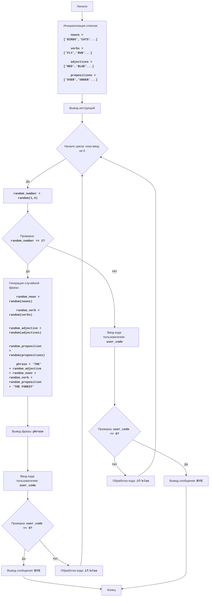

# Анализ кода модуля poetry.py

**Качество кода**
6
- Плюсы
    - Код игры прост для понимания и реализации.
    - Используется `random` для генерации случайных фраз и выбора слов.
    - Логика игры чётко разделена на ввод, обработку и вывод.
    - Есть блок-схема и текстовое описание алгоритма, что облегчает понимание кода.

- Минусы
    - Отсутствует обработка ошибок для нечислового ввода, что может привести к падению программы.
    - Код не соответствует PEP8, например, использование camelCase вместо snake_case в именах переменных.
    - Нет docstring для модуля и функции `change_list`.
    - Нет логирования ошибок.
    - Избыточное использование try-except блоков.
    - Код недостаточно структурирован.
    - Повторяющийся код для обработки ввода пользователя.
    - Не используется `j_loads` или `j_loads_ns`.

**Рекомендации по улучшению**
1. Добавить docstring для модуля и функции.
2. Использовать `from src.logger.logger import logger` для логирования ошибок.
3. Избегать избыточного использования `try-except`, использовать `logger.error`.
4. Рефакторинг: вынести повторяющийся код в отдельную функцию.
5. Добавить проверку ввода пользователя, чтобы исключить не числовые значения.
6. Привести имена переменных и функций к snake_case.
7. Добавить комментарии в формате RST.

**Оптимизированный код**
```python
"""
Модуль POETRY:
=========================================================================================
Игра "Поэзия" - это игра, в которой компьютер генерирует случайные предложения,
выбирая случайные слова из заранее заданных списков. Игрок может влиять на генерацию,
вводя различные коды, которые меняют источник слов.

Цель игры - увидеть и оценить случайные и иногда абсурдные результаты генерации фраз.

Правила игры:
1. В начале игры компьютер выводит приветствие и инструкции.
2. Компьютер случайным образом выбирает слова из списков существительных, глаголов, прилагательных и предлогов.
3. Используя выбранные слова, компьютер составляет случайное предложение.
4. Игрок может влиять на вывод, вводя следующие коды:
    - 1: Изменяет список существительных.
    - 2: Изменяет список глаголов.
    - 3: Изменяет список прилагательных.
    - 4: Изменяет список предлогов.
    - 0: Завершает игру.
5. После ввода кода, компьютер меняет соответствующий список на новый, и предлагает новую сгенерированную фразу.
6. Игра продолжается, пока игрок не введет код 0.
-----------------
Алгоритм:
1. Инициализировать списки существительных (nouns), глаголов (verbs), прилагательных (adjectives) и предлогов (prepositions) с начальными значениями.
2. Вывести приветствие и инструкции.
3. Начать цикл, который продолжается до тех пор, пока игрок не выберет вариант 0:
    3.1 Сгенерировать случайный номер от 1 до 4.
    3.2 Если номер равен 1, сгенерировать случайную фразу, используя текущие значения списков:
        - Выбрать случайное существительное из списка существительных.
        - Выбрать случайный глагол из списка глаголов.
        - Выбрать случайное прилагательное из списка прилагательных.
        - Выбрать случайный предлог из списка предлогов.
        - Составить предложение и вывести его на экран.
        - Спросить у пользователя, что он хочет изменить (ввести 0 для выхода).
    3.3 Если номер не 1, запросить у игрока ввод кода (0, 1, 2, 3, или 4).
    3.4 Если ввод 1, изменить список существительных на новый.
    3.5 Если ввод 2, изменить список глаголов на новый.
    3.6 Если ввод 3, изменить список прилагательных на новый.
    3.7 Если ввод 4, изменить список предлогов на новый.
    3.8 Если ввод 0, завершить игру.
4. Вывести сообщение "BYE".
5. Завершить программу.
-----------------
Блок-схема:


Legenda:
    Start - Начало программы.
    InitializeLists - Инициализация списков nouns, verbs, adjectives и prepositions начальными значениями.
    OutputInstructions - Вывод на экран инструкций для пользователя.
    LoopStart - Начало цикла, который повторяется, пока пользователь не введет 0.
    GenerateRandomNumber - Генерация случайного числа от 1 до 4.
    CheckRandomNumber - Проверка, равно ли случайное число 1.
    GeneratePhrase - Генерация случайной фразы на основе текущих списков слов.
    OutputPhrase - Вывод сгенерированной фразы на экран.
    InputCode - Запрос ввода кода от пользователя.
    CheckUserCode - Проверка, равен ли введенный код 0 для завершения игры.
    OutputBye - Вывод сообщения "BYE" перед завершением программы.
    End - Конец программы.
    ProcessCode - Вызов обработки кода, для изменения списков слов.
    InputCode2 - Запрос ввода кода от пользователя.
    CheckUserCode2 - Проверка, равен ли введенный код 0 для завершения игры.
    OutputBye2 - Вывод сообщения "BYE" перед завершением программы.
    ProcessCode2 - Вызов обработки кода, для изменения списков слов.
"""
import random
from src.logger.logger import logger # Импорт logger для логирования ошибок

# Начальные списки слов
nouns = ['BIRDS', 'CATS', 'DOGS', 'FISH', 'TREES', 'FLOWERS', 'RIVERS', 'MOUNTAINS', 'CLOUDS', 'STARS']
verbs = ['FLY', 'RUN', 'SWIM', 'JUMP', 'GROW', 'BLOOM', 'FLOW', 'CLIMB', 'FLOAT', 'SHINE']
adjectives = ['RED', 'BLUE', 'GREEN', 'YELLOW', 'TALL', 'SHORT', 'BIG', 'SMALL', 'BRIGHT', 'DARK']
prepositions = ['OVER', 'UNDER', 'IN', 'ON', 'BY', 'NEAR', 'THROUGH', 'AROUND', 'ACROSS', 'ALONG']


def change_list(list_name: str) -> list:
    """
    Изменяет список слов.

    :param list_name: Название списка слов для изменения.
    :return: Новый список слов.
    """
    new_list = input(f'Введите новые слова для списка {list_name} через запятую: ').upper().split(',')
    return new_list


def get_user_code() -> int | None:
    """
    Запрашивает у пользователя ввод кода и проверяет его на корректность.

    :return: Код, введенный пользователем, или None в случае ошибки.
    """
    user_code = input('Введите код (0 для выхода): ')
    if user_code == '0':
        return 0
    try:
        return int(user_code)
    except ValueError:
        logger.error(f'Неверный ввод: {user_code}. Введите 0, 1, 2, 3 или 4.')
        return None


print('Добро пожаловать в игру POETRY!')
print('Нажмите:')
print('1 чтобы поменять существительные')
print('2 чтобы поменять глаголы')
print('3 чтобы поменять прилагательные')
print('4 чтобы поменять предлоги')
print('0 чтобы выйти')

while True:
    # Генерируем случайное число от 1 до 4
    random_number = random.randint(1, 4)

    if random_number == 1:
        # Генерируем предложение
        random_noun = random.choice(nouns)
        random_verb = random.choice(verbs)
        random_adjective = random.choice(adjectives)
        random_preposition = random.choice(prepositions)

        phrase = f'THE {random_adjective} {random_noun} {random_verb} {random_preposition} THE FOREST'
        print(f'Случайная фраза: {phrase}')
        user_code = get_user_code() # Код запрашивает ввод у пользователя и проверяет его
        if user_code == 0:
            break
        if user_code is None:
            continue
    else:
        user_code = get_user_code() # Код запрашивает ввод у пользователя и проверяет его
        if user_code == 0:
            break
        if user_code is None:
             continue

    if user_code == 1:
        nouns = change_list('существительных') # Код изменяет список существительных
    elif user_code == 2:
        verbs = change_list('глаголов') # Код изменяет список глаголов
    elif user_code == 3:
        adjectives = change_list('прилагательных') # Код изменяет список прилагательных
    elif user_code == 4:
        prepositions = change_list('предлогов') # Код изменяет список предлогов

print('BYE')