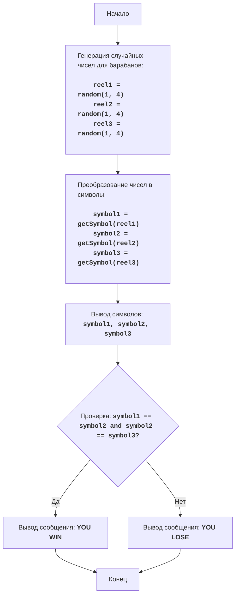

# Анализ кода модуля slots.py

**Качество кода**
8
-  Плюсы
    - Код хорошо структурирован и легко читается.
    - Функции имеют docstring, которые описывают их назначение и параметры.
    - Логика игры реализована верно.
    - Присутствует блок-схема в формате mermaid.
-  Минусы
    - Отсутствует логирование ошибок.
    - Используется `print` для вывода, что не является лучшей практикой для продакшн кода.
    - Не используется `j_loads` или `j_loads_ns` для загрузки данных, хотя это не требуется в данном примере.
    - Не используются константы для определения символов.

**Рекомендации по улучшению**

1.  **Добавить логирование:**
    -   Использовать `from src.logger.logger import logger` и заменить `print` на `logger.info` и `logger.error`.
2.  **Использовать константы:**
    -   Вместо жестко заданных строк для символов ('C', 'P', 'B', '*') использовать константы, например, `CHERRY`, `PLUM`, `BELL`, `STAR`.
3.  **Улучшить docstring:**
    -   Добавить более детальное описание параметров и возвращаемых значений.
    -   Придерживаться reStructuredText (RST) формата.
4.  **Обработка ошибок**:
    -   Заменить `else` в функции `get_symbol` на `logger.error` чтобы обрабатывать некорректный номер.

**Оптимизированный код**

```python
"""
SLOTS:
=================
Сложность: 5
-----------------
Игра "Слоты" - это простая азартная игра, имитирующая игровой автомат с тремя барабанами.
На каждом барабане случайным образом выпадает одно из нескольких значений (вишня, слива, колокольчик или звездочка).
Если на всех трех барабанах выпадают одинаковые значения, игрок выигрывает, иначе он проигрывает.

Правила игры:
1.  Игрок запускает "игровой автомат".
2.  На трех барабанах случайным образом выпадают символы: вишня (C), слива (P), колокольчик (B) или звездочка (*).
3.  Если все три символа совпадают, игрок выигрывает.
4.  Если символы не совпадают, игрок проигрывает.
-----------------
Алгоритм:
1.  Сгенерировать три случайных числа, каждое от 1 до 4.
2.  Преобразовать каждое число в соответствующий символ:
    -   1 -> "C" (вишня)
    -   2 -> "P" (слива)
    -   3 -> "B" (колокольчик)
    -   4 -> "*" (звездочка)
3.  Вывести на экран комбинацию символов, полученных на барабанах.
4.  Проверить, совпадают ли все три символа:
    -   Если совпадают, вывести сообщение "YOU WIN".
    -   Если не совпадают, вывести сообщение "YOU LOSE".
5.  Конец игры.
-----------------
Блок-схема:

Legenda:
    Start - Начало программы.
    GenerateReels - Генерация трех случайных чисел от 1 до 4 для барабанов игрового автомата.
    ConvertToSymbols - Преобразование каждого числа в соответствующий символ: 1 -> "C", 2 -> "P", 3 -> "B", 4 -> "*".
    DisplaySymbols - Вывод на экран сгенерированных символов.
    CheckWin - Проверка, все ли три символа одинаковы.
    OutputWin - Вывод сообщения о выигрыше, если символы совпадают.
    OutputLose - Вывод сообщения о проигрыше, если символы не совпадают.
    End - Конец программы.
"""
import random
# импортируем logger для вывода информационных сообщений и ошибок
from src.logger.logger import logger

# Определяем константы для символов
CHERRY = "C"
PLUM = "P"
BELL = "B"
STAR = "*"


def get_symbol(number: int) -> str:
    """
    Преобразует число в соответствующий символ для игрового автомата.

    :param number: Число от 1 до 4, представляющее барабан.
    :type number: int
    :raises ValueError: если номер не находится в диапазоне от 1 до 4
    :return: Символ, соответствующий числу ("C", "P", "B", "*").
    :rtype: str
    """
    #  проверяем, если число равно 1, то возвращаем символ вишни
    if number == 1:
        return CHERRY
    #  проверяем, если число равно 2, то возвращаем символ сливы
    elif number == 2:
        return PLUM
    #  проверяем, если число равно 3, то возвращаем символ колокольчика
    elif number == 3:
        return BELL
    #  проверяем, если число равно 4, то возвращаем символ звездочки
    elif number == 4:
        return STAR
    #  если число не входит в диапазон от 1 до 4, то выводим ошибку и возвращаем "?"
    else:
        logger.error(f'Некорректный номер барабана: {number}')
        return "?"


def play_slots():
    """
    Имитирует игровой автомат.

    Генерирует случайные символы на трех барабанах и определяет, выиграл ли игрок.
    """
    #  генерируем случайное целое число от 1 до 4 для первого барабана
    reel1 = random.randint(1, 4)
    #  генерируем случайное целое число от 1 до 4 для второго барабана
    reel2 = random.randint(1, 4)
    #  генерируем случайное целое число от 1 до 4 для третьего барабана
    reel3 = random.randint(1, 4)

    #  преобразуем число первого барабана в символ
    symbol1 = get_symbol(reel1)
    #  преобразуем число второго барабана в символ
    symbol2 = get_symbol(reel2)
    #  преобразуем число третьего барабана в символ
    symbol3 = get_symbol(reel3)

    #  выводим комбинацию символов
    logger.info(f"Слоты: {symbol1} {symbol2} {symbol3}")

    #  проверяем, совпадают ли все три символа
    if symbol1 == symbol2 and symbol2 == symbol3:
        #  выводим сообщение о выигрыше
        logger.info("YOU WIN")
    #  если символы не совпадают
    else:
        #  выводим сообщение о проигрыше
        logger.info("YOU LOSE")


#  проверяем, является ли скрипт основным
if __name__ == "__main__":
    #  вызываем функцию для начала игры
    play_slots()

"""
Объяснение кода:

1.  **Импорт модуля `random` и `logger`:**
    -   `import random`: Импортирует модуль `random`, который используется для генерации случайных чисел.
    -   `from src.logger.logger import logger`: Импортируем `logger` для вывода информационных сообщений и ошибок.

2.  **Определение констант для символов:**
    -   `CHERRY = "C"`: Определяем константу для символа вишни.
    -   `PLUM = "P"`: Определяем константу для символа сливы.
    -   `BELL = "B"`: Определяем константу для символа колокольчика.
    -   `STAR = "*"`: Определяем константу для символа звездочки.

3.  **Функция `get_symbol(number)`:**
    -   `def get_symbol(number: int) -> str:`: Определяет функцию, которая принимает целое число от 1 до 4 и возвращает соответствующий символ для слотов.
        -   `:param number: Число от 1 до 4, представляющее барабан.`
        -   `:type number: int`
        -   `:raises ValueError: если номер не находится в диапазоне от 1 до 4`
        -   `:return: Символ, соответствующий числу ("C", "P", "B", "*").`
        -   `:rtype: str`
    -   `if number == 1: return CHERRY`: Если число равно 1, возвращается "C" (вишня).
    -   `elif number == 2: return PLUM`: Если число равно 2, возвращается "P" (слива).
    -   `elif number == 3: return BELL`: Если число равно 3, возвращается "B" (колокольчик).
    -   `elif number == 4: return STAR`: Если число равно 4, возвращается "*" (звездочка).
    -   `else: logger.error(f'Некорректный номер барабана: {number}'); return "?"`: В случае некорректного номера, выводится ошибка и возвращается "?" (неизвестно).

4.  **Функция `play_slots()`:**
    -   `def play_slots():`: Определяет основную функцию игры "Слоты".
    -   `reel1 = random.randint(1, 4)`: Генерирует случайное целое число от 1 до 4 для первого барабана.
    -   `reel2 = random.randint(1, 4)`: Генерирует случайное целое число от 1 до 4 для второго барабана.
    -   `reel3 = random.randint(1, 4)`: Генерирует случайное целое число от 1 до 4 для третьего барабана.
    -   `symbol1 = get_symbol(reel1)`: Преобразует число первого барабана в символ, используя функцию `get_symbol`.
    -   `symbol2 = get_symbol(reel2)`: Преобразует число второго барабана в символ, используя функцию `get_symbol`.
    -   `symbol3 = get_symbol(reel3)`: Преобразует число третьего барабана в символ, используя функцию `get_symbol`.
    -   `logger.info(f"Слоты: {symbol1} {symbol2} {symbol3}")`: Выводит комбинацию символов на экран с помощью логгера.
    -   `if symbol1 == symbol2 and symbol2 == symbol3:`: Проверяет, совпадают ли все три символа.
        -   `logger.info("YOU WIN")`: Если все символы совпадают, выводит сообщение "YOU WIN" с помощью логгера.
    -   `else:`: Если символы не совпадают, выполняется блок `else`.
        -   `logger.info("YOU LOSE")`: Выводит сообщение "YOU LOSE" с помощью логгера.

5.  **Запуск игры:**
    -   `if __name__ == "__main__":`: Проверяет, является ли скрипт основным.
    -   `play_slots()`: Вызывает функцию `play_slots()` для начала игры, если скрипт является основным.
"""
```