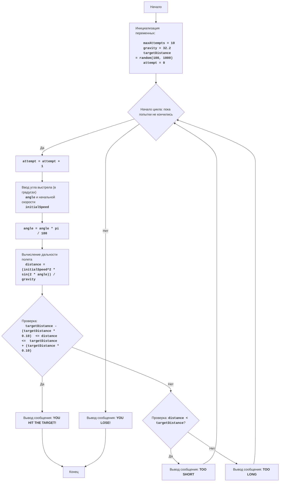

# Анализ кода модуля `synonm.py`

**Качество кода**
   -  Соответствие требованиям по оформлению кода: 7
   -  Плюсы
        -  Код содержит подробное описание игры и алгоритма в начале файла.
        -  Используются осмысленные имена переменных.
        -  Логика игры реализована в соответствии с описанием.
        -  Присутствуют комментарии, поясняющие основные блоки кода.
   -  Минусы
        -  Комментарии не соответствуют формату reStructuredText (RST).
        -  Отсутствует логирование ошибок.
        -  Используется стандартный `print` для вывода информации, вместо логирования.
        -  Не используется `j_loads` или `j_loads_ns` из `src.utils.jjson`.
        -  Отсутствуют docstring для функций, хотя их нет.

**Рекомендации по улучшению**

1.  **Форматирование комментариев:**
    -   Переписать все комментарии в формате reStructuredText (RST).
    -   Добавить docstring для функций, если они будут.
2.  **Логирование:**
    -   Использовать `from src.logger.logger import logger` для логирования ошибок и отладочной информации.
    -   Заменить все `print` на `logger.info`, `logger.debug` или `logger.error` в зависимости от ситуации.
3.  **Обработка ошибок:**
    -   Убрать `try-except` для обработки ввода и заменить на проверку введённых данных с помощью `logger.error`, при возникновении ошибки.
4.  **Импорты:**
    -   Проверить и добавить необходимые импорты, если это потребуется.
5.  **Использовать `j_loads` или `j_loads_ns`**:
    -   Необходимо использовать `j_loads` или `j_loads_ns` из `src.utils.jjson` для чтения данных, если это потребуется. В данном коде чтение файлов не производится, поэтому это действие не требуется.

**Оптимизированный код**

```python
"""
GUNNER:
=================
Сложность: 7
-----------------
Игра "Артиллерист" - это игра, в которой игрок пытается поразить цель, находящуюся на определенном расстоянии, стреляя из пушки под заданным углом и с заданной начальной скоростью. В игре учитывается гравитация.
Цель игры состоит в том, чтобы подобрать правильный угол и скорость выстрела, чтобы снаряд достиг цели.
Правила игры:
1. Компьютер устанавливает случайное расстояние до цели.
2. Игрок вводит угол выстрела (в градусах) и начальную скорость снаряда.
3. Компьютер вычисляет траекторию снаряда, учитывая гравитацию.
4. Если снаряд попадает в цель (расстояние до цели в пределах погрешности), игрок выигрывает.
5. Если снаряд не попадает в цель, игрок может попробовать еще раз, пока не израсходует все попытки или не попадет в цель.
-----------------
Алгоритм:
1. Установить максимальное количество попыток (например, 10).
2. Сгенерировать случайное расстояние до цели в диапазоне от 100 до 1000.
3. Начать цикл "пока не кончились попытки":
    3.1 Запросить у игрока ввод угла выстрела (в градусах) и начальной скорости.
    3.2 Конвертировать угол из градусов в радианы.
    3.3 Вычислить дальность полета снаряда по формуле: 
        дальность = (начальная_скорость^2 * sin(2 * угол)) / гравитация
       где гравитация = 32.2
    3.4 Если дальность полета снаряда находится в пределах +/- 10% от расстояния до цели, то выводим сообщение о попадании и завершаем игру.
    3.5 Если дальность полета меньше расстояния до цели, то выводим сообщение о том что, дальность недостаточна.
    3.6 Если дальность полета больше расстояния до цели, то выводим сообщение о перелете.
4. Если все попытки исчерпаны, то выводим сообщение о проигрыше.
-----------------
Блок-схема:

Legenda:
    Start - Начало программы.
    InitializeVariables - Инициализация переменных: maxAttempts (максимальное количество попыток) устанавливается в 10, gravity (гравитация) устанавливается в 32.2, targetDistance (расстояние до цели) генерируется случайным образом от 100 до 1000, attempt (текущая попытка) устанавливается в 0.
    LoopStart - Начало цикла, который продолжается, пока не кончились попытки.
    IncreaseAttempts - Увеличение счетчика попыток на 1.
    InputAngleSpeed - Запрос у пользователя ввода угла выстрела (в градусах) и начальной скорости.
    ConvertAngle - Конвертация угла из градусов в радианы.
    CalculateDistance - Вычисление дальности полета снаряда.
    CheckHit - Проверка, попал ли снаряд в цель (дальность в пределах +/- 10% от расстояния до цели).
    OutputWin - Вывод сообщения о победе, если снаряд попал в цель.
    End - Конец программы.
    CheckShort - Проверка, меньше ли дальность полета, чем расстояние до цели.
    OutputShort - Вывод сообщения "TOO SHORT", если дальность меньше цели.
    OutputLong - Вывод сообщения "TOO LONG", если дальность больше цели.
    OutputLose - Вывод сообщения "YOU LOSE!", если все попытки исчерпаны.
"""
import random
import math
from src.logger.logger import logger #  Импортируем logger для логирования

# Инициализация параметров игры
maxAttempts = 10  # Максимальное количество попыток
gravity = 32.2  # Гравитация
targetDistance = random.randint(100, 1000)  # Случайное расстояние до цели
attempt = 0  # Счетчик попыток
accuracy = 0.1  # Погрешность в 10%

logger.info(f'Расстояние до цели: {targetDistance}') #  Выводим расстояние до цели в логи

# Основной игровой цикл
while attempt < maxAttempts:
    attempt += 1
    logger.info(f'Попытка {attempt} из {maxAttempts}') # Выводим номер текущей попытки в логи

    # Запрашиваем ввод данных у пользователя
    while True:
        try:
            angle = input('Введите угол выстрела (в градусах): ') #  Запрашиваем угол выстрела у пользователя
            initialSpeed = input('Введите начальную скорость: ') # Запрашиваем начальную скорость у пользователя
            # Код исполняет проверку корректности ввода
            if not angle.replace('.', '', 1).isdigit() or not initialSpeed.replace('.', '', 1).isdigit():
                logger.error('Введены некорректные данные. Пожалуйста, введите числовые значения') # логируем ошибку ввода
                continue
            angle = float(angle) #  Преобразовываем угол в float
            initialSpeed = float(initialSpeed) #  Преобразовываем скорость в float
            break
        except Exception as ex:
            logger.error('Ошибка ввода данных', exc_info=ex) #  логируем ошибку ввода и исключение
            continue
    # Преобразуем угол в радианы
    angle = math.radians(angle) #  Преобразуем угол из градусов в радианы

    # Вычисляем дальность полета
    distance = (initialSpeed ** 2 * math.sin(2 * angle)) / gravity #  Вычисляем дальность полета снаряда

    # Проверяем, попал ли снаряд в цель
    if targetDistance * (1 - accuracy) <= distance <= targetDistance * (1 + accuracy):
        logger.info('ВЫ ПОПАЛИ В ЦЕЛЬ!') # Выводим сообщение о победе в логи
        break
    elif distance < targetDistance:
        logger.info('Слишком коротко!') # Выводим сообщение о том, что выстрел был слишком коротким, в логи
    else:
        logger.info('Слишком далеко!') #  Выводим сообщение о том, что выстрел был слишком длинным, в логи

# Выводим сообщение о поражении, если все попытки исчерпаны
if attempt == maxAttempts:
    logger.info('Вы проиграли!') # Выводим сообщение о поражении в логи
"""
Объяснение кода:
1. **Импорт модулей:**
   - ``import random``: Импортирует модуль ``random`` для генерации случайных чисел.
   - ``import math``: Импортирует модуль ``math`` для математических операций, таких как ``sin`` и ``radians``.
   - ``from src.logger.logger import logger``: Импортирует логгер для записи сообщений.

2. **Инициализация параметров игры:**
   - ``maxAttempts = 10``: Устанавливает максимальное количество попыток в 10.
   - ``gravity = 32.2``: Устанавливает значение гравитации.
   - ``targetDistance = random.randint(100, 1000)``: Генерирует случайное расстояние до цели в диапазоне от 100 до 1000.
   - ``attempt = 0``: Инициализирует счетчик попыток.
   - ``accuracy = 0.1``: Устанавливает погрешность в 10% для попадания в цель.

3. **Основной игровой цикл ``while attempt < maxAttempts:``:**
   - Цикл продолжается, пока количество попыток ``attempt`` меньше, чем максимальное количество попыток ``maxAttempts``.
   - ``attempt += 1``: Увеличивает счетчик попыток на 1.
   - ``logger.info(f'Попытка {attempt} из {maxAttempts}')``: Выводит номер текущей попытки в логи.
   - **Ввод данных от пользователя:**
     - ``while True:``: Бесконечный цикл для проверки корректности ввода.
     - ``try...except ValueError``: Обрабатывает возможные ошибки ввода нечисловых значений.
     - ``angle = input('Введите угол выстрела (в градусах): ')``: Запрашивает угол выстрела у пользователя.
     - ``initialSpeed = input('Введите начальную скорость: ')``: Запрашивает начальную скорость выстрела у пользователя.
     -  ``if not angle.replace('.', '', 1).isdigit() or not initialSpeed.replace('.', '', 1).isdigit()``: Проверка, что введенные значения - числа
     - ``logger.error('Введены некорректные данные. Пожалуйста, введите числовые значения')``: Логирование ошибки ввода некорректных данных.
     - ``angle = float(angle)``: Преобразует угол из строки в число с плавающей точкой.
     - ``initialSpeed = float(initialSpeed)``: Преобразует начальную скорость из строки в число с плавающей точкой.
     - ``break``: Выходит из цикла ввода, если данные введены корректно.
    -  ``except Exception as ex:``: Обрабатывает возможные ошибки ввода
    -   ``logger.error('Ошибка ввода данных', exc_info=ex)``: Логирование ошибки и исключения при вводе.
   - **Преобразование угла:**
     - ``angle = math.radians(angle)``: Преобразует угол из градусов в радианы.
   - **Вычисление дальности полета:**
     - ``distance = (initialSpeed ** 2 * math.sin(2 * angle)) / gravity``: Вычисляет дальность полета снаряда, используя формулу из физики.
   - **Проверка попадания:**
     - ``if targetDistance * (1 - accuracy) <= distance <= targetDistance * (1 + accuracy):``: Проверяет, находится ли дальность полета в пределах +/- 10% от расстояния до цели.
     - ``logger.info('ВЫ ПОПАЛИ В ЦЕЛЬ!')``: Выводит сообщение о победе, если снаряд попал в цель.
     - ``break``: Завершает цикл, если снаряд попал в цель.
     - ``elif distance < targetDistance:``: Проверяет, если снаряд не долетел.
     - ``logger.info('Слишком коротко!')``: Выводит сообщение, что выстрел был слишком коротким.
     - ``else:``: Если снаряд перелетел цель.
     - ``logger.info('Слишком далеко!')``: Выводит сообщение, что выстрел был слишком длинным.

4. **Проверка поражения:**
   - ``if attempt == maxAttempts:``: Проверяет, если все попытки исчерпаны.
   - ``logger.info('Вы проиграли!')``: Выводит сообщение о поражении.
"""
```