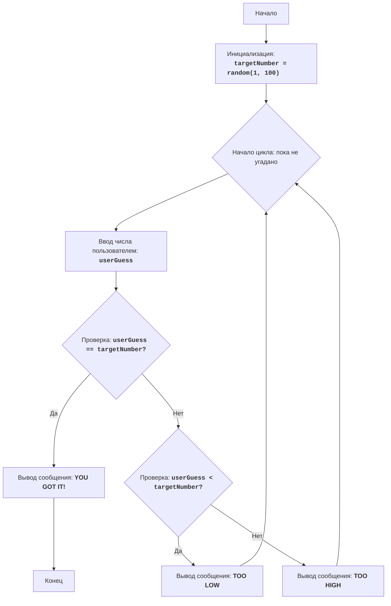

# Анализ кода модуля ugly.py

**Качество кода**
8
- Плюсы
    - Код достаточно прост и понятен, хорошо структурирован, легко читается.
    - Используется try-except для обработки исключений при вводе данных пользователем.
    - Есть подробное описание работы алгоритма в docstring.
    - Есть блок-схема в mermaid формате.
- Минусы
    - Отсутствуют импорты из `src.utils.jjson` и `src.logger.logger`.
    - Не используется логгирование ошибок через `logger.error`.
    - Комментарии не соответствуют формату reStructuredText (RST).
    - Используется конструкция `while True:`, что не всегда является лучшим решением. Можно использовать флаг для выхода из цикла.

**Рекомендации по улучшению**
1.  Добавить необходимые импорты `j_loads`, `j_loads_ns` из `src.utils.jjson` и `logger` из `src.logger.logger`.
2.  Переписать docstring модуля и комментарии к коду в формате RST.
3.  Заменить стандартный `print` на использование `logger.info` и `logger.error` для вывода сообщений.
4.  Обработать исключение `ValueError` с помощью `logger.error` и не выводить сообщение об ошибке через `print`.
5.  Улучшить цикл while  с помощью флага.
6.  Привести код в соответствие с инструкциями (одинарные кавычки в Python коде).

**Оптимизированный код**
```python
"""
Модуль игры "UGLY"
===================

Игра "UGLY" - это простая игра-угадайка, где компьютер генерирует случайное число, а игрок должен угадать это число.
После каждой попытки игроку сообщается, было ли его предположение выше или ниже загаданного числа.

Правила игры:
1. Компьютер генерирует случайное целое число от 1 до 100.
2. Игрок вводит свое предположение о загаданном числе.
3. После каждой попытки компьютер сообщает, было ли введенное число "TOO HIGH" (слишком высоко) или "TOO LOW" (слишком низко).
4. Игра заканчивается, когда игрок угадывает число.

Алгоритм:
1. Сгенерировать случайное число в диапазоне от 1 до 100 и сохранить его в переменной `target_number`.
2. Начать цикл "пока не угадано":
    2.1 Запросить у игрока ввод числа и сохранить его в переменной `user_guess`.
    2.2 Если `user_guess` равно `target_number`, вывести сообщение "YOU GOT IT!" и перейти к шагу 3.
    2.3 Если `user_guess` меньше `target_number`, вывести сообщение "TOO LOW".
    2.4 Если `user_guess` больше `target_number`, вывести сообщение "TOO HIGH".
3. Завершить игру.

Блок-схема:

Legenda:
    Start - Начало программы.
    InitializeTargetNumber - Инициализация переменной target_number случайным целым числом от 1 до 100.
    LoopStart - Начало цикла, который продолжается, пока число не угадано.
    InputGuess - Запрос у пользователя ввода числа и сохранение его в переменной user_guess.
    CheckGuess - Проверка, равно ли введенное число user_guess загаданному числу target_number.
    OutputWin - Вывод сообщения о победе, если числа равны.
    End - Конец программы.
    CheckLow - Проверка, меньше ли введенное число user_guess загаданного числа target_number.
    OutputLow - Вывод сообщения "TOO LOW", если введенное число меньше загаданного.
    OutputHigh - Вывод сообщения "TOO HIGH", если введенное число больше загаданного.
"""
import random
from src.logger.logger import logger
# from src.utils.jjson import j_loads, j_loads_ns # TODO: check if required

# Генерируется случайное число от 1 до 100.
target_number = random.randint(1, 100)

# Инициализация флага для управления циклом.
game_over = False

# Цикл продолжается пока игра не окончена.
while not game_over:
    # Запрашивается у пользователя ввод числа.
    try:
        user_guess = int(input('Угадай число: '))
    except ValueError as ex:
        # логируется ошибка, если пользователь ввел не целое число
        logger.error('Пожалуйста, введите целое число.', exc_info=ex)
        continue

    # Проверяется, угадано ли число.
    if user_guess == target_number:
        # Выводится сообщение о победе.
        logger.info('YOU GOT IT!')
        # Устанавливается флаг окончания игры.
        game_over = True
    # Проверяется, если введенное число меньше загаданного.
    elif user_guess < target_number:
        # Выводится подсказка, что число слишком маленькое.
        logger.info('TOO LOW')
    # Если введенное число больше загаданного.
    else:
        # Выводится подсказка, что число слишком большое.
        logger.info('TOO HIGH')

"""
Объяснение кода:
1.  **Импорт модуля `random`**:
    -   `import random`: Импортируется модуль `random`, который используется для генерации случайного числа.
    -   `from src.logger.logger import logger`: импортируется  модуль `logger`, для логгирования.
2.  **Генерация случайного числа**:
    -   `target_number = random.randint(1, 100)`: Генерируется случайное целое число в диапазоне от 1 до 100 и сохраняется в переменной `target_number`.
3.  **Основной цикл `while not game_over:`**:
    -   `game_over = False`: Устанавливает начальное значение для флага управления циклом.
    -   `while not game_over:`: Создает цикл, который продолжается, пока игра не окончена.
    -  **Ввод данных**:
        - `try...except ValueError`: Блок try-except обрабатывает возможные ошибки ввода. Если пользователь введет не целое число, то будет выведено сообщение об ошибке в лог.
        -   `user_guess = int(input('Угадай число: '))`: Запрашивает у пользователя ввод числа и сохраняет его в переменной `user_guess`.
    -   **Проверка условия победы**:
        -   `if user_guess == target_number:`: Проверяется, равно ли введенное число загаданному.
        -   `logger.info('YOU GOT IT!')`: Выводится сообщение о победе.
        -   `game_over = True`: Устанавливает флаг `game_over` в `True`, что приводит к завершению цикла.
    -   **Подсказки**:
        -   `elif user_guess < target_number:`: Проверяется, если введенное число меньше загаданного.
        -   `logger.info('TOO LOW')`: Выводится подсказка, что нужно ввести число больше.
        -   `else:`: Если число не угадано и не меньше загаданного, то оно больше.
        -   `logger.info('TOO HIGH')`: Выводится подсказка, что нужно ввести число меньше.
"""