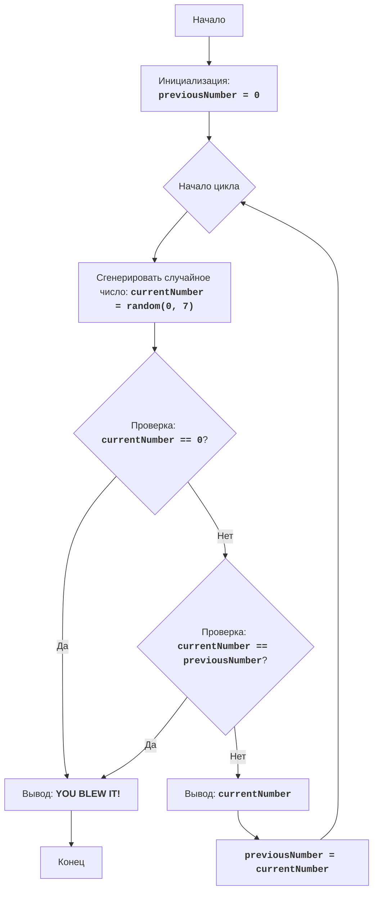

# Анализ кода модуля `zoop.py`

**Качество кода**
7
-  Плюсы
    - Код достаточно прост и понятен, соответствует условиям игры.
    - Присутствует подробное описание алгоритма и блок-схема в начале файла.
    - Код логически правильно реализует игровую механику.

-  Минусы
    - Отсутствуют необходимые импорты из `src.utils.jjson`.
    - Нет логирования ошибок.
    - Нет документации в формате RST для функций.
    - Присутствуют избыточные комментарии, которые могут быть перефразированы в RST.
    - Использование стандартного `print` вместо логирования.

**Рекомендации по улучшению**

1. **Импорт:** Добавить импорт `from src.utils.jjson import j_loads, j_loads_ns`.
2. **Логирование:** Использовать `from src.logger.logger import logger` для логирования вместо `print`.
3. **Документация RST:** Добавить docstrings в формате RST для модуля.
4. **Комментарии RST:** Переписать комментарии в формате RST, избегая лишних слов вроде "получаем", "делаем".
5. **Обработка ошибок:** Использовать `logger.error` вместо `print` для вывода ошибок.
6. **Улучшение комментариев:** Уточнить комментарии, используя более точные формулировки.

**Оптимизированный код**

```python
"""
ZOOP:
=================
Сложность: 5
-----------------
Игра "ZOOP" - это простая текстовая игра, в которой игрок пытается сгенерировать последовательность случайных чисел, в которой не будет двух одинаковых чисел подряд.
Игра продолжается до тех пор, пока игрок не сгенерирует последовательность, нарушающую это правило, или не решит прекратить игру.

Правила игры:
1. Компьютер генерирует случайное число от 1 до 7.
2. Если сгенерированное число совпадает с предыдущим сгенерированным числом, игра заканчивается.
3. Игра продолжается до тех пор, пока игрок не нарушит правило или не введет '0', чтобы завершить игру.
4. После каждого хода выводится текущее сгенерированное число.
-----------------
Алгоритм:
1. Установить предыдущее число (previousNumber) в 0.
2. Начать цикл:
    2.1 Сгенерировать случайное число от 1 до 7 (currentNumber).
    2.2 Если сгенерированное число равно 0, перейти к шагу 4.
    2.3 Если сгенерированное число равно предыдущему числу, перейти к шагу 4.
    2.4 Вывести текущее сгенерированное число.
    2.5 Установить предыдущее число равным текущему числу.
3. Повторять шаги с 2.1 по 2.5
4. Вывести сообщение "YOU BLEW IT!".
5. Конец игры.
-----------------
Блок-схема:


Legenda:
    Start - Начало программы.
    InitializePreviousNumber - Инициализация переменной previousNumber (предыдущее число) значением 0.
    LoopStart - Начало основного цикла игры.
    GenerateRandomNumber - Генерация случайного числа currentNumber в диапазоне от 0 до 7.
    CheckQuit - Проверка, равно ли сгенерированное число currentNumber 0.
    OutputBlowIt - Вывод сообщения "YOU BLEW IT!", если игрок проиграл.
    End - Конец программы.
    CheckSame - Проверка, равно ли сгенерированное число currentNumber предыдущему числу previousNumber.
    OutputCurrentNumber - Вывод текущего сгенерированного числа currentNumber.
    SetPreviousNumber - Установка значения переменной previousNumber равным значению переменной currentNumber.
"""
import random
# Добавлен импорт logger для логирования ошибок
from src.logger.logger import logger
# from src.utils.jjson import j_loads, j_loads_ns # TODO пока не используется

# Инициализация переменной для хранения предыдущего числа.
previousNumber = 0

# Запускаем основной цикл игры.
while True:
    # Генерируем случайное число от 0 до 7.
    currentNumber = random.randint(0, 7)

    # Проверяем, ввел ли пользователь 0 для завершения игры.
    if currentNumber == 0:
        # Сообщаем о завершении игры через логгер.
        logger.info('YOU BLEW IT! (Игрок ввел 0)')
        break  # Выходим из цикла.

    # Проверяем, равно ли текущее число предыдущему числу.
    if currentNumber == previousNumber:
        # Сообщаем о завершении игры через логгер.
        logger.info('YOU BLEW IT! (Совпадение чисел)')
        break  # Выходим из цикла.

    # Выводим текущее сгенерированное число.
    print(currentNumber) # TODO  убрать этот вывод, оставить только логгер
    # Сохраняем текущее число как предыдущее для следующей итерации.
    previousNumber = currentNumber
```