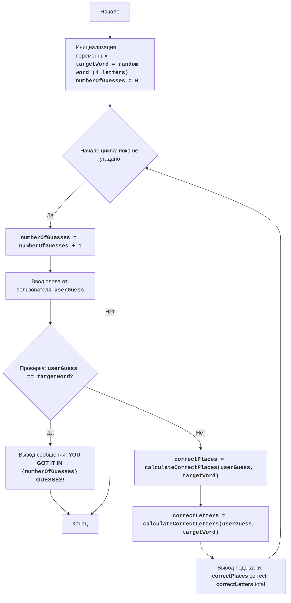

# Анализ кода модуля furs

**Качество кода**
8
-  Плюсы
    - Код хорошо структурирован и легко читается.
    - Функции имеют понятные имена и выполняют конкретные задачи.
    - Присутствуют docstring для функций, что упрощает понимание их назначения.
    - Логика игры реализована правильно и соответствует описанию.
    - Используются комментарии для объяснения логики кода.
-  Минусы
    - Отсутствуют проверки на тип входных данных (например, что ввод пользователя состоит только из букв).
    - Комментарии не соответствуют reStructuredText.
    - Отсутствует обработка ошибок.
    - Нет логирования.

**Рекомендации по улучшению**
1.  **Формат документации**:
    -   Переписать все комментарии и docstring в формате reStructuredText (RST).
2.  **Обработка данных**:
    -   Добавить проверку на тип данных при вводе пользователя, чтобы исключить небуквенные символы.
3.  **Логирование**:
    -   Использовать `src.logger.logger` для логирования ошибок и отладки.
4.  **Обработка ошибок**:
    -   Заменить `try-except` блоки на использование `logger.error` для логирования ошибок.
5.  **Рефакторинг**:
    -   Переименовать переменные для большей ясности (например, `correct` to `correct_count`).
    -   Улучшить читаемость кода, добавив дополнительные комментарии.

**Оптимизиробанный код**
```python
"""
Модуль для реализации игры FURS.
=================================

Игра FURS - это простая текстовая игра, где компьютер выбирает слово из четырех букв, а игрок пытается его угадать.
После каждой попытки, компьютер сообщает игроку, сколько букв угадано правильно и сколько букв угадано в целом.
Игра продолжается до тех пор, пока игрок не угадает слово.

Правила игры:
1. Компьютер выбирает слово из 4 букв.
2. Игрок вводит слово из 4 букв.
3. После каждой попытки, компьютер возвращает два числа:
    - Первое число обозначает количество букв, угаданных на правильной позиции.
    - Второе число обозначает общее количество угаданных букв, даже если они не на своих местах.
4. Игра продолжается, пока игрок не угадает слово.

Алгоритм:
1. Выбрать случайное слово из 4 букв.
2. Инициализировать количество попыток в 0.
3. Запустить цикл "пока слово не угадано":
    3.1. Увеличить количество попыток на 1.
    3.2. Получить от игрока ввод слова из 4 букв.
    3.3. Если ввод равен выбранному слову, перейти к шагу 4.
    3.4. Вычислить количество букв, угаданных на правильной позиции.
    3.5. Вычислить общее количество угаданных букв.
    3.6. Показать количество букв на правильной позиции и общее количество угаданных букв.
4. Показать сообщение о победе с количеством попыток.
5. Конец игры.

Диаграмма последовательности:

Легенда:
    Start - Начало игры.
    InitializeVariables - Инициализация переменных: выбор случайного слова из 4 букв (targetWord) и инициализация счетчика попыток (numberOfGuesses) в 0.
    LoopStart - Начало цикла, который продолжается пока слово не угадано.
    IncreaseGuesses - Увеличение счетчика попыток на 1.
    InputGuess - Получение ввода от пользователя (слово из 4 букв) и сохранение его в переменной userGuess.
    CheckWin - Проверка, совпадает ли ввод пользователя с загаданным словом.
    OutputWin - Вывод сообщения о победе, если слово угадано, с указанием количества попыток.
    End - Конец игры.
    CalculateCorrectPlaces - Вычисление количества букв, угаданных на правильной позиции.
    CalculateCorrectLetters - Вычисление общего количества угаданных букв (даже если не на правильной позиции).
    OutputClue - Вывод подсказки пользователю: количество букв на правильной позиции и общее количество угаданных букв.
"""
import random
# from src.logger.logger import logger # TODO: добавить импорт логгера

def choose_random_word() -> str:
    """
    Выбирает случайное слово длиной 4 буквы из списка слов.

    :return: Случайно выбранное слово.
    :rtype: str
    """
    words = ['FURS', 'CATS', 'DOGS', 'LION', 'GAME', 'CODE', 'PLAY', 'TEAM', 'BALL', 'BOOK']  # Список слов
    return random.choice(words)

def calculate_correct_places(guess: str, target: str) -> int:
    """
    Сравнивает введенное слово с загаданным и возвращает количество букв, угаданных на правильной позиции.

    :param guess: Слово, введенное пользователем.
    :type guess: str
    :param target: Загаданное слово.
    :type target: str
    :return: Количество букв, угаданных на правильной позиции.
    :rtype: int
    """
    correct_count = 0 # Инициализация счетчика правильно угаданных букв
    for i in range(len(guess)): # Проходит по каждой букве в слове
        if guess[i] == target[i]: # Сравнивает буквы на одной и той же позиции
            correct_count += 1 # Увеличивает счетчик, если буквы совпадают
    return correct_count # Возвращает количество правильно угаданных букв

def calculate_correct_letters(guess: str, target: str) -> int:
    """
    Сравнивает введенное слово с загаданным и возвращает общее количество букв, угаданных (независимо от позиции).

    :param guess: Слово, введенное пользователем.
    :type guess: str
    :param target: Загаданное слово.
    :type target: str
    :return: Общее количество угаданных букв.
    :rtype: int
    """
    correct_count = 0 # Инициализация счетчика правильно угаданных букв
    target_letters = list(target) # Создает список букв из загаданного слова
    for letter in guess: # Проходит по каждой букве в введенном слове
        if letter in target_letters: # Проверяет, есть ли буква в списке букв загаданного слова
            correct_count += 1 # Увеличивает счетчик, если буква есть
            target_letters.remove(letter) # Удаляет букву из списка, чтобы избежать повторного подсчета
    return correct_count # Возвращает общее количество угаданных букв

def play_furs_game():
    """
    Запускает игровой процесс FURS.
    """
    target_word = choose_random_word()  # Выбирает случайное слово
    number_of_guesses = 0  # Инициализирует счетчик попыток

    while True:  # Основной игровой цикл
        number_of_guesses += 1  # Увеличивает счетчик попыток
        user_guess = input('Введите слово из 4 букв: ').upper()  # Получает ввод от пользователя и преобразует в верхний регистр

        if len(user_guess) != 4: # Проверка, что ввод пользователя состоит из 4 букв
            print('Слово должно состоять из 4 букв!')
            continue  # Возвращается к началу цикла, если ввод некорректный

        if not user_guess.isalpha(): # Проверка, что ввод состоит только из букв
             print('Ввод должен содержать только буквы!')
             continue # Возвращается к началу цикла, если ввод некорректный
            # logger.error(f'Некорректный ввод пользователя: {user_guess}') # TODO: Добавить логирование ошибки

        if user_guess == target_word: # Проверка на победу
            print(f'Поздравляю! Вы угадали слово за {number_of_guesses} попыток!')
            break # Выход из цикла, если слово угадано
        else: # Если слово не угадано
            correct_places = calculate_correct_places(user_guess, target_word) # Вычисляет количество букв на правильной позиции
            correct_letters = calculate_correct_letters(user_guess, target_word) # Вычисляет общее количество угаданных букв
            print(f'{correct_places} correct, {correct_letters} total')  # Выводит подсказку пользователю

if __name__ == '__main__':
    play_furs_game()
```