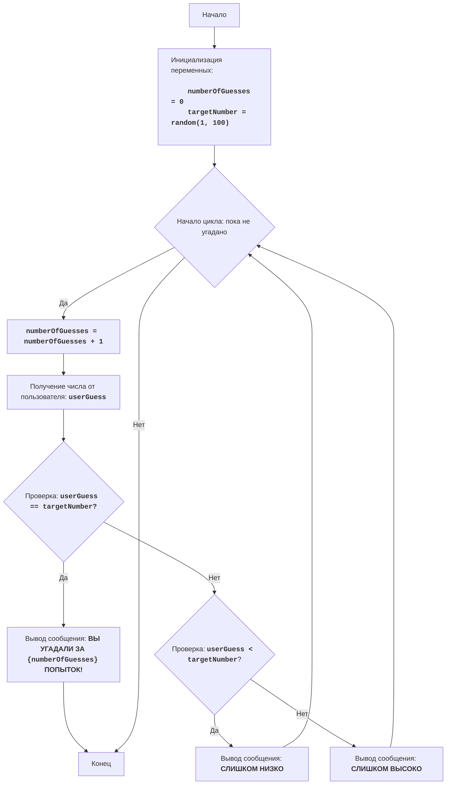

# Анализ кода модуля `hi_lo.py`

**Качество кода**
1.  Соответствие требованиям по оформлению кода: 6/10
    *   Плюсы:
        *   Код содержит docstring для модуля с описанием игры, правил, алгоритма и блок-схемой в mermaid.
        *   Используются комментарии для пояснения основных частей кода.
        *   Логика игры реализована корректно.
    *   Минусы:
        *   Не используется reStructuredText (RST) для комментариев и docstring.
        *   Отсутствует логирование ошибок.
        *   Некоторые комментарии слишком общие.
        *   Не все переменные и функции имеют docstring.
        *   Используется стандартный блок `try-except` вместо `logger.error` для обработки ошибок.

**Рекомендации по улучшению**

1.  **Формат документации**:
    *   Переписать все комментарии и docstring в формате reStructuredText (RST).
2.  **Логирование ошибок**:
    *   Использовать `from src.logger.logger import logger` для логирования ошибок.
    *   Избегать избыточного использования стандартных блоков `try-except`, заменив их на `logger.error`.
3.  **Уточнение комментариев**:
    *   Сделать комментарии более конкретными и информативными.
    *   Добавить docstring к переменным.
4.  **Импорты**:
    *   Проверить и добавить отсутствующие импорты.
5.  **Общая структура**:
    *   Убрать лишние пустые строки для улучшения читаемости.

**Оптимизированный код**

```python
"""
HI LO:
=================
קושי: 2
-----------------
Игра "Выше или ниже" - это игра в угадывание, в которой компьютер выбирает случайное число в диапазоне от 1 до 100,
а игрок должен угадать его, получая подсказки "слишком высоко" или "слишком низко", пока не угадает правильно.

Правила игры:
1. Компьютер выбирает случайное число в диапазоне от 1 до 100.
2. Игрок пытается угадать число и получает подсказку, если его предположение выше или ниже фактического числа.
3. Игра продолжается до тех пор, пока игрок не угадает правильное число.
-----------------
Алгоритм:
1. Инициализировать количество попыток до 0.
2. Сгенерировать случайное число от 1 до 100.
3. Начать цикл (пока число не угадано):
    3.1 Увеличить количество попыток на 1.
    3.2 Получить догадку от игрока.
    3.3 Если догадка равна сгенерированному числу:
        3.3.1 Показать сообщение о победе и завершить игру.
    3.4 Иначе (если догадка не равна сгенерированному числу):
        3.4.1 Если догадка меньше сгенерированного числа:
            3.4.1.1 Показать сообщение "СЛИШКОМ НИЗКО".
        3.4.2 Иначе (если догадка больше сгенерированного числа):
            3.4.2.1 Показать сообщение "СЛИШКОМ ВЫСОКО".
-----------------
Блок-схема:

Легенда:
    Start - Начало игры.
    InitializeVariables - Инициализация переменных: numberOfGuesses (количество попыток) начинается с 0, и targetNumber (число, которое нужно угадать) генерируется случайным образом между 1 и 100.
    LoopStart - Начало цикла, который будет продолжаться до тех пор, пока пользователь не угадает число.
    IncreaseGuesses - Увеличение счетчика количества попыток на 1 при каждой попытке угадать.
    InputGuess - Получение ввода от пользователя (догадка) и сохранение в переменной userGuess.
    CheckGuess - Проверка, равна ли догадка числу, которое нужно угадать.
    OutputWin - Вывод сообщения о победе пользователя, включая количество попыток, и завершение игры.
    End - Конец игры.
    CheckLow - Проверка, является ли догадка меньше числа, которое нужно угадать.
    OutputLow - Вывод сообщения о том, что догадка слишком мала и возврат к циклу.
    OutputHigh - Вывод сообщения о том, что догадка слишком велика и возврат к циклу.
"""
import random
from src.logger.logger import logger

#:  Инициализация количества попыток
numberOfGuesses = 0
#:  Выбор случайного числа от 1 до 100
targetNumber = random.randint(1, 100)

# Игровой цикл - выполняется до тех пор, пока число не будет угадано
while True:
    # Увеличивает количество попыток на 1
    numberOfGuesses += 1
    
    # Получение ввода от пользователя
    try:
        # Код преобразует ввод пользователя в целое число
        userGuess = int(input("Попробуйте угадать число (1-100): "))
    except ValueError as e:
        # Логирование ошибки, если ввод не является целым числом
        logger.error('Некорректный ввод. Пожалуйста, введите целое число.', exc_info=True)
        print("Некорректный ввод. Пожалуйста, введите целое число.")
        continue

    # Проверка, угадано ли число
    if userGuess == targetNumber:
        print(f"Поздравляю! Вы угадали число за {numberOfGuesses} попыток!")
        break  # Код завершает цикл, если число угадано
    
    # Вывод подсказки: меньше или больше
    elif userGuess < targetNumber:
        print("Слишком низко!")
    else:
        print("Слишком высоко!")

"""
Подробное объяснение кода:
1.  **Импорт модуля `random`**:
    - `import random`: импортирует модуль `random`, который используется для генерации случайных чисел.
    - `from src.logger.logger import logger`: импортирует логгер для записи ошибок.

2.  **Инициализация переменных**:
    - `numberOfGuesses = 0`: инициализирует переменную для подсчета попыток угадывания числом ноль.
    - `targetNumber = random.randint(1, 100)`: генерирует случайное целое число между 1 и 100 и сохраняет его в переменной `targetNumber`. Это число, которое должен угадать пользователь.

3.  **Игровой цикл `while True:`**:
    - `while True:`: создает бесконечный цикл, который будет продолжаться до тех пор, пока пользователь не угадает число, после чего цикл прерывается с помощью `break`.
    - `numberOfGuesses += 1`: увеличивает количество попыток на 1 с каждой итерацией цикла.

4.  **Получение ввода от пользователя**:
    - `try...except ValueError`: блок try-except, обрабатывающий возможные ошибки ввода. Если пользователь вводит что-то, что не является целым числом, выводится соответствующее сообщение, и цикл переходит к следующей итерации.
    - `userGuess = int(input("Попробуйте угадать число (1-100): "))`: просит пользователя ввести догадку и преобразует ее в целое число, сохраняя в переменную `userGuess`.

5.  **Проверка на победу**:
    - `if userGuess == targetNumber:`: проверяет, равно ли введенное пользователем число загаданному.
    - `print(f"Поздравляю! Вы угадали число за {numberOfGuesses} попыток!")`: если догадка верна, выводится сообщение с количеством попыток.
    - `break`: прерывает цикл, и игра заканчивается.

6.  **Подсказки**:
    - `elif userGuess < targetNumber:`: если догадка не верна, проверяет, меньше ли она загаданного числа.
    - `print("Слишком низко!")`: если догадка меньше, выводится сообщение об этом.
    - `else:`: если догадка не верна и не меньше загаданного числа, значит, она больше.
    - `print("Слишком высоко!")`: выводится сообщение, что догадка больше.

Код написан просто и понятно, с комментариями, объясняющими каждый шаг, что делает его легким для понимания начинающим.
"""
```