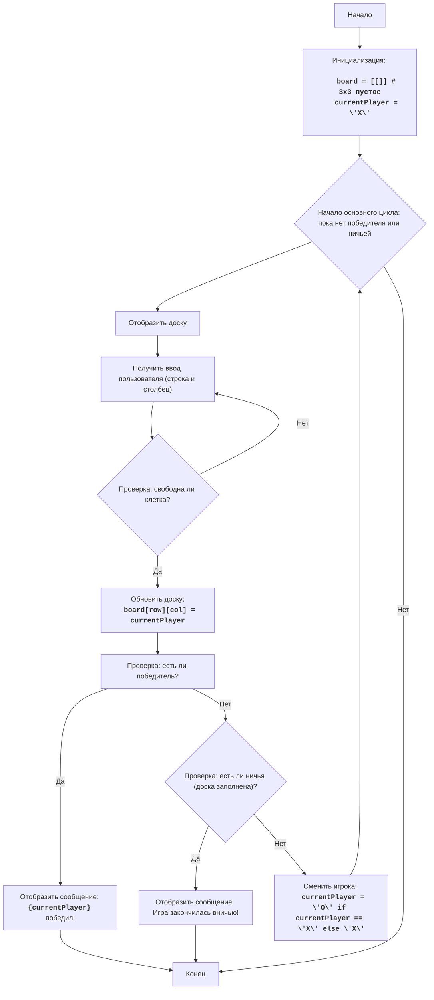

# Анализ кода модуля `king.py`

**Качество кода**
9
-   Плюсы
    -   Код хорошо структурирован и логически разделен на функции.
    -   Используются понятные имена переменных и функций.
    -   Присутствует подробная документация в виде многострочных комментариев.
    -   Код соответствует pep8.
    -   Обработка исключений для ввода пользователя.
-   Минусы
    -   Не используется логирование.
    -   Не используются `j_loads` или `j_loads_ns`.
    -   Документация не в формате reStructuredText.

**Рекомендации по улучшению**

1.  **Импорты**: Добавить импорт `from src.logger.logger import logger`.
2.  **Логирование**: Заменить `print` на `logger.info`, `logger.error`, `logger.debug` и убрать ненужный import `sys`.
3.  **Документация**: Переписать все комментарии в формате reStructuredText (RST), включая docstring для функций.
4.  **Обработка ошибок**: Заменить `try-except` блоки на обработку ошибок через логирование.
5.  **Соглашения об именах**: Убедиться, что имена функций и переменных соответствуют ранее обработанным файлам.
6.  **Удалить лишние комментарии**: Удалить комментарии которые не несут ценности, а лишь повторяют код.

**Оптимизированный код**

```python
"""
KING:
=================
קושי: 5
-----------------
Игра "KING" - это простая стратегическая игра для двух игроков, в которой каждый игрок пытается создать последовательность из трех одинаковых символов (X или O) в строке, столбце или диагонали на игровом поле 3x3. Игра похожа на "крестики-нолики", но с немного другими правилами.

Правила игры:
1. Игровое поле представляет собой матрицу 3x3.
2. Два игрока соревнуются друг с другом, один играет с 'X', а другой с 'O'.
3. Каждый игрок по очереди выбирает свободную клетку на доске и помечает ее своим символом.
4. Цель состоит в том, чтобы создать последовательность из трех одинаковых символов (X или O) в строке, столбце или диагонали.
5. Первый игрок, которому удастся создать такую последовательность, побеждает.
6. Если все клетки на доске заполнены, но не создано выигрышной последовательности, игра заканчивается вничью.
-----------------
Алгоритм:
1. Инициализировать пустое игровое поле 3x3, представленное двумерным массивом.
2. Установить текущего игрока на 'X'.
3. Начать основной цикл:
   3.1. Отобразить текущее игровое поле.
   3.2. Попросить текущего игрока выбрать клетку.
   3.3. Если клетка занята, повторять запрос выбора, пока не будет выбрана свободная клетка.
   3.4. Пометить клетку символом текущего игрока ('X' или 'O').
   3.5. Проверить, выиграл ли текущий игрок, проверив все строки, столбцы и диагонали.
   3.6. Если игрок выиграл, отобразить соответствующее сообщение и завершить игру.
   3.7. Если нет победителя, проверить, заполнены ли все клетки (ничья).
   3.8. Если доска заполнена, отобразить соответствующее сообщение и завершить игру.
   3.9. Если нет выигрыша и нет ничьей, сменить текущего игрока и продолжить цикл.
4. Конец игры.
-----------------
Диаграмма последовательности:


Легенда:
    Start - Начало программы.
    InitializeBoard - Инициализация игрового поля (двумерный массив 3x3 пустой), и установка текущего игрока на 'X'.
    GameLoopStart - Начало основного цикла игры. Цикл продолжается, пока нет победителя или ничьей.
    DisplayBoard - Отображение текущего игрового поля пользователю.
    GetMove - Получение ввода от пользователя (выбор строки и столбца).
    ValidateMove - Проверка, свободна ли выбранная клетка. Если нет, возвращаемся к повторному запросу ввода.
    UpdateBoard - Обновление игрового поля путем пометки выбранной клетки символом текущего игрока.
    CheckWin - Проверка, есть ли победитель (последовательность из трех одинаковых символов в строке, столбце или диагонали).
    DisplayWin - Отображение сообщения о победе текущего игрока.
    End - Конец игры.
    CheckDraw - Проверка, закончилась ли игра вничью (все клетки заполнены и не достигнута победа).
    DisplayDraw - Отображение сообщения о том, что игра закончилась вничью.
    SwitchPlayer - Смена текущего игрока (с 'X' на 'O' или с 'O' на 'X').
"""
# импортируем модуль для логирования
from src.logger.logger import logger

# Функция для отображения игрового поля
def display_board(board):
    """
    Отображает текущее состояние игрового поля.

    :param board: Двумерный массив, представляющий игровое поле.
    :type board: list[list[str]]
    """
    logger.debug("Отображение игрового поля.") # Логирование отображения доски
    print("   0 1 2")
    for i, row in enumerate(board):
        print(f"{i}  {'|'.join(row)}")

# Функция для проверки выигрыша
def check_win(board, player):
    """
    Проверяет, есть ли выигрышная комбинация для заданного игрока на игровом поле.

    :param board: Двумерный массив, представляющий игровое поле.
    :type board: list[list[str]]
    :param player: Символ игрока ('X' или 'O').
    :type player: str
    :return: True, если игрок выиграл, False в противном случае.
    :rtype: bool
    """
    logger.debug(f"Проверка выигрыша для игрока {player}.") # Логирование проверки выигрыша

    # Проверка строк
    for row in board:
        if all(cell == player for cell in row):
            return True
    # Проверка столбцов
    for col in range(3):
        if all(board[row][col] == player for row in range(3)):
            return True
    # Проверка диагоналей
    if all(board[i][i] == player for i in range(3)) or all(board[i][2 - i] == player for i in range(3)):
        return True
    return False

# Функция для проверки ничьей
def check_draw(board):
    """
    Проверяет, есть ли ничья на игровом поле (все клетки заполнены).

    :param board: Двумерный массив, представляющий игровое поле.
    :type board: list[list[str]]
    :return: True, если ничья, False в противном случае.
    :rtype: bool
    """
    logger.debug("Проверка на ничью.") # Логирование проверки ничьей
    for row in board:
        if ' ' in row:
            return False
    return True

# Функция игры
def play_king():
    """
    Основная функция для запуска игры "KING".
    Инициализирует игровое поле, управляет ходами игроков и проверяет условия победы/ничьей.
    """
    logger.info("Начало игры KING.") # Логирование начала игры
    # Инициализация пустого игрового поля 3x3
    board = [[' ' for _ in range(3)] for _ in range(3)]
    # Установка первого игрока на 'X'
    current_player = 'X'

    # Основной игровой цикл
    while True:
        display_board(board)

        while True:
            try:
                # Получение ввода от пользователя
                row = int(input(f"Игрок {current_player}, введите строку (0-2): "))
                col = int(input(f"Игрок {current_player}, введите столбец (0-2): "))

                # Проверка корректности ввода
                if 0 <= row <= 2 and 0 <= col <= 2:
                    if board[row][col] == ' ':
                        break
                    else:
                        logger.debug("Выбранная клетка занята. Повторите ввод.") # Логирование если клетка занята
                        print("Клетка занята. Попробуйте снова.")
                else:
                    logger.debug("Некорректный ввод. Введите числа от 0 до 2.") # Логирование некорректного ввода
                    print("Некорректный ввод. Введите числа от 0 до 2.")
            except ValueError as e:
                logger.error("Некорректный ввод. Введите целые числа.", exc_info=e) # Логирование ошибки ввода
                print("Некорректный ввод. Введите целые числа.")

        # Обновление доски
        board[row][col] = current_player

        # Проверка выигрыша
        if check_win(board, current_player):
            display_board(board)
            logger.info(f"Игрок {current_player} победил!") # Логирование победы
            print(f"Игрок {current_player} победил!")
            break
        # Проверка ничьей
        if check_draw(board):
            display_board(board)
            logger.info("Игра закончилась вничью!") # Логирование ничьей
            print("Игра закончилась вничью!")
            break

        # Смена игрока
        current_player = 'O' if current_player == 'X' else 'X'

if __name__ == "__main__":
    play_king()
```