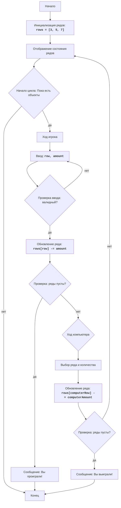

# Анализ кода модуля NIM

**Качество кода**
9
-  Плюсы
    - Код игры NIM хорошо структурирован и следует основным правилам игры.
    - Присутствует разделение на функции для отображения состояния строк и выбора хода компьютером.
    - Есть обработка ввода пользователя с проверкой на корректность.
    - Имеется описание работы кода в виде комментария в конце файла.
-  Минусы
    - Отсутствует документация в формате reStructuredText (RST) для модуля и функций.
    - Использование стандартных блоков `try-except` для обработки ошибок можно улучшить, применяя `logger.error`.
    - Код использует стандартные комментарии `#`, которые нужно переписать в RST.
    - Отсутствует импорт `logger` из `src.logger.logger`.
    - Не используется `j_loads` или `j_loads_ns` для чтения данных (хотя здесь это не требуется).

**Рекомендации по улучшению**
1. Добавить в начало файла описание модуля в формате RST.
2. Заменить все комментарии `#` на комментарии в формате RST.
3. Добавить docstring в формате RST для каждой функции.
4. Использовать `from src.logger.logger import logger` для логирования ошибок.
5. Заменить обработку ошибок `try-except` на `logger.error` с более информативными сообщениями.
6. Отрефакторить код для соответствия PEP8.

**Оптимизированный код**
```python
"""
Модуль, реализующий игру NIM.
=========================================================================================

Игра NIM - это математическая игра между двумя игроками, где игроки по очереди
удаляют объекты из разных кучек. Цель - быть последним игроком, удалившим объект.
Эта реализация представляет собой простую версию NIM с тремя рядами/кучками объектов.
Компьютер и игрок по очереди удаляют объекты из одного ряда за ход.
Игрок, удаливший последний объект, проигрывает.

Правила игры:
1. Игра начинается с 3 рядов объектов (один с 3 объектами, один с 5 и один с 7).
2. Игроки (компьютер и человек) по очереди удаляют объекты из любого ряда.
3. За ход игрок выбирает ряд и количество объектов для удаления.
4. Количество объектов, удаляемых за ход, должно быть не меньше 1 и не больше количества объектов в ряду.
5. Игрок, удаливший последний объект, проигрывает.

Алгоритм:
1. Инициализировать количество объектов в каждом ряду (ряд 1: 3 объекта, ряд 2: 5 объектов, ряд 3: 7 объектов).
2. Вывести состояние объектов в рядах.
3. Пока есть объекты:
    3.1. Ход игрока:
        3.1.1. Запросить у игрока выбор ряда и количества объектов для удаления.
        3.1.2. Проверить, что выбор валидный. Если нет, повторить запрос.
        3.1.3. Обновить количество объектов в выбранном ряду.
    3.2. Если есть объекты, ход компьютера:
        3.2.1. Компьютер выбирает ряд и количество объектов для удаления (случайным образом и в рамках правил).
        3.2.2. Обновить количество объектов в выбранном ряду.
4. Если игрок убрал последний объект, компьютер выиграл.
5. Если компьютер убрал последний объект, игрок выиграл.
6. Конец игры.

Диаграмма потока:

Легенда:
    Start - Начало игры.
    Initialize - Инициализация количества объектов в трех рядах (3, 5, 7).
    DisplayRows - Отображение состояния объектов в рядах игроку.
    LoopStart - Начало цикла, который продолжается пока есть объекты в рядах.
    PlayerTurnStart - Начало хода игрока.
    PlayerInputRow - Получение ввода от пользователя - номер ряда и количество объектов для удаления.
    ValidatePlayerInput - Проверка валидности ввода игрока (в диапазоне, есть объекты в ряду).
    UpdateRowsPlayer - Обновление количества объектов в ряду, выбранном игроком.
    CheckRowsEmpty - Проверка остались ли объекты после хода игрока.
    OutputPlayerLose - Сообщение о проигрыше игрока.
    ComputerTurnStart - Начало хода компьютера.
    ComputerChooseMove - Выбор ряда и количества объектов для удаления компьютером.
    UpdateRowsComputer - Обновление количества объектов в ряду, выбранном компьютером.
    CheckRowsEmptyComputer - Проверка остались ли объекты после хода компьютера.
    OutputComputerLose - Сообщение о проигрыше компьютера (победе игрока).
    End - Конец игры.
"""
import random
from src.logger.logger import logger # импорт logger

# Инициализация количества объектов в каждом ряду
rows = [3, 5, 7]

def display_rows() -> None:
    """
    Выводит текущее состояние рядов на экран.

    Выводит количество объектов в каждом ряду, используя символ '*' для представления каждого объекта.
    """
    print("Состояние рядов:")
    for i, row in enumerate(rows):
        print(f"Ряд {i + 1}: {'*' * row} ({row} объектов)")

def computer_move() -> tuple[int | None, int | None]:
    """
    Определяет ход компьютера.

    Случайным образом выбирает ряд и количество объектов для удаления.

    :return: Кортеж из номера ряда и количества удаляемых объектов, или (None, None), если ходов нет.
    :rtype: tuple[int | None, int | None]
    """
    # Выбор случайного ряда, в котором есть объекты
    available_rows = [i for i, count in enumerate(rows) if count > 0]
    if not available_rows:
        return None, None

    computer_row = random.choice(available_rows)
    # Выбор случайного количества объектов для удаления, но не больше чем есть в ряду
    computer_amount = random.randint(1, rows[computer_row])
    return computer_row, computer_amount

# Основной цикл игры
while True:
    display_rows()  # Отображение состояния рядов перед ходом игрока

    # Ход игрока
    while True:
        try:
            row = int(input("Выберите ряд (1, 2 или 3): ")) - 1 # Получение ряда от пользователя и преобразование к индексу
            amount = int(input("Выберите количество для удаления: "))  # Получение количества от пользователя

            # Проверка, что выбор игрока валиден
            if 0 <= row < 3 and 1 <= amount <= rows[row]:
                rows[row] -= amount   # Обновление количества объектов в ряду
                break
            else:
                print("Неверный выбор. Попробуйте снова.")  # Сообщение о неверном выборе
        except (ValueError, IndexError) as e:
             logger.error("Некорректный ввод. Введите только числа.", exc_info=e) # Логирование ошибки ввода
             print("Некорректный ввод. Введите только числа.") # Сообщение о неверном вводе

    # Проверка, проиграл ли игрок
    if all(count == 0 for count in rows):
        print("Вы проиграли! Компьютер выиграл.")
        break

    # Ход компьютера
    computer_row, computer_amount = computer_move()
    if computer_row is not None:
        rows[computer_row] -= computer_amount
        print(f"Компьютер удалил {computer_amount} объектов из ряда {computer_row + 1}.")

    # Проверка, проиграл ли компьютер
    if all(count == 0 for count in rows):
         print("Вы выиграли! Компьютер проиграл.")
         break
```