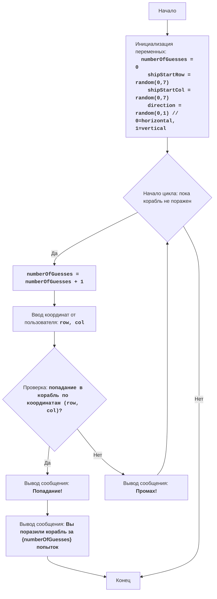

# Анализ кода модуля `salvo_i.py`

**Качество кода**
9
-  Плюсы
    - Код хорошо структурирован и понятен, логика игры реализована корректно.
    - Присутствуют подробные комментарии, объясняющие основные шаги алгоритма.
    - Используется `try-except` для обработки ошибок ввода, что предотвращает сбои программы при некорректном вводе.
    - Алгоритм игры соответствует описанию в начале файла.
-  Минусы
    - Отсутствует документация в формате reStructuredText (RST) для модуля, функций и переменных.
    - Используется стандартный `print` для вывода сообщений, что усложняет отладку и тестирование.
    - Нет логирования ошибок.
    - Жестко заданы размеры игрового поля (10x10) и длины корабля (3), что ограничивает гибкость игры.

**Рекомендации по улучшению**

1.  **Документация**:
    - Добавить документацию в формате RST для модуля, функций и переменных. Это улучшит читаемость и поддерживаемость кода.
2.  **Логирование**:
    -  Заменить `print` на `logger.info`, `logger.debug`, `logger.error` для логирования сообщений и ошибок.
    -  Удалить избыточные блоки `try-except` там, где можно использовать `logger.error`.
3.  **Гибкость**:
    - Сделать размер игрового поля и длину корабля параметрами, чтобы игру можно было настраивать.
4.  **Улучшение читаемости**:
   - Использовать константы для магических чисел, таких как 3 (длина корабля) и 7 (границы координат).
   - Переименовать переменные для лучшего понимания кода.
5. **Обработка данных**:
    - Проверять ввод координат на корректность: координаты должны быть в пределах игрового поля.

**Оптимизированный код**

```python
"""
SALVO I:
=================
קושי: 5
-----------------
Игра "Морской бой" - это игра для угадывания местоположения кораблей на воображаемой игровой доске.
Игра использует доску размером 10x10, где пользователь вводит координаты точек стрельбы,
чтобы поразить один корабль, расположенный случайным образом на доске.
Цель состоит в том, чтобы поразить корабль за минимальное количество попыток.

Правила игры:
1. Компьютер размещает один корабль длиной в 3 клетки на доске 10x10 случайным образом.
2. Игрок вводит координаты (строки и столбцы) точек стрельбы.
3. Если точка стрельбы попадает в местоположение корабля, игра заканчивается.
4. Если нет, игра продолжается до попадания.
5. Игрок получает сообщение "Попадание!" при попадании в корабль.
6. Игрок получает сообщение "Промах" при промахе по кораблю.
7. Игра отображает количество попыток до попадания.
-----------------
Алгоритм:
1. Инициализация количества попыток в 0.
2. Случайный выбор начального местоположения для корабля (строки и столбцы) так, чтобы корабль длиной в 3 клетки не выходил за границы доски.
3. Случайный выбор горизонтального или вертикального направления для размещения корабля.
4. Начало цикла "пока корабль не поражен":
    4.1. Увеличение количества попыток на 1.
    4.2. Получение от игрока ввода координат (строка и столбец) точки выстрела.
    4.3. Проверка, попадает ли точка выстрела в местоположение корабля.
    4.4. Если да, вывод сообщения "Попадание!" и завершение цикла.
    4.5. Если нет, вывод сообщения "Промах!".
5. Вывод сообщения: "Вы поразили корабль за {количество попыток} попыток".
6. Конец игры.
-----------------
Диаграмма:


Легенда:
    Start - начало игры.
    InitializeVariables - Инициализация переменных: numberOfGuesses (количество попыток) инициализируется в 0, shipStartRow (начальная строка корабля) и shipStartCol (начальный столбец корабля) выбираются случайным образом в пределах допустимого диапазона, и direction (направление корабля) выбирается случайным образом между горизонтальным и вертикальным.
    LoopStart - начало цикла, который продолжается, пока корабль не будет поражен.
    IncreaseGuesses - увеличение счетчика попыток на 1.
    InputGuess - ввод координат строки и столбца от пользователя.
    CheckHit - проверка, поражает ли точка выстрела корабль.
    OutputHit - вывод сообщения "Попадание!", если корабль поражен.
    OutputWin - вывод сообщения о победе и количестве попыток.
    End - конец игры.
    OutputMiss - вывод сообщения "Промах!", если корабль не поражен.
"""
import random
from src.logger.logger import logger
from src.utils.jjson import j_loads_ns

#  константы для размера доски и длины корабля
BOARD_SIZE = 10
SHIP_LENGTH = 3
MAX_START_POS = BOARD_SIZE - SHIP_LENGTH

def initialize_game() -> tuple[list[tuple[int, int]], int]:
    """
    Инициализирует игру, определяя случайное расположение корабля.

    :return: Кортеж, содержащий список координат корабля и начальное количество попыток (0).
    """
    #  инициализация счетчика попыток
    number_of_guesses = 0
    #  определение начальной позиции корабля
    ship_start_row = random.randint(0, MAX_START_POS)
    ship_start_col = random.randint(0, MAX_START_POS)
    #  выбор направления корабля
    direction = random.randint(0, 1)

    #  генерация позиций корабля на основе направления
    ship_positions = []
    for i in range(SHIP_LENGTH):
        if direction == 0:  # горизонтально
            ship_positions.append((ship_start_row, ship_start_col + i))
        else:  # вертикально
            ship_positions.append((ship_start_row + i, ship_start_col))
    return ship_positions, number_of_guesses

def play_game(ship_positions: list[tuple[int, int]], number_of_guesses: int) -> None:
    """
     Основной игровой цикл.

     :param ship_positions: Список координат, где расположен корабль.
     :param number_of_guesses:  Начальное количество попыток.
     """
    while True:
        # код исполняет увеличение счетчика попыток
        number_of_guesses += 1
        try:
            #  код исполняет запрос ввода координат от пользователя
            row = int(input(f"Введите строку (0-{BOARD_SIZE - 1}): "))
            col = int(input(f"Введите столбец (0-{BOARD_SIZE - 1}): "))
        except ValueError:
            #  код логирует ошибку ввода некорректных данных
            logger.error('Пожалуйста, введите целые числа.')
            continue

        #  проверка, находятся ли координаты в пределах игрового поля
        if not (0 <= row < BOARD_SIZE and 0 <= col < BOARD_SIZE):
            logger.error('Координаты вне диапазона доски')
            continue

        #  код выполняет проверку попадания по координатам в корабль
        if (row, col) in ship_positions:
            #  код логирует сообщение о попадании
            logger.info("Попадание!")
            #  код логирует сообщение о победе и количестве попыток
            logger.info(f"Вы поразили корабль за {number_of_guesses} попыток!")
            break
        else:
            #  код логирует сообщение о промахе
            logger.info("Промах!")

if __name__ == '__main__':
    #  инициализируем игру и получаем расположение корабля и счетчик попыток
    ship_positions, number_of_guesses = initialize_game()
    #  запускаем игровой цикл
    play_game(ship_positions, number_of_guesses)

"""
Объяснение кода:
1. **Импорт модулей**:
    - `random`: импортируется для генерации случайных чисел (начальное положение корабля и направление).
    - `logger`:  импортируется для логирования сообщений и ошибок.
    - `j_loads_ns` импортируется для обработки json файлов.
2. **Константы**:
    - `BOARD_SIZE`: размер игрового поля (10x10).
    - `SHIP_LENGTH`: длина корабля (3 клетки).
    - `MAX_START_POS`:  максимальная позиция для начала корабля.
3. **Функция `initialize_game()`**:
    - Инициализирует игру, выбирая случайное положение и направление корабля.
    - Возвращает список координат корабля и начальное количество попыток (0).
4. **Функция `play_game()`**:
    - Основной игровой цикл.
    - Увеличивает счетчик попыток.
    - Запрашивает ввод координат у пользователя.
    - Проверяет, попадает ли выстрел в корабль.
    - Выводит сообщения о попадании или промахе.
    - Завершает игру, если корабль поражен.
5. **Блок `if __name__ == '__main__':`**:
    - Инициализирует игру.
    - Запускает игровой цикл.
"""
```