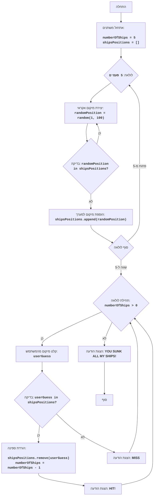

# Анализ кода модуля `salvo.py`

**Качество кода**
7
 -  Плюсы
    - Код логически понятен и соответствует правилам игры "Морской бой".
    - Используются осмысленные имена переменных, что облегчает понимание кода.
    - Присутствуют комментарии, которые объясняют основные шаги алгоритма.
    - Код содержит обработку исключения `ValueError` для пользовательского ввода.
    - Есть диаграмма процесса и описание алгоритма в начале файла.
 -  Минусы
    - Комментарии не соответствуют формату RST.
    - Используются стандартные блоки `try-except` без логирования ошибок.
    - Отсутствует импорт модуля `logger` для логирования.
    - Некоторые комментарии не полностью описывают код.
    - Не используется `j_loads` или `j_loads_ns` для чтения файлов (хотя в этом коде нет чтения файлов, но это замечание на будущее).
    - Не все комментарии к коду достаточно подробные.

**Рекомендации по улучшению**
1.  **Форматирование комментариев**:
    - Перевести все комментарии в формат reStructuredText (RST).
    - Добавить подробное описание модуля, функций и переменных в формате docstring.

2.  **Логирование ошибок**:
    - Использовать `from src.logger.logger import logger` для логирования ошибок.
    - Заменить `try-except` блоки на `logger.error` для обработки ошибок.

3.  **Обработка данных**:
    - Заменить стандартный `json.load` на `j_loads` или `j_loads_ns` из `src.utils.jjson` (если бы был файл для чтения).

4.  **Подробные комментарии**:
    - Добавить более подробные комментарии, объясняющие каждый блок кода.
    - Использовать более конкретные формулировки в комментариях (например, "код исполняет", "код проверяет" вместо "мы делаем").

5.  **Улучшение структуры**:
    - Улучшить структуру кода, если это необходимо, чтобы сделать его более читаемым и поддерживаемым.
    - В данном случае, код достаточно структурирован, но комментарии можно улучшить.

**Оптимизированный код**
```python
"""
SALVO:
=================
קושי: 4
-----------------
"סלבו" הוא משחק לוח אסטרטגי לשני שחקנים, בו כל שחקן מנסה להטביע את ספינות היריב. המשחק מתרחש על לוח ריבועי, כאשר כל שחקן ממקם את הספינות שלו במיקומים נסתרים. השחקנים מתחלפים בניסיונות לפגוע בספינות היריב על ידי הזנת קואורדינטות. המטרה היא להטביע את כל הספינות של היריב ראשון. גרסה זו היא מופשטת של המשחק.
חוקי המשחק:
1. הלוח הוא בגודל 10x10, אך הוא מיוצג באמצעות משתנים בודדים.
2. המחשב בוחר באופן אקראי 5 מיקומים בספינה (מספרים בין 1 ל-100)
3. השחקן מנסה לפגוע בספינות על ידי הזנת קואורדינטות, שהן בעצם מספרים מ-1 עד 100.
4. המחשב מודיע האם הניסיון פגע בספינה או לא.
5. המשחק נמשך עד שכל הספינות של המחשב הוטבעו.
-----------------
אלגוריתם:
1. אתחל את מספר הספינות (ships) ל-5.
2. אתחל מערך (array) ריק בשם "ships_positions".
3. בצע לולאה 5 פעמים:
  3.1. צור מיקום ספינה אקראי בין 1 ל-100.
  3.2. אם המיקום כבר קיים במערך "ships_positions", חזור לשלב 3.1.
  3.3. הוסף את המיקום החדש למערך "ships_positions".
4. התחל לולאה "כל עוד מספר הספינות גדול מ-0":
  4.1. בקש מהמשתמש להזין מיקום ניסיון.
  4.2. אם המיקום קיים במערך "ships_positions":
    4.2.1. הסר את המיקום מהמערך.
    4.2.2. הורד את מספר הספינות ב-1.
    4.2.3. הצג הודעה "HIT!".
  4.3 אחרת:
    4.3.1. הצג הודעה "MISS".
5. הצג הודעה "YOU SUNK ALL MY SHIPS!".
6. סיום המשחק.
-----------------
תרשים זרימה:

Legenda:
    Start - התחלת התוכנית.
    InitializeVariables - אתחול משתנים: numberOfShips (מספר הספינות) מאותחל ל-5, ו-shipsPositions (מערך מיקומי הספינות) מאותחל כרשימה ריקה.
    GenerateShipsLoopStart - תחילת לולאה ליצירת מיקומי הספינות (5 פעמים).
    GenerateRandomPosition - יצירת מיקום אקראי של ספינה בין 1 ל-100.
    CheckPosition - בדיקה האם המיקום האקראי כבר קיים במערך.
    AddPosition - הוספת מיקום הספינה למערך אם הוא לא קיים.
    GenerateShipsLoopEnd - סוף לולאת יצירת מיקומי הספינות.
    GameLoopStart - תחילת לולאה של המשחק, כל עוד יש ספינות שלא הוטבעו.
    InputGuess - קליטת מיקום ניסיון מהמשתמש.
    CheckHit - בדיקה האם הניסיון פגע בספינה (האם המיקום נמצא במערך מיקומי הספינות).
    RemoveShip - הורדת הספינה: הסרת המיקום הפגוע מהמערך, והורדת מונה הספינות ב-1.
    OutputHit - הצגת הודעה "HIT!".
    OutputMiss - הצגת הודעה "MISS".
    OutputWin - הצגת הודעת ניצחון "YOU SUNK ALL MY SHIPS!".
    End - סוף התוכנית.
"""
import random
# from src.logger.logger import logger  # TODO: импортировать logger
# 1.  Импортируется модуль random для генерации случайных чисел.
#    Этот модуль используется для определения случайного местоположения кораблей.

# 2.  Инициализация количества кораблей и списка их позиций.
numberOfShips = 5
# 2.1  Переменная `numberOfShips` инициализируется значением 5,
#    что представляет количество кораблей, которые игрок должен потопить.
shipsPositions = []
# 2.2  Список `shipsPositions` инициализируется как пустой.
#    Этот список будет содержать случайные позиции кораблей на игровом поле.

# 3.  Цикл для создания 5 случайных позиций кораблей.
for _ in range(5):
    # 3.1  Бесконечный цикл, который продолжается до тех пор,
    #    пока не будет найдена уникальная позиция корабля.
    while True:
        # 3.1.1  Генерируется случайная позиция корабля в диапазоне от 1 до 100.
        randomPosition = random.randint(1, 100)
        # 3.1.2  Проверяется, если эта позиция еще не была выбрана.
        if randomPosition not in shipsPositions:
            # 3.1.3  Если позиция уникальна, она добавляется в список `shipsPositions`.
            shipsPositions.append(randomPosition)
            # 3.1.4  Цикл прерывается, так как уникальная позиция найдена.
            break

# 4.  Основной игровой цикл.
while numberOfShips > 0:
    try:
        # 4.1  Код запрашивает ввод от пользователя (предполагаемую позицию корабля) и преобразует его в целое число.
        userGuess = int(input('נסה לפגוע בספינה (1-100): '))
    except ValueError:
        # logger.error('Введен некорректный формат числа')  # TODO: добавить логирование ошибки
        # 4.1.1 Если пользователь ввел некорректный формат, выводится сообщение об ошибке.
        print('אנא הזן מספר שלם בין 1 ל-100.')
        # 4.1.2 Код переходит к началу цикла.
        continue

    # 4.2 Код проверяет, соответствует ли введенная пользователем позиция позиции корабля.
    if userGuess in shipsPositions:
        # 4.2.1 Если позиция совпадает, код удаляет эту позицию из списка `shipsPositions`.
        shipsPositions.remove(userGuess)
        # 4.2.2 Количество кораблей уменьшается на 1.
        numberOfShips -= 1
        # 4.2.3 Код выводит сообщение о попадании.
        print('פגיעה!')
    else:
        # 4.3 Если позиция не совпадает, код выводит сообщение о промахе.
        print('החטאה.')

# 5.  Код выводит сообщение о победе, когда все корабли потоплены.
print('הטבעת את כל הספינות שלי!')
"""
# TODO: добавить описание модуля
"""
Описание кода:
    - Код представляет собой игру "Морской бой" в упрощенном виде, где игрок пытается потопить корабли компьютера.
    - Корабли компьютера располагаются в случайных местах на игровом поле 10x10.
    - Игрок вводит координаты, и программа сообщает, попал ли игрок в корабль или нет.
    - Игра продолжается до тех пор, пока все корабли компьютера не будут потоплены.
"""
```