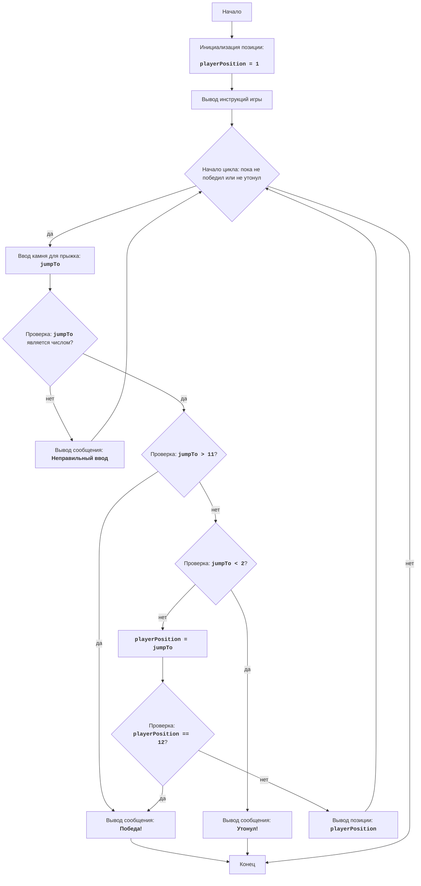

# Анализ кода модуля `word.py`

**Качество кода: 7/10**

*   **Плюсы:**
    *   Код игры "FROG" достаточно прост для понимания и выполняет поставленную задачу.
    *   Используются комментарии, описывающие логику игры.
    *   Логика игры четко структурирована и понятна.
    *   Есть обработка исключений для некорректного ввода пользователя.
    *   Присутствует описание игры в начале файла и алгоритм работы, а так же диаграмма.

*   **Минусы:**
    *   Отсутствует reStructuredText (RST) для комментариев и docstring.
    *   Не используется `from src.logger.logger import logger` для логирования ошибок.
    *   Используется стандартный блок `try-except` без `logger.error`.
    *   Некоторые комментарии можно сделать более информативными.
    *   Не используется `j_loads` или `j_loads_ns` из `src.utils.jjson`.

**Рекомендации по улучшению**

1.  **Документация RST**: Переписать комментарии и docstring в формате reStructuredText (RST), чтобы соответствовать стандартам документации.
2.  **Логирование**: Заменить `print` на `logger.error` для обработки ошибок и логирования событий.
3.  **Обработка исключений**: Улучшить обработку исключений, используя `logger.error` для записи ошибок.
4.  **Убрать избыточность**: Удалить лишние комментарии и переформулировать комментарии, которые несут мало информации.
5.  **Импорты**: Проверить и добавить необходимые импорты в код, если они есть, но отсутствуют.
6.  **Использовать `j_loads`**: Использовать `j_loads` или `j_loads_ns` из `src.utils.jjson`, если требуется чтение файлов.

**Оптимизированный код**

```python
"""
FROG:
=================
קושי: 5
-----------------
Игра "Цапля" - это игра, где игрок пытается достичь противоположного берега реки, прыгая по камням.
На каждом ходу игрок выбирает, на какой камень прыгнуть, и игра определяет, был ли прыжок успешным,
куда игрок приземлился и утонул ли он. Игра заканчивается, когда игрок достиг противоположного берега или утонул.

Правила игры:
1. Игрок начинает в позиции 1 (один берег реки).
2. В реке 10 камней, отмеченных номерами от 2 до 11.
3. Игрок должен достичь камня 12 (противоположный берег реки), чтобы выиграть.
4. На каждом ходу игрок выбирает, на какой камень прыгнуть.
5. Если игрок прыгает на существующий камень, он достигает его.
6. Если игрок прыгает в несуществующее место, он тонет.
7. Если игрок достигает камня 12, он побеждает.
-----------------
Алгоритм:
1. Установите начальную позицию игрока как 1.
2. Выведите инструкции к игре и отобразите текущую позицию игрока.
3. Начните цикл "пока игрок не достиг конца или не утонул":
    3.1 Получите ввод от игрока, на какой камень прыгнуть.
    3.2 Если ввод не является числом, выведите сообщение об ошибке и вернитесь к шагу 3.1.
    3.3 Если игрок прыгнул в место больше 11 (т. е. на другую сторону реки) - игрок победил, выйдите из цикла.
    3.4 Если игрок прыгнул в место меньше 2, игрок утонул, выйдите из цикла.
    3.5 Обновите позицию игрока на позицию, куда он прыгнул.
    3.6 Если игрок достиг позиции 12, он победил, выйдите из цикла.
    3.7 Отобразите позицию игрока.
4. Если игрок достиг другого берега, выведите сообщение о победе.
5. В противном случае (игрок утонул) выведите сообщение об утоплении.
6. Конец игры.
-----------------
Диаграмма:


Легенда:
    Start - Начало программы.
    InitializePosition - Инициализация позиции игрока в 1 (начало реки).
    OutputInstructions - Вывод инструкций игры для игрока.
    LoopStart - Начало главного цикла, пока игрок не выиграл или не утонул.
    InputJump - Получение ввода от пользователя, на какой камень прыгнуть (jumpTo).
    ValidateInput - Проверка, является ли ввод правильным числом.
    OutputError - Вывод сообщения об ошибке, если ввод не является числом.
    CheckWin - Проверка, прыгнул ли игрок за реку - победа.
    OutputWin - Вывод сообщения о победе.
    End - Конец программы.
    CheckLose - Проверка, прыгнул ли игрок в воду - проигрыш.
    OutputLose - Вывод сообщения о проигрыше - утопление.
    UpdatePosition - Обновление позиции игрока на позицию, куда он прыгнул.
    CheckFinalPosition - Проверка, достиг ли игрок противоположного берега реки.
    OutputPosition - Вывод текущей позиции игрока.
"""

#  импортируем модуль sys
import sys
# импортируем logger
from src.logger.logger import logger

"""
Описание:
Игра FROG имитирует прыжки лягушки по камням в реке.
Игрок начинает в позиции 1 и должен достичь позиции 12.
На каждом ходу игрок вводит номер камня, на который он хочет прыгнуть.
Если игрок прыгает за камни или в воду, он проигрывает.
"""

def play_frog_game():
    """
    Запускает игру "Лягушка".

    Инициализирует начальную позицию игрока, выводит инструкции,
    и затем запускает игровой цикл, в котором игрок прыгает по камням
    до победы или поражения.
    """
    # Начальная позиция игрока
    playerPosition = 1

    # Вывод инструкций для пользователя
    print("Вы лягушка, которая должна пересечь реку, прыгая по камням.")
    print("В реке 10 камней, от номера 2 до 11.")
    print("Вы должны достичь камня 12, чтобы победить.")
    print("Если вы прыгнете за камни или в воду - вы утонете!")
    print("Выбирайте, на какой камень хотите прыгнуть на каждом ходу.")

    # Игровой цикл
    while True:
        print(f"Вы сейчас в позиции: {playerPosition}")
        try:
            #  Получаем ввод от пользователя
            jumpTo = int(input("На какой камень вы хотите прыгнуть? "))
        except ValueError:
            #  Обработка неверного ввода
            logger.error("Некорректный ввод. Пожалуйста, введите целое число.")
            continue

        # Проверяем, выиграл ли игрок
        if jumpTo > 11:
            print("Вы достигли другой стороны реки! Вы выиграли!")
            break

        # Проверяем, утонул ли игрок
        if jumpTo < 2:
            print("Вы утонули в воде! Вы проиграли!")
            break

        # Обновляем позицию игрока
        playerPosition = jumpTo
        if playerPosition == 12:
          print("Вы достигли другой стороны реки! Вы выиграли!")
          break

if __name__ == "__main__":
    play_frog_game()

"""
Подробное объяснение кода:
1.  **Импорт модуля `sys`**:
    - `import sys`: импортируется модуль `sys`, который не используется непосредственно в текущей игре,
      но может быть полезен в других случаях.
2.  **Импорт модуля `logger`**:
    - `from src.logger.logger import logger`: импортируется модуль `logger` для логирования ошибок.
3.  **Функция `play_frog_game()`**:
    - `def play_frog_game():`: определяет функцию, содержащую игровую логику.
    - `playerPosition = 1`: инициализирует позицию лягушки в 1, что является началом пути.
4.  **Вывод инструкций игры**:
    - Выводит описание игры, включая цель (достичь камня 12), правила и последствия неправильных прыжков.
5.  **Игровой цикл `while True:`**:
    - Бесконечный цикл, который позволяет продолжать игру до победы или поражения игрока.
6.  **Отображение текущей позиции и получение ввода**:
    - Выводит текущую позицию игрока.
    - `try...except ValueError`: блок try-except обрабатывает возможные ошибки ввода. Если пользователь вводит не целое число, отобразится сообщение об ошибке.
    - `jumpTo = int(input("На какой камень вы хотите прыгнуть? "))`: Получает ввод от пользователя, на какой камень он хочет прыгнуть, и преобразует его в целое число.
7.  **Проверка условия победы**:
    - `if jumpTo > 11:`: проверяет, прыгнул ли игрок на камень 12 или дальше - победа.
    - `print("Вы достигли другой стороны реки! Вы выиграли!")`: выводит сообщение о победе.
    - `break`: завершает цикл, если игрок победил.
8.  **Проверка условия поражения**:
    - `if jumpTo < 2:`: проверяет, прыгнул ли игрок в воду.
    - `print("Вы утонули в воде! Вы проиграли!")`: выводит сообщение о поражении.
    - `break`: завершает цикл, если игрок проиграл.
9.  **Обновление позиции игрока**:
    - `playerPosition = jumpTo`: обновляет позицию лягушки на позицию, куда она прыгнула.
10. **Проверка достиг ли игрок противоположного берега**:
    - `if playerPosition == 12`: проверка, достиг ли игрок камня 12 (победа).
    -  `print("Вы достигли другой стороны реки! Вы выиграли!")`: вывод сообщения о победе.
    -  `break`: завершает цикл (и игру), если игрок достиг финиша.
11. **Запуск игры**:
    - `if __name__ == "__main__":`: этот блок гарантирует, что код запустится только если скрипт запущен напрямую, а не как модуль.
    - `play_frog_game()`: вызов функции для запуска игры.
"""
```