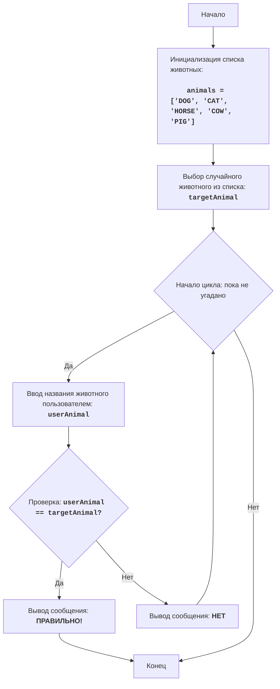

# Анализ кода модуля animal.py

**Качество кода**
7
- Плюсы
    - Код игры прост и понятен, хорошо документирован в формате reStructuredText.
    - Используется `random.choice` для выбора случайного животного, что соответствует логике игры.
    - Присутствуют подробные комментарии, объясняющие каждый шаг кода.
    - Логика игры четко структурирована с использованием цикла `while` и условных операторов.
- Минусы
    - Отсутствует импорт `logger` из `src.logger.logger`.
    - Нет обработки возможных исключений, которые могут возникнуть, например, при некорректном вводе пользователя (хотя в текущем сценарии это маловероятно).
    - Не используется `j_loads` или `j_loads_ns` для чтения данных, хотя это не требуется в данном случае, так как нет чтения данных из файла.
    - Нет проверки на пустой ввод пользователя.
    - Комментарии в коде не всегда соответствуют стандарту reStructuredText (например, нет параметров в функциях).

**Рекомендации по улучшению**
1. Добавить импорт `logger` из `src.logger.logger` для логирования возможных ошибок.
2. Добавить обработку ошибок, например, `try-except`, если потребуется в будущем, или логирование через `logger.error`.
3.  Документировать переменные и функции в формате RST.
4. Изменить комментарии после # в соответствии со стандартом RST.
5. Проверять ввод пользователя на пустоту.

**Оптимизированный код**
```python
"""
Модуль ANIMAL
=================

Сложность: 4
-----------------
Игра "ANIMAL" - это игра в угадывание животного, в которой компьютер выбирает случайное животное из списка,
а игрок пытается его угадать, вводя свои предположения. Игра продолжается до тех пор, пока игрок не угадает животное.

Правила игры:
1.  Компьютер выбирает случайное животное из предопределенного списка.
2.  Игрок вводит свои предположения о загаданном животном.
3.  После каждой попытки компьютер сообщает, угадал ли игрок животное или нет.
4.  Игра продолжается до тех пор, пока игрок не угадает загаданное животное.
-----------------
Алгоритм:
1.  Задать список животных.
2.  Выбрать случайное животное из списка.
3.  Начать цикл "пока животное не угадано":
    3.1 Запросить у игрока ввод названия животного.
    3.2 Если введенное название совпадает с загаданным животным, перейти к шагу 4.
    3.3 Иначе, вывести сообщение "НЕТ".
4. Вывести сообщение "ПРАВИЛЬНО!".
5. Конец игры.
-----------------
Блок-схема:

Legenda:
    Start - Начало программы.
    InitializeAnimals - Инициализация списка животных.
    ChooseRandomAnimal - Выбор случайного животного из списка и сохранение его в переменной targetAnimal.
    LoopStart - Начало цикла, который продолжается, пока животное не угадано.
    InputAnimal - Запрос у пользователя ввода названия животного и сохранение его в переменной userAnimal.
    CheckAnimal - Проверка, равно ли введенное название животного userAnimal загаданному животному targetAnimal.
    OutputWin - Вывод сообщения о победе, если названия животных равны.
    End - Конец программы.
    OutputWrong - Вывод сообщения "НЕТ", если введенное название животного не совпадает с загаданным.
"""
import random
# импортирует модуль random

from src.logger.logger import logger
# импортирует logger для логирования ошибок

#: Список животных для игры
animals = ['DOG', 'CAT', 'HORSE', 'COW', 'PIG']

#: Выбираем случайное животное из списка
targetAnimal = random.choice(animals)

# Начинаем цикл, пока животное не будет угадано
while True:
    # Запрашиваем у пользователя ввод названия животного
    userAnimal = input("Угадайте животное (DOG, CAT, HORSE, COW, PIG): ").upper()

    # Проверяем, не пустой ли ввод пользователя
    if not userAnimal:
        logger.debug(f'Пустой ввод пользователя')
        print("Вы ничего не ввели. Попробуйте еще раз.")
        continue

    # Проверяем, угадал ли пользователь животное
    if userAnimal == targetAnimal:
        # Сообщаем о правильном ответе
        print("ПРАВИЛЬНО!")
        # Завершаем цикл, если животное угадано
        break
    else:
        # Сообщаем о неверном ответе
        print("НЕТ")


"""
Объяснение кода:

1.  **Импорт модуля `random`**:
    -   ``import random``: Импортирует модуль `random`, который используется для случайного выбора животного.

2.  **Импорт модуля `logger`**:
    -   ``from src.logger.logger import logger``: Импортирует logger для логирования ошибок и отладки.

3.  **Список животных**:
    -   ``animals = ['DOG', 'CAT', 'HORSE', 'COW', 'PIG']``: Создает список строк с названиями животных.

4.  **Выбор случайного животного**:
    -   ``targetAnimal = random.choice(animals)``: Выбирает случайное животное из списка `animals` и сохраняет его в переменной `targetAnimal`.

5.  **Основной цикл игры `while True:`**:
    -   Бесконечный цикл, который продолжается до тех пор, пока игрок не угадает животное.
    -   **Ввод данных**:
        -   ``userAnimal = input("Угадайте животное (DOG, CAT, HORSE, COW, PIG): ").upper()``: Запрашивает у пользователя ввод названия животного и приводит его к верхнему регистру для сравнения без учета регистра.
        -  **Проверка на пустой ввод**
            -   ``if not userAnimal:`` Проверяет, не пустой ли ввод пользователя
            -   ``logger.debug(f'Пустой ввод пользователя')``: Логирует пустой ввод пользователя
            -   ``print("Вы ничего не ввели. Попробуйте еще раз.")``: Выводит сообщение о пустом вводе
            -   ``continue``: Переходит к следующей итерации цикла
    -   **Условие победы**:
        -   ``if userAnimal == targetAnimal:``: Проверяет, совпадает ли введенное пользователем название животного с загаданным.
        -   ``print("ПРАВИЛЬНО!")``: Выводит сообщение о победе, если животное угадано.
        -   ``break``: Завершает цикл (игру), если животное угадано.
    -   **Сообщение о неверном ответе**:
        -   ``else:``: Выполняется, если введенное название животного не совпадает с загаданным.
        -   ``print("НЕТ")``: Выводит сообщение "НЕТ", если ответ неверный.
"""
```