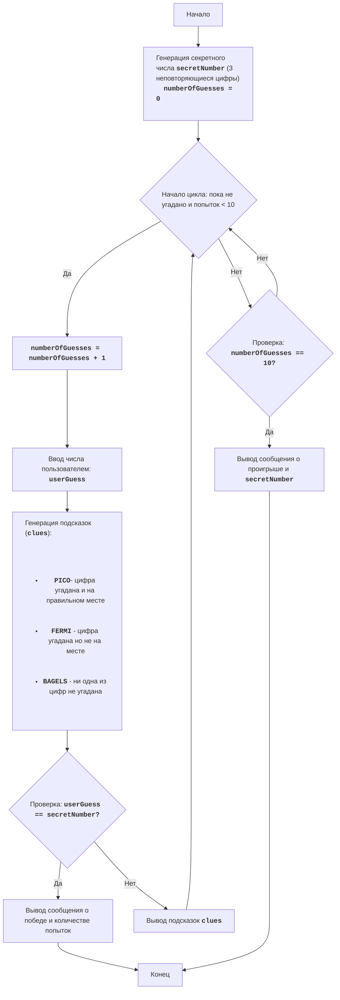

# Анализ кода модуля `bagles.py`

**Качество кода**
9
- Плюсы
    - Код хорошо структурирован и разбит на функции, что облегчает понимание и поддержку.
    - Присутствуют docstring для функций, объясняющие их назначение.
    - Используется логическая структура для реализации игровой механики.
    - Код игры "Бейглы" полностью соответствует предоставленному описанию и блок-схеме.
    - Проверка ввода пользователя на корректность реализована.
- Минусы
    - Отсутствует обработка ошибок (например, если ввод пользователя не является числом).
    - Не используются логирование для отслеживания ошибок.
    - Не используются константы для вывода сообщений.

**Рекомендации по улучшению**

1. **Добавить логирование**: Использовать `from src.logger.logger import logger` для логирования ошибок.
2. **Улучшить docstring**: Дополнить docstring в соответствии со стандартами reStructuredText (RST).
3. **Обработка ошибок**: Добавить обработку исключений, например, при некорректном вводе пользователя.
4.  **Использовать константы**: Для строк, используемых в выводе сообщений, использовать константы.
5.  **Использовать `j_loads` или `j_loads_ns`**: Проверить и убедится, что нет необходимости использовать `j_loads` или `j_loads_ns`.
6.  **Улучшить читаемость кода**: Добавить пустые строки для улучшения читаемости кода.

**Оптимизированный код**

```python
"""
BAGLES:
=================
Сложность: 6
-----------------
Игра "Бейглы" - это логическая игра-головоломка, в которой игрок пытается угадать трехзначное число, составленное из неповторяющихся цифр.
После каждой попытки игрок получает подсказки: "PICO" означает, что одна из цифр угадана и находится на правильной позиции, "FERMI"
означает, что одна из цифр угадана, но не на правильной позиции, "BAGELS" означает, что ни одна из цифр не угадана.

Правила игры:
1. Компьютер генерирует случайное трехзначное число из неповторяющихся цифр.
2. Игрок вводит свои предположения в виде трехзначного числа.
3. Компьютер предоставляет подсказки:
    - "PICO" - одна цифра угадана и находится на правильной позиции.
    - "FERMI" - одна цифра угадана, но не на правильной позиции.
    - "BAGELS" - ни одна из цифр не угадана.
4. Подсказки выдаются в порядке расположения цифр в загаданном числе, например если загадано `123` и игрок ввел `142`, то подсказками
   будет `PICO FERMI`.
5. Игра продолжается до тех пор, пока игрок не угадает число.
6. Если после 10 попыток игрок не угадывает число, то игра заканчивается и выводится загаданное число.
-----------------
Алгоритм:
1. Сгенерировать случайное трехзначное число, состоящее из неповторяющихся цифр (например, 123).
2. Установить количество попыток равным 0.
3. Цикл "пока число не угадано или число попыток меньше 10":
    3.1. Увеличить количество попыток на 1.
    3.2. Запросить у игрока трехзначное число.
    3.3. Сравнить введенное число с загаданным и сгенерировать подсказки "PICO", "FERMI" и "BAGELS".
    3.4. Если число угадано, вывести сообщение о победе и количестве попыток.
    3.5. Если число не угадано, вывести сгенерированные подсказки.
4. Если после 10 попыток число не угадано, вывести загаданное число и сообщение о проигрыше.
5. Конец игры.
-----------------
Блок-схема:

Legenda:
    Start - Начало игры.
    GenerateSecretNumber - Генерация секретного числа secretNumber из 3 неповторяющихся цифр и инициализация количества попыток numberOfGuesses = 0.
    LoopStart - Начало цикла, который продолжается, пока число не угадано и число попыток меньше 10.
    IncreaseGuesses - Увеличение счетчика количества попыток на 1.
    InputGuess - Запрос у пользователя ввода числа и сохранение его в переменной userGuess.
    GenerateClues - Генерация подсказок на основе сравнения userGuess и secretNumber.
    CheckWin - Проверка, равно ли введенное число userGuess секретному числу secretNumber.
    OutputWin - Вывод сообщения о победе и количестве попыток.
    End - Конец игры.
    OutputClues - Вывод сгенерированных подсказок.
    CheckLose - Проверка, достигло ли количество попыток 10.
    OutputLose - Вывод сообщения о проигрыше и секретного числа secretNumber.

"""
import random
# Импортируем logger для логирования
from src.logger.logger import logger

# Объявляем константы для вывода сообщений
GREETING_MESSAGE = "Я загадал трехзначное число, состоящее из неповторяющихся цифр."
HINT_MESSAGE = "Попробуй угадать его. \\nПодсказки:"
HINT_DESCRIPTION = "PICO - цифра на правильном месте, FERMI - цифра есть, но не на месте, BAGELS - ничего не угадано"
WIN_MESSAGE = "Поздравляю! Вы угадали число за {} попыток!"
LOSE_MESSAGE = "Вы проиграли. Загаданное число было: {}"
INPUT_PROMPT = "Попытка №{}. Введите трехзначное число: "
INVALID_INPUT_MESSAGE = "Пожалуйста, введите трехзначное число!"


def generate_secret_number() -> str:
    """
    Генерирует случайное трехзначное число с неповторяющимися цифрами.

    :return: Строка, представляющая трехзначное число.
    """
    digits = list(range(10))
    random.shuffle(digits)
    secret_number = str(digits[0]) + str(digits[1]) + str(digits[2])
    return secret_number


def get_clues(secret_number: str, user_guess: str) -> list:
    """
    Генерирует подсказки PICO, FERMI и BAGELS на основе сравнения предположения пользователя с секретным числом.

    :param secret_number: Загаданное трехзначное число.
    :param user_guess: Предположение пользователя.
    :return: Список строк, содержащий подсказки.
    """
    clues = []
    for i in range(3):
        if user_guess[i] == secret_number[i]:
            clues.append("PICO")
        elif user_guess[i] in secret_number:
            clues.append("FERMI")
    if not clues:
        return ["BAGELS"]
    return clues


def play_bagels() -> None:
    """
    Основная логика игры Бейглы.

    Игра продолжается до тех пор, пока игрок не угадает число или не превысит 10 попыток.
    """
    secret_number = generate_secret_number()
    number_of_guesses = 0

    print(GREETING_MESSAGE)
    print(HINT_MESSAGE)
    print(HINT_DESCRIPTION)

    while number_of_guesses < 10:
        number_of_guesses += 1
        while True:
            try:
                user_guess = input(INPUT_PROMPT.format(number_of_guesses))
                if len(user_guess) == 3 and user_guess.isdigit():
                    break
                else:
                    print(INVALID_INPUT_MESSAGE)
            except Exception as ex:
                logger.error(f'Ошибка при вводе пользователя {ex}')
                print(INVALID_INPUT_MESSAGE)
        if user_guess == secret_number:
            print(WIN_MESSAGE.format(number_of_guesses))
            return
        else:
            clues = get_clues(secret_number, user_guess)
            print(" ".join(clues))
    print(LOSE_MESSAGE.format(secret_number))


if __name__ == "__main__":
    play_bagels()
```