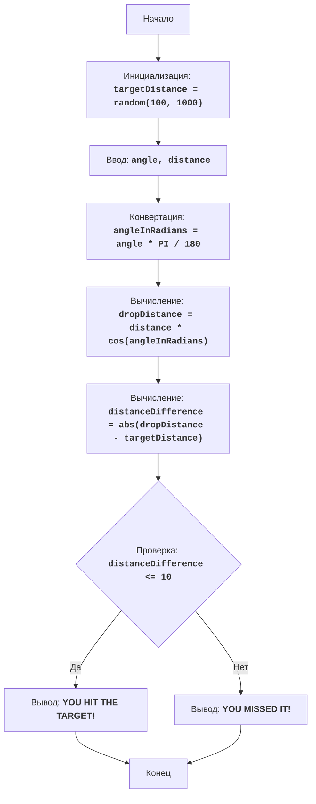

# Анализ кода модуля bomber.py

**Качество кода**
8
- Плюсы
    - Код имеет подробное описание в виде docstring, объясняющее правила игры, алгоритм и блок-схему.
    - Присутствует обработка ошибок ввода (проверка на `ValueError` при вводе угла и расстояния).
    - Используются комментарии, объясняющие основные этапы выполнения кода.
    - Присутствуют необходимые импорты модулей `random` и `math`.
- Минусы
    - Код не использует `logger` для логирования ошибок.
    - Комментарии в коде не соответствуют формату `reStructuredText (RST)`.
    - Используется стандартный `print` для вывода, вместо логирования через `logger`.
    - Отсутствует docstring для модуля, функций и переменных.

**Рекомендации по улучшению**

1.  Добавить docstring в формате RST для модуля, функций и переменных.
2.  Заменить `print` на `logger.info` или `logger.error` для логирования.
3.  Удалить блок `try-except` и заменить обработку ошибок через `logger.error`
4.  Переписать все комментарии в формате RST.

**Оптимизированный код**

```python
"""
Модуль для игры в "Бомбер"
=========================================================================================

Игра "Бомбер" - это игра-головоломка, в которой игрок пытается сбросить бомбу на цель,
расположенную на случайно сгенерированном расстоянии. Игрок вводит угол сброса и расстояние,
а компьютер вычисляет траекторию бомбы. Цель игры - как можно точнее попасть в цель.

Правила игры:
    1. Компьютер генерирует случайное расстояние до цели в диапазоне от 100 до 1000.
    2. Игрок вводит угол сброса бомбы и расстояние сброса бомбы.
    3. Компьютер вычисляет расстояние, на которое упадет бомба.
    4. Если расстояние падения бомбы находится в пределах 10 единиц от расстояния до цели, игрок побеждает.
    5. Если расстояние падения бомбы не попадает в диапазон, то игрок проигрывает.
-----------------
Алгоритм:
    1. Сгенерировать случайное расстояние до цели в диапазоне от 100 до 1000 и присвоить переменной `targetDistance`.
    2. Запросить у игрока угол сброса бомбы в градусах (угол) и расстояние сброса (расстояние).
    3. Преобразовать угол из градусов в радианы `angleInRadians = angle * 3.14159 / 180`.
    4. Вычислить расстояние падения бомбы по формуле: `dropDistance = distance * cos(angleInRadians)`.
    5. Вычислить разницу между расстоянием падения бомбы и расстоянием до цели: `distanceDifference = abs(dropDistance - targetDistance)`.
    6. Если разница между расстояниями меньше или равна 10, то вывести сообщение о выигрыше.
    7. Иначе вывести сообщение о проигрыше.
    8. Конец игры.
-----------------
Блок-схема:

Legenda:
    Start - Начало программы.
    InitializeTargetDistance - Инициализация: генерируется случайное расстояние до цели (targetDistance) от 100 до 1000.
    InputAngleDistance - Запрос у пользователя угла сброса (angle) и расстояния сброса (distance).
    ConvertAngle - Преобразование угла из градусов в радианы (angleInRadians).
    CalculateDropDistance - Вычисление расстояния падения бомбы (dropDistance) на основе введенных данных.
    CalculateDistanceDifference - Вычисление абсолютной разницы между расстоянием падения бомбы (dropDistance) и расстоянием до цели (targetDistance).
    CheckDistanceDifference - Проверка, находится ли разница между расстояниями в пределах 10 единиц (distanceDifference <= 10).
    OutputWin - Вывод сообщения о выигрыше, если разница в пределах 10 единиц.
    End - Конец программы.
    OutputLose - Вывод сообщения о проигрыше, если разница больше 10 единиц.
"""
import random
import math
from src.logger.logger import logger # подключаем logger

# Генерируем случайное расстояние до цели от 100 до 1000
targetDistance = random.randint(100, 1000)

# Запрашиваем ввод угла и расстояния сброса бомбы
try:
    # Запрашивает у пользователя угол сброса бомбы в градусах и преобразует введенное значение в число с плавающей точкой.
    angle = float(input("Введите угол сброса бомбы в градусах: "))
    # Запрашивает у пользователя расстояние сброса бомбы и преобразует введенное значение в число с плавающей точкой.
    distance = float(input("Введите расстояние сброса бомбы: "))
except ValueError as e:
    # Логируем ошибку, если пользователь ввел не числовые значения.
    logger.error('Ошибка: Пожалуйста, введите числовые значения для угла и расстояния.', exc_info=True)
    exit()

# Преобразовывает угол из градусов в радианы.
angleInRadians = angle * math.pi / 180

# Вычисляет расстояние, на которое упадет бомба.
dropDistance = distance * math.cos(angleInRadians)

# Вычисляет разницу между расстоянием падения бомбы и расстоянием до цели.
distanceDifference = abs(dropDistance - targetDistance)

# Проверяем, попала ли бомба в цель
if distanceDifference <= 10:
    # Если разница между расстояниями меньше или равна 10, логирует сообщение о выигрыше
    logger.info("ПОЗДРАВЛЯЮ! Вы поразили цель!")
else:
    # Если разница больше 10, логирует сообщение о проигрыше
    logger.info("Вы промахнулись!")
```