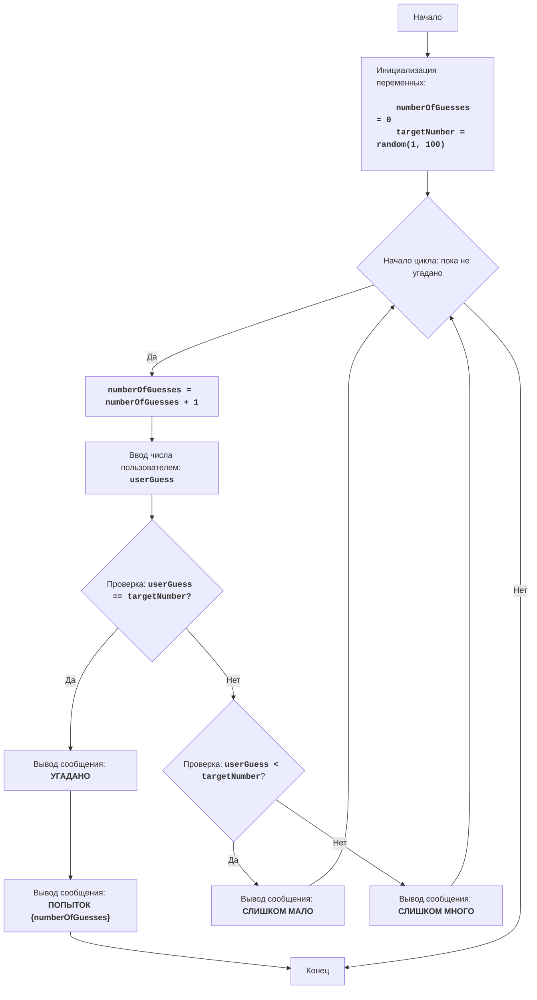

# Анализ кода модуля `buzzwd.py`

**Качество кода: 7/10**

-   **Плюсы:**
    -   Код игры прост и понятен, алгоритм реализован верно.
    -   Используется блок `try-except` для обработки ошибок ввода, что повышает устойчивость программы.
    -   Логика игры четко следует алгоритму, описанному в начале файла.
    -   Есть подробное описание алгоритма игры в начале файла и в конце в комментариях.

-   **Минусы:**
    -   Не используется `j_loads` или `j_loads_ns` для чтения данных, хотя это не требуется в данном коде.
    -   Отсутствуют docstring для модуля, переменных, и функций (в данном случае их нет).
    -   Не используется логирование ошибок.
    -   Стиль комментариев `reStructuredText`  не используется.

**Рекомендации по улучшению:**

1.  **Добавить docstring:** Добавить описание модуля в формате `reStructuredText`, а также описания для переменных и функций (хотя в данном коде нет функций).
2.  **Использовать логирование:** Заменить `print` на `logger.info` для информационных сообщений и `logger.error` для ошибок.
3.  **Форматирование комментариев:** Привести все комментарии в соответствие со стандартом reStructuredText.
4.  **Удалить лишнее:** Убрать ненужные комментарии в конце кода.

**Оптимизированный код**

```python
"""
BUZZWD:
=================
Сложность: 4
-----------------
Игра "BUZZWD" представляет собой простую числовую игру, где компьютер генерирует случайное число, а игрок должен угадать его, вводя числа по очереди.
После каждого ввода программа сообщает, является ли введенное число "слишком высоким", "слишком низким" или же оно угадано.
Игра завершается, когда игрок правильно угадывает число.

Правила игры:
1. Компьютер выбирает случайное целое число от 1 до 100.
2. Игрок вводит свои предположения о загаданном числе.
3. После каждой попытки компьютер сообщает, было ли введенное число слишком низким, слишком высоким или угадано.
4. Игра продолжается до тех пор, пока игрок не угадает загаданное число.
-----------------
Алгоритм:
1. Установить счетчик попыток в 0.
2. Сгенерировать случайное число в диапазоне от 1 до 100.
3. Начать цикл "пока число не угадано":
    3.1 Увеличить счетчик попыток на 1.
    3.2 Запросить у игрока ввод числа.
    3.3 Если введенное число равно загаданному числу, вывести сообщение "УГАДАНО" и перейти к шагу 4.
    3.4 Если введенное число меньше загаданного числа, вывести сообщение "СЛИШКОМ МАЛО".
    3.5 Если введенное число больше загаданного числа, вывести сообщение "СЛИШКОМ МНОГО".
4. Вывести сообщение "ПОПЫТОК {счетчик попыток}"
5. Конец игры.
-----------------
Блок-схема:


Legenda:
    Start - Начало программы.
    InitializeVariables - Инициализация переменных: numberOfGuesses (количество попыток) устанавливается в 0, а targetNumber (загаданное число) генерируется случайным образом от 1 до 100.
    LoopStart - Начало цикла, который продолжается, пока число не угадано.
    IncreaseGuesses - Увеличение счетчика количества попыток на 1.
    InputGuess - Запрос у пользователя ввода числа и сохранение его в переменной userGuess.
    CheckGuess - Проверка, равно ли введенное число userGuess загаданному числу targetNumber.
    OutputWin - Вывод сообщения "УГАДАНО", если числа равны.
    OutputAttempts - Вывод сообщения "ПОПЫТОК {numberOfGuesses}", с указанием количества попыток.
    End - Конец программы.
    CheckLow - Проверка, меньше ли введенное число userGuess загаданного числа targetNumber.
    OutputLow - Вывод сообщения "СЛИШКОМ МАЛО", если введенное число меньше загаданного.
    OutputHigh - Вывод сообщения "СЛИШКОМ МНОГО", если введенное число больше загаданного.
"""
# импортируем модуль random
import random
# импортируем logger для логирования
from src.logger.logger import logger

# Инициализация счетчика попыток
# количество попыток пользователя
numberOfGuesses = 0
# Генерируем случайное число от 1 до 100
# загаданное число
targetNumber = random.randint(1, 100)

# Основной игровой цикл
# цикл продолжается пока пользователь не угадает число
while True:
    # Увеличиваем количество попыток
    # увеличивает счетчик попыток на 1
    numberOfGuesses += 1
    # Запрашиваем ввод числа у пользователя
    # обработка ввода числа от пользователя
    try:
        userGuess = int(input('Введите число: '))
    except ValueError as e:
        # если пользователь ввел не число, выводим ошибку
        logger.error('Ошибка ввода. Введите целое число.', exc_info=e)
        continue

    # Проверяем, угадано ли число
    # проверка на совпадение введенного числа с загаданным
    if userGuess == targetNumber:
        # если число угадано, выводим сообщение
        logger.info('УГАДАНО')
        # выводим количество попыток
        logger.info(f'ПОПЫТОК {numberOfGuesses}')
        break  # Завершаем цикл, если число угадано
    # если введенное число меньше загаданного
    elif userGuess < targetNumber:
        # выводим сообщение, что число меньше загаданного
        logger.info('СЛИШКОМ МАЛО')
    # если введенное число больше загаданного
    else:
        # выводим сообщение, что число больше загаданного
        logger.info('СЛИШКОМ МНОГО')
```