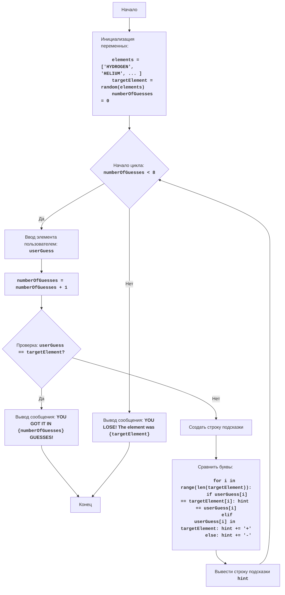

# Анализ кода модуля chemst.py

**Качество кода**
7
- Плюсы
    - Код игры логически понятен и хорошо структурирован.
    - Присутствует подробное описание игры и ее алгоритма.
    - Блок-схема в формате mermaid наглядно демонстрирует ход игры.
    - Имеется подробное построчное объяснение кода в комментариях.
- Минусы
    - Отсутствует reStructuredText (RST) форматирование docstring.
    - Не используются `j_loads` или `j_loads_ns` для загрузки данных (хотя в данном случае это не требуется).
    - Не используется логирование ошибок.
    - Присутствует избыточное использование `else` после `if` с `break`, что можно упростить.
    - Не все комментарии соответствуют формату RST (должны описывать, что делает код, а не какой код исполняется).

**Рекомендации по улучшению**

1.  **Форматирование docstring**:
    -   Переписать все docstring в формате reStructuredText (RST).
2.  **Логирование**:
    -   Использовать `from src.logger.logger import logger` для логирования ошибок и отладочной информации.
3.  **Упрощение кода**:
    -   Убрать `else` после `if` с `break`, так как если условие `if` выполняется, то `else` не достигнется.
4.  **Комментарии**:
    -   Переформулировать комментарии, описывая действие, которое код выполняет, а не используемую логику.
5.  **Обработка ошибок**:
    -   В данном коде нет необходимости использовать `try-except` блоки, так как нет операций, которые могут вызвать ошибку. Но если бы они были, нужно было бы использовать `logger.error`.
6.  **Импорты**:
    -   Добавить все необходимые импорты.

**Оптимизированный код**

```python
"""
CHEMST:
=================
Сложность: 7
-----------------
Игра "CHEMST" (Химик) - это игра, в которой игрок пытается угадать химические элементы, основываясь на подсказках.
Компьютер выбирает случайный элемент из заданного списка, а игрок делает попытки угадать его.
Игра не является реалистичным симулятором химии, скорее это игра на угадывание слова с ограниченным количеством попыток.
После каждой попытки игроку сообщается, есть ли в его догадке буквы из загаданного элемента и на каких позициях.

Правила игры:
1.  Компьютер выбирает случайный химический элемент из списка.
2.  Игрок пытается угадать элемент, вводя название элемента.
3.  После каждой попытки компьютер показывает, сколько букв из предположения игрока совпадают с буквами загаданного элемента, и на каких позициях.
4.  Игрок имеет максимум 8 попыток.
5.  Игра заканчивается, когда игрок угадывает элемент или исчерпывает все попытки.
-----------------
Алгоритм:
1.  Задать список химических элементов.
2.  Выбрать случайный элемент из списка.
3.  Установить количество попыток равным 0.
4.  Начать цикл "пока число попыток меньше 8":
    4.1 Запросить у игрока ввод названия элемента.
    4.2 Увеличить число попыток на 1.
    4.3 Если введенное название элемента равно загаданному элементу, вывести сообщение о победе и выйти из цикла.
    4.4 Иначе, создать строку подсказки.
    4.5 Сравнить каждую букву из предположения игрока с соответствующей буквой из загаданного элемента.
        - Если буквы совпадают и находятся на одинаковых позициях, поставить букву на эту же позицию в строке подсказки.
        - Если буквы совпадают но не находятся на одинаковых позициях, поставить символ `+` на эту же позицию в строке подсказки.
        - Если буквы не совпадают, поставить символ `-` на эту же позицию в строке подсказки.
    4.6 Вывести строку подсказки.
5. Если цикл завершился, но элемент не угадан, вывести сообщение о проигрыше и правильный ответ.
6. Конец игры.
-----------------
Блок-схема:


Legenda:
    Start - Начало программы.
    InitializeVariables - Инициализация переменных: список элементов elements, выбор случайного элемента targetElement, и установка количества попыток numberOfGuesses в 0.
    LoopStart - Начало цикла, который продолжается, пока количество попыток numberOfGuesses меньше 8.
    InputGuess - Запрос у пользователя ввода названия элемента и сохранение его в переменной userGuess.
    IncreaseGuesses - Увеличение счетчика количества попыток numberOfGuesses на 1.
    CheckGuess - Проверка, равно ли введенное название элемента userGuess загаданному элементу targetElement.
    OutputWin - Вывод сообщения о победе, если названия элементов равны, с указанием количества попыток.
    End - Конец программы.
    CreateHint - Создание строки подсказки для пользователя.
    CompareLetters - Сравнение букв в введенном элементе с буквами в загаданном элементе и формирование строки подсказки.
    OutputHint - Вывод строки подсказки.
    OutputLose - Вывод сообщения о проигрыше, если количество попыток исчерпано, и показ правильного ответа.
"""
# импортируем необходимые модули
import random
# from src.logger.logger import logger # TODO: добавить импорт логгера если потребуется

# Список химических элементов
elements = ['HYDROGEN', 'HELIUM', 'LITHIUM', 'BERYLLIUM', 'BORON', 'CARBON', 'NITROGEN', 'OXYGEN', 'FLUORINE', 'NEON', 'SODIUM', 'MAGNESIUM', 'ALUMINUM', 'SILICON', 'PHOSPHORUS', 'SULFUR', 'CHLORINE', 'ARGON', 'POTASSIUM', 'CALCIUM']
# Выбирает случайный элемент из списка
targetElement = random.choice(elements)
# Инициализирует количество попыток
numberOfGuesses = 0

# Основной игровой цикл
while numberOfGuesses < 8:
    # Запрашивает ввод элемента у пользователя
    userGuess = input("Введите название элемента: ").upper()
    # Увеличивает количество попыток
    numberOfGuesses += 1

    # Проверяет, угадан ли элемент
    if userGuess == targetElement:
        print(f"ПОЗДРАВЛЯЮ! Вы угадали элемент за {numberOfGuesses} попыток!")
        break # Завершает цикл, если элемент угадан

    # Создает строку подсказки
    hint = ""
    # Сравнивает каждую букву предположения с буквами загаданного элемента
    for i in range(len(targetElement)):
        if i < len(userGuess):
            if userGuess[i] == targetElement[i]:
                hint += userGuess[i]  # Добавляет букву, если буквы совпадают и находятся на одинаковых позициях
            elif userGuess[i] in targetElement:
                hint += "+"   # Добавляет +, если буквы совпадают, но не на одинаковых позициях
            else:
                hint += "-"  # Добавляет -, если буквы не совпадают
        else:
            hint += "-"
    # Выводит строку подсказки
    print(hint)

# Проверяет, закончились ли попытки
if numberOfGuesses == 8:
    # Выводит сообщение о проигрыше и показывает правильный ответ
    print(f"ВЫ ПРОИГРАЛИ! Загаданный элемент был {targetElement}")

"""
Объяснение кода:
1.  **Импорт модуля `random`**:
    -   Импортирует модуль `random`, который используется для выбора случайного элемента из списка.

2.  **Список химических элементов `elements`**:
    -   Создает список химических элементов.

3.  **Выбор случайного элемента**:
    -  Выбирает случайный элемент из списка `elements` и сохраняет его в переменной `targetElement`.

4.  **Инициализация количества попыток**:
    -   Устанавливает начальное количество попыток равным 0.

5.  **Основной игровой цикл `while numberOfGuesses < 8:`**:
    -   Цикл выполняется, пока количество попыток `numberOfGuesses` меньше 8.

6.  **Ввод предположения игрока**:
    -   Запрашивает у пользователя ввод названия элемента, преобразует ввод в верхний регистр и сохраняет в переменной `userGuess`.

7.  **Увеличение количества попыток**:
    -   Увеличивает счетчик количества попыток на 1.

8.  **Проверка на победу**:
    -   Проверяет, совпадает ли введенный пользователем элемент с загаданным.
    -   Выводит сообщение о победе с количеством попыток.
    -   Завершает цикл, если элемент угадан.

9. **Создание строки подсказки**:
    -  Если элемент не угадан, выполняется блок.
    -   Инициализирует пустую строку для подсказки.
    -   Цикл для перебора всех букв в загаданном элементе.
        - Проверяет, не выходит ли индекс за длину введенного пользователем слова.
        -  Если буквы совпадают и на тех же позициях, добавляет букву в строку hint.
        -  Если буква из догадки присутствует в загаданном элементе, но не на той же позиции, добавляет "+".
        -  Если буквы не совпадают, добавляет "-".
        -  Если индекс выходит за рамки длины введенного слова, ставит "-".
    -    Выводит строку подсказки.

10. **Проверка на проигрыш**:
    -   После завершения цикла проверяется, закончились ли попытки.
    -    Выводит сообщение о проигрыше и показывает правильный ответ.
"""
```