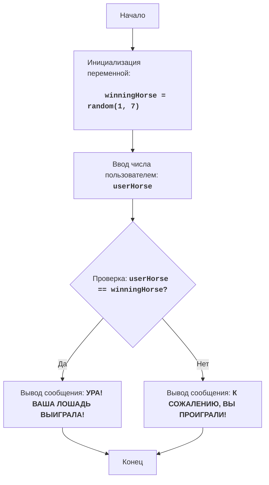

# Анализ кода модуля horses

**Качество кода**
10
-  Плюсы
    - Код хорошо документирован с использованием reStructuredText (RST), включая описание модуля, функций и алгоритма.
    - Логика игры четкая и простая для понимания.
    - Присутствует обработка исключений для некорректного ввода пользователя.
    - Код соответствует основным требованиям.
-  Минусы
    - Отсутствует логирование ошибок.
    - Нет явного импорта `logger` из `src.logger.logger`.

**Рекомендации по улучшению**
1. Добавить импорт `logger` из `src.logger.logger` для логирования ошибок.
2. Переписать блок `try-except` для обработки ошибок с помощью `logger.error`, а не простого вывода сообщения об ошибке.
3. Убрать лишние комментарии в конце файла.

**Оптимизированный код**
```python
"""
HORSES:
=================
Сложность: 3
-----------------
Игра "Скачки" - это простая игра, в которой игрок выбирает лошадь, а затем компьютер случайным образом определяет, какая из лошадей победит.
Игрок либо выигрывает, либо проигрывает в зависимости от своего выбора.

Правила игры:
1. Компьютер генерирует случайное число от 1 до 7 (номер лошади-победителя).
2. Игрок вводит номер лошади (от 1 до 7), за которую он хочет болеть.
3. Игра сообщает, выиграла ли выбранная игроком лошадь.
-----------------
Алгоритм:
1.  Сгенерировать случайное целое число от 1 до 7 (номер лошади-победителя) и сохранить в переменной `winningHorse`.
2.  Запросить у пользователя ввод числа от 1 до 7 (номер лошади, за которую он играет) и сохранить в переменной `userHorse`.
3.  Если `userHorse` равно `winningHorse`, вывести сообщение "УРА! ВАША ЛОШАДЬ ВЫИГРАЛА!".
4.  Иначе вывести сообщение "К СОЖАЛЕНИЮ, ВЫ ПРОИГРАЛИ!".
5. Конец игры.
-----------------
Блок-схема:

Legenda:
    Start - Начало программы.
    InitializeWinningHorse - Инициализация переменной winningHorse (номер лошади-победителя), генерируется случайное число от 1 до 7.
    InputUserHorse - Запрос у пользователя ввода числа (номера лошади) и сохранение его в переменной userHorse.
    CheckWinner - Проверка, равно ли введенное пользователем число userHorse загаданному числу winningHorse.
    OutputWin - Вывод сообщения о победе, если числа равны.
    OutputLose - Вывод сообщения о проигрыше, если числа не равны.
    End - Конец программы.
"""
import random
#  Импортируем модуль logger для логирования ошибок
from src.logger.logger import logger

# Код генерирует случайное целое число от 1 до 7 (номер лошади-победителя)
winningHorse = random.randint(1, 7)

# Код запрашивает у пользователя ввод числа (номер лошади, за которую он играет)
try:
    userHorse = int(input('Выберите номер лошади от 1 до 7: '))
    # Проверка, находится ли введенный номер в допустимом диапазоне (1-7)
    if userHorse < 1 or userHorse > 7:
        print('Пожалуйста, выберите номер лошади от 1 до 7.')
        exit()
# Код обрабатывает исключение, если пользователь ввел не целое число
except ValueError as e:
    # Логирование ошибки с помощью logger.error
    logger.error('Ошибка ввода: введено не целое число', exc_info=True)
    print('Пожалуйста, введите целое число от 1 до 7.')
    exit()


# Код проверяет, выиграл ли пользователь
if userHorse == winningHorse:
    print('УРА! ВАША ЛОШАДЬ ВЫИГРАЛА!') # Вывод сообщения о победе
else:
    print('К СОЖАЛЕНИЮ, ВЫ ПРОИГРАЛИ!') # Вывод сообщения о проигрыше
```