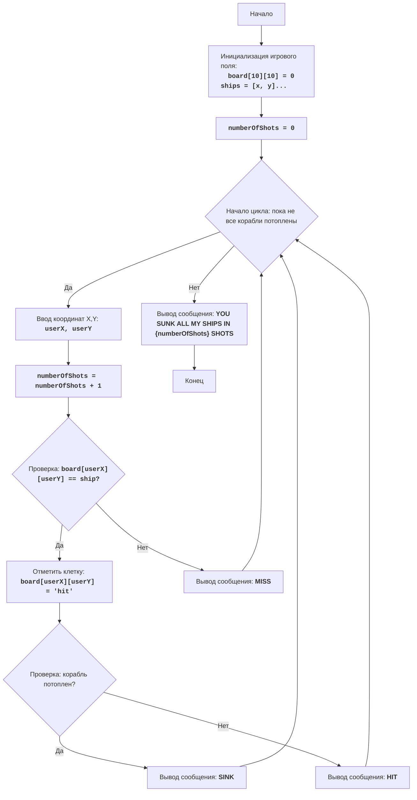

# Анализ кода модуля `salvo.py`

**Качество кода**
6
-  Плюсы
    - Код достаточно хорошо структурирован, функции разделены по задачам.
    - Есть подробная документация модуля в формате RST, включая блок-схему в формате mermaid.
    - Присутствует обработка исключений для некорректного ввода координат.
    -  Используется `random` для размещения кораблей, что добавляет элемент случайности.
    -  Функция `is_sunk` для проверки потопления корабля.
    - Функция `print_board` для отображения игрового поля.
-  Минусы
    -  Отсутствует импорт `logger` для логирования ошибок.
    -  Используются стандартные блоки `try-except` без логирования ошибок, что затрудняет отладку и мониторинг.
    -  Размещение кораблей не гарантирует, что корабли не будут перекрываться или располагаться вплотную друг к другу.
    - Не используются константы для размеров доски и длин кораблей.
    - Логика игры  реализована в одном блоке,  что снижает читаемость.

**Рекомендации по улучшению**
1.  Добавить импорт `from src.logger.logger import logger` для логирования ошибок.
2.  Заменить блоки `try-except` на обработку ошибок с помощью `logger.error`.
3.  Улучшить алгоритм размещения кораблей, чтобы избежать их наложения друг на друга.
4.  Использовать константы для размеров доски и длин кораблей.
5.  Разделить логику игры в функции на более мелкие подфункции для лучшей читаемости.
6.  Добавить проверки на корректность ввода координат.
7.  Добавить docstring к функциям, включая описание параметров и возвращаемых значений.
8.  Улучшить форматирование кода, для лучшей читаемости.

**Оптимизиробанный код**
```python
"""
SALVO:
=================
Сложность: 7
-----------------
Игра "SALVO" представляет собой морской бой, в котором игрок пытается потопить корабли противника, которые расположены на сетке.
Игрок вводит координаты для стрельбы, и игра сообщает о попадании или промахе.
Цель игры - потопить все корабли противника за минимальное количество ходов.
Игра заканчивается, когда все корабли противника будут потоплены.

Правила игры:
1.  Игра происходит на сетке 10x10.
2.  Противник размещает корабли (количество и размеры не указаны в коде).
3.  Игрок вводит координаты (X, Y) для стрельбы.
4.  После каждого выстрела игра сообщает о результате: "MISS", "HIT", или "SINK".
5.  Игра заканчивается, когда все корабли противника потоплены.
6.  Счетчик выстрелов ведется.

-----------------
Алгоритм:
1. Инициализировать игровое поле (10x10).
2. Разместить корабли противника на поле (алгоритм размещения не указан в коде).
3. Инициализировать счетчик выстрелов нулем.
4. Начать цикл "пока не все корабли потоплены":
    4.1 Запросить у игрока координаты выстрела (X, Y).
    4.2 Увеличить счетчик выстрелов на 1.
    4.3 Если выстрел попал в корабль, то:
        4.3.1 Пометить клетку как "hit".
        4.3.2 Если корабль потоплен, то вывести сообщение "SINK".
        4.3.3 Если корабль не потоплен, вывести сообщение "HIT".
    4.4 Если выстрел не попал в корабль, то:
        4.4.1 Вывести сообщение "MISS".
5. Вывести сообщение о победе и количество выстрелов.
6. Конец игры.
-----------------
Блок-схема:

Legenda:
    Start - Начало программы.
    InitializeBoard - Инициализация игрового поля размером 10x10 и размещение кораблей противника.
    InitializeShots - Инициализация счетчика выстрелов, устанавливая его в 0.
    GameLoopStart - Начало игрового цикла, который продолжается, пока не потоплены все корабли противника.
    InputCoordinates - Запрос у пользователя ввода координат X и Y для выстрела.
    IncreaseShots - Увеличение счетчика выстрелов на 1.
    CheckHit - Проверка, попал ли выстрел в корабль на игровом поле.
    MarkHit - Помечаем клетку на игровом поле как "hit", если был сделан выстрел по кораблю
    CheckSink - Проверка, потоплен ли корабль, по которому был произведен выстрел
    OutputSink - Вывод сообщения "SINK", если корабль потоплен.
    OutputHit - Вывод сообщения "HIT", если выстрел попал в корабль, но он не был потоплен.
    OutputMiss - Вывод сообщения "MISS", если выстрел не попал в корабль.
    OutputWin - Вывод сообщения о победе, когда все корабли противника потоплены, и количества выстрелов.
    End - Конец программы.
"""
import random
#  импортируем logger для логирования ошибок
from src.logger.logger import logger


# Определяем константы для размера игрового поля и длин кораблей.
BOARD_SIZE = 10
SHIPS_LENGTHS = [2, 3, 4, 5]


def create_board(size: int) -> list[list[int]]:
    """
    Создает игровое поле заданного размера.

    :param size: Размер игрового поля (сторона квадрата).
    :return: Двумерный список, представляющий игровое поле, заполненное нулями.
    """
    return [[0 for _ in range(size)] for _ in range(size)]


def place_ships(board: list[list[int]], ships_lengths: list[int]) -> list[tuple[int, int, str, int]]:
    """
    Размещает корабли на игровом поле.

    :param board: Игровое поле в виде двумерного списка.
    :param ships_lengths: Список длин кораблей для размещения.
    :return: Список кортежей с информацией о размещенных кораблях (row, col, orientation, length).
    """
    ships = []
    for length in ships_lengths:
        placed = False
        while not placed:
            orientation = random.choice(['horizontal', 'vertical'])
            if orientation == 'horizontal':
                row = random.randint(0, len(board) - 1)
                col = random.randint(0, len(board) - length)
                if all(board[row][col + i] == 0 for i in range(length)):
                    for i in range(length):
                        board[row][col + i] = 1
                    ships.append((row, col, orientation, length))
                    placed = True

            elif orientation == 'vertical':
                row = random.randint(0, len(board) - length)
                col = random.randint(0, len(board) - 1)
                if all(board[row + i][col] == 0 for i in range(length)):
                    for i in range(length):
                        board[row + i][col] = 1
                    ships.append((row, col, orientation, length))
                    placed = True

    return ships


def is_sunk(board: list[list[int]], ship: tuple[int, int, str, int]) -> bool:
    """
    Проверяет, потоплен ли корабль.

    :param board: Игровое поле.
    :param ship: Кортеж с информацией о корабле (row, col, orientation, length).
    :return: True, если корабль потоплен, иначе False.
    """
    row, col, orientation, length = ship
    if orientation == 'horizontal':
        return all(board[row][col + i] == 'hit' for i in range(length))
    else:
        return all(board[row + i][col] == 'hit' for i in range(length))


def print_board(board: list[list[int]]) -> None:
    """
    Выводит игровое поле в консоль, скрывая расположение кораблей.

    :param board: Игровое поле в виде двумерного списка.
    """
    size = len(board)
    print("  " + " ".join(str(i) for i in range(size)))
    for i, row in enumerate(board):
        print(str(i) + " " + " ".join('~' if cell == 0 or cell == 1 else cell for cell in row))


def get_user_coordinates(board_size: int) -> tuple[int, int]:
    """
    Запрашивает у пользователя координаты для выстрела.

    :param board_size: Размер игрового поля.
    :return: Кортеж с координатами (x, y).
    """
    while True:
        try:
            x = int(input("Введите координату X (0-9): "))
            y = int(input("Введите координату Y (0-9): "))
            if not (0 <= x < board_size and 0 <= y < board_size):
                print("Неверные координаты. Попробуйте снова.")
                continue
            return x, y
        except ValueError as ex:
            logger.error("Неверный ввод. Пожалуйста, введите числа от 0 до 9.", ex)
            print("Неверный ввод. Пожалуйста, введите числа от 0 до 9.")


def update_board(board: list[list[int]], x: int, y: int, ships: list[tuple[int, int, str, int]]) -> tuple[bool, int]:
    """
    Обновляет игровое поле после выстрела.

    :param board: Игровое поле.
    :param x: Координата X выстрела.
    :param y: Координата Y выстрела.
    :param ships: Список с информацией о кораблях.
    :return: Кортеж (потоплен ли корабль, количество потопленных кораблей)
    """
    if board[x][y] == 1:
        board[x][y] = 'hit'
        ship_sunk = False
        sunk_ships_count = 0
        for ship in list(ships):
            if is_sunk(board, ship):
                print("SINK")
                ship_sunk = True
                sunk_ships_count += 1
                ships.remove(ship)
                break
        if not ship_sunk:
            print("HIT")
        return True, sunk_ships_count
    elif board[x][y] == 0:
        board[x][y] = 'miss'
        print("MISS")
        return False, 0
    else:
        print("Вы уже стреляли по этим координатам")
        return False, 0


def play_salvo() -> None:
    """Основная функция игры Salvo."""
    board = create_board(BOARD_SIZE)
    ships = place_ships(board, SHIPS_LENGTHS)
    number_of_shots = 0
    sunk_ships_count = 0
    print_board(board)

    while sunk_ships_count < len(ships):
        x, y = get_user_coordinates(BOARD_SIZE)
        number_of_shots += 1
        ship_sunk, sunk_count = update_board(board, x, y, ships)
        sunk_ships_count += sunk_count
        print_board(board)

    print(f"YOU SUNK ALL MY SHIPS IN {number_of_shots} SHOTS")


if __name__ == "__main__":
    play_salvo()
```