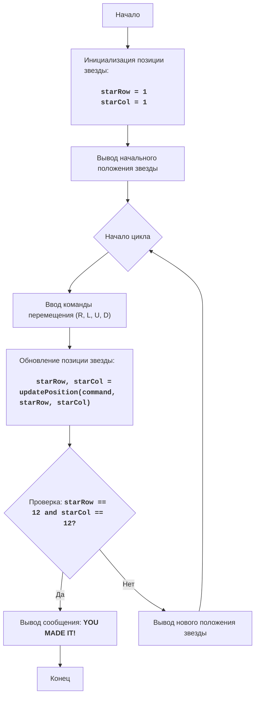

# Анализ кода модуля STARS

**Качество кода**
6
-   Плюсы
    -   Код хорошо структурирован и логически разделен на функции.
    -   Используются понятные имена переменных и функций.
    -   Есть подробные комментарии, объясняющие логику кода.
    -   Код игры достаточно прост и понятен для новичков.
-   Минусы
    -   Отсутствует обработка ошибок при вводе некорректных команд.
    -   Нет импортов, хотя они не нужны.
    -   Комментарии не соответствуют формату RST.
    -   Не используется логирование.
    -   Не все комментарии после `#` объясняют код.

**Рекомендации по улучшению**

1.  Переписать все комментарии в формате RST, включая docstring функций и описание модуля.
2.  Добавить обработку ошибок ввода для защиты от некорректных команд пользователя.
3.  Использовать логирование для отслеживания ошибок и важных событий.
4.  Изменить комментарии после `#`, чтобы они более точно описывали следующие строки кода.
5.  Удалить лишние комментарии, которые не добавляют ценности коду.
6.  Использовать константы для размеров доски, чтобы сделать код более гибким.

**Оптимизированный код**

```python
"""
Модуль STARS
=================
Сложность: 4
-----------------
Игра "Звезды" представляет собой простую текстовую игру, в которой игрок управляет положением "звезды" на экране, вводя команды для ее перемещения.
Цель игры - переместить звезду в правый нижний угол экрана.

Правила игры:
1. Изначально звезда находится в левом верхнем углу экрана (позиция 1,1).
2. Игрок вводит команды перемещения:
   - 'R' - переместить звезду вправо
   - 'L' - переместить звезду влево
   - 'U' - переместить звезду вверх
   - 'D' - переместить звезду вниз
3. Экран представляет собой сетку 12x12.
4. Игра заканчивается, когда звезда достигает правого нижнего угла экрана (позиция 12,12).
-----------------
Алгоритм:
1. Установить начальную позицию звезды в (1, 1).
2. Вывести на экран начальное расположение звезды, изображая ее символом "*".
3. Начать цикл:
    3.1 Запросить ввод команды перемещения ('R', 'L', 'U', 'D').
    3.2 Обновить позицию звезды в зависимости от введенной команды.
    3.3 Проверить, достигла ли звезда позиции (12, 12). Если да, вывести сообщение о победе и завершить игру.
    3.4 Иначе вывести на экран новое расположение звезды.
4. Конец игры.
-----------------
Блок-схема:


Legenda:
    Start - Начало программы.
    InitializePosition - Инициализация начальной позиции звезды: starRow (строка) и starCol (столбец) устанавливаются в 1.
    DisplayBoard - Вывод на экран начального расположения звезды.
    LoopStart - Начало игрового цикла.
    InputMove - Запрос у игрока команды для перемещения звезды ('R', 'L', 'U', 'D').
    UpdatePosition - Обновление позиции звезды на основе введенной команды.
    CheckWin - Проверка, достигла ли звезда конечной позиции (12, 12).
    OutputWin - Вывод сообщения о победе, если звезда достигла конечной позиции.
    End - Конец программы.
    DisplayBoardUpdated - Вывод на экран обновленного положения звезды.
"""


from src.logger.logger import logger # Импортируем logger

# Инициализация начальной позиции звезды
starRow = 1
starCol = 1
# Размер игровой доски
BOARD_SIZE = 12

def printBoard(starRow: int, starCol: int) -> None:
    """
    Выводит на экран игровое поле с текущей позицией звезды.

    :param starRow: строка, в которой находится звезда.
    :param starCol: столбец, в котором находится звезда.
    :return: None
    """
    for row in range(1, BOARD_SIZE + 1):
        line = ""
        for col in range(1, BOARD_SIZE + 1):
            if row == starRow and col == starCol:
                line += "*" # Отображаем звезду
            else:
                line += "." # Отображаем пустую клетку
        print(line)


def updatePosition(command: str, starRow: int, starCol: int) -> tuple[int, int]:
    """
    Обновляет позицию звезды на основе введенной команды.

    :param command: команда перемещения ('R', 'L', 'U', 'D').
    :param starRow: текущая строка звезды.
    :param starCol: текущий столбец звезды.
    :return: новая строка и столбец звезды.
    """
    if command == 'R': # Код проверяет команду на перемещение вправо
        if starCol < BOARD_SIZE:
           starCol += 1
    elif command == 'L': # Код проверяет команду на перемещение влево
        if starCol > 1:
            starCol -= 1
    elif command == 'U': # Код проверяет команду на перемещение вверх
        if starRow > 1:
            starRow -= 1
    elif command == 'D':  # Код проверяет команду на перемещение вниз
        if starRow < BOARD_SIZE:
            starRow += 1
    return starRow, starCol


# Вывод начального положения звезды
printBoard(starRow, starCol)

# Основной игровой цикл
while True:
    # Запрос команды перемещения у пользователя
    command = input("Введите команду (R/L/U/D): ").upper()

    # Проверяем корректность ввода команды
    if command not in ['R', 'L', 'U', 'D']: # Код проверяет ввод команды
        logger.error(f"Некорректная команда: {command}. Используйте R, L, U или D.") # Логируем ошибку
        print("Некорректная команда. Используйте R, L, U или D.")
        continue # Код пропускает итерацию цикла

    # Обновление позиции звезды на основе введенной команды
    starRow, starCol = updatePosition(command, starRow, starCol)

    # Вывод нового положения звезды на экран
    printBoard(starRow, starCol)

    # Проверка, достигла ли звезда конечной позиции
    if starRow == BOARD_SIZE and starCol == BOARD_SIZE: # Код проверяет достижение конечной позиции
        print("ПОЗДРАВЛЯЮ! Вы переместили звезду в правый нижний угол!")
        break # Завершаем игру
```