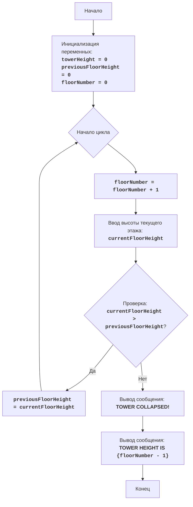

# Анализ кода модуля `tower.py`

**Качество кода**
7
-   Плюсы
    -   Код игры хорошо структурирован и понятен.
    -   Используется цикл `while True` для основного игрового процесса, который завершается при падении башни.
    -   Присутствует обработка исключений `ValueError` для защиты от некорректного ввода.
    -   Есть подробное описание алгоритма и блок-схема в начале файла.
-   Минусы
    -   Отсутствует явное указание кодировки файла.
    -   Не используются импорты из `src.utils.jjson` и `src.logger.logger` для обработки данных и логирования.
    -   Отсутствует reStructuredText (RST) документация для модуля, переменных и функций.
    -   Используется стандартный `print` вместо логирования через `logger`.
    -   Не стандартизировано написание комментариев в коде.

**Рекомендации по улучшению**

1.  Добавить в начало файла указание кодировки: `# -*- coding: utf-8 -*-`.
2.  Использовать `from src.utils.jjson import j_loads, j_loads_ns` для загрузки данных, если это потребуется.
3.  Использовать `from src.logger.logger import logger` для логирования.
4.  Переписать все комментарии в формате reStructuredText (RST).
5.  Заменить `print` на `logger.info` для вывода сообщений и `logger.error` для ошибок.
6.  Добавить docstring к модулю, описывающий его назначение и правила игры.
7.  Стандартизировать комментарии в коде и добавить подробные объяснения.
8.  Удалить избыточные комментарии после кода.

**Оптимизированный код**

```python
# -*- coding: utf-8 -*-
"""
TOWER
=====
Сложность: 4
-----------------
Игра "Башня" - это игра, в которой игрок пытается построить башню, вводя высоту каждого этажа.
Цель - построить башню как можно выше, но есть ограничение: если текущий этаж будет меньше предыдущего, то башня рухнет.

Правила игры:
1. Игрок начинает с высоты первого этажа.
2. На каждом последующем этапе игрок вводит высоту следующего этажа.
3. Если высота текущего этажа больше высоты предыдущего этажа, то этаж добавляется к башне, и игра продолжается.
4. Если высота текущего этажа равна или меньше высоты предыдущего этажа, то башня рушится, и игра заканчивается.
5. Цель игры - построить башню как можно выше, то есть как можно больше этажей.
-----------------
Алгоритм:
1. Установить начальную высоту башни 0.
2. Установить начальную высоту предыдущего этажа 0.
3. Установить номер этажа 0.
4. Начать цикл:
   4.1 Увеличить номер этажа на 1.
   4.2 Запросить у игрока ввод высоты текущего этажа.
   4.3 Если высота текущего этажа больше высоты предыдущего этажа:
       4.3.1 Установить высоту предыдущего этажа равной высоте текущего этажа.
   4.4 Иначе:
      4.4.1 Вывести сообщение о том, что башня рухнула.
      4.4.2 Вывести сообщение о высоте башни, то есть номер этажа минус 1.
      4.4.3 Завершить игру.
-----------------
Блок-схема:

Legenda:
    Start - Начало программы.
    InitializeVariables - Инициализация переменных: towerHeight (высота башни) устанавливается в 0, previousFloorHeight (высота предыдущего этажа) устанавливается в 0, floorNumber (номер этажа) устанавливается в 0.
    LoopStart - Начало цикла, продолжающегося до тех пор, пока башня не рухнет.
    IncreaseFloorNumber - Увеличение номера этажа на 1.
    InputFloorHeight - Запрос у пользователя ввода высоты текущего этажа и сохранение его в переменной currentFloorHeight.
    CheckFloorHeight - Проверка, больше ли высота текущего этажа currentFloorHeight высоты предыдущего этажа previousFloorHeight.
    UpdatePreviousFloorHeight - Обновление высоты предыдущего этажа previousFloorHeight значением высоты текущего этажа currentFloorHeight.
    OutputGameOver - Вывод сообщения о том, что башня рухнула.
    OutputTowerHeight - Вывод сообщения о высоте башни (floorNumber - 1).
    End - Конец программы.

"""


from src.logger.logger import logger # Подключаем модуль логирования
# from src.utils.jjson import j_loads, j_loads_ns  # TODO: пока не используем, но может потребоваться в будущем

# Инициализация переменных
towerHeight = 0 # высота башни
previousFloorHeight = 0 # высота предыдущего этажа
floorNumber = 0 # номер текущего этажа

# Начало основного цикла игры
while True:
    # Увеличиваем номер этажа
    floorNumber += 1

    try:
        # Запрашиваем высоту текущего этажа
        currentFloorHeight = int(input(f"Введите высоту этажа {floorNumber}: "))
    except ValueError as e:
        # Логируем ошибку ввода
        logger.error("Ошибка ввода, ожидается целое число.", exc_info=True)
        continue

    # Проверяем, больше ли текущая высота этажа предыдущей
    if currentFloorHeight > previousFloorHeight:
        # Если больше, то обновляем высоту предыдущего этажа
        previousFloorHeight = currentFloorHeight
    else:
        # Если текущая высота меньше или равна предыдущей, то башня рушится
        logger.info("БАШНЯ РУХНУЛА!")
        logger.info(f"Высота башни: {floorNumber - 1}")
        break  # Завершаем игру
```