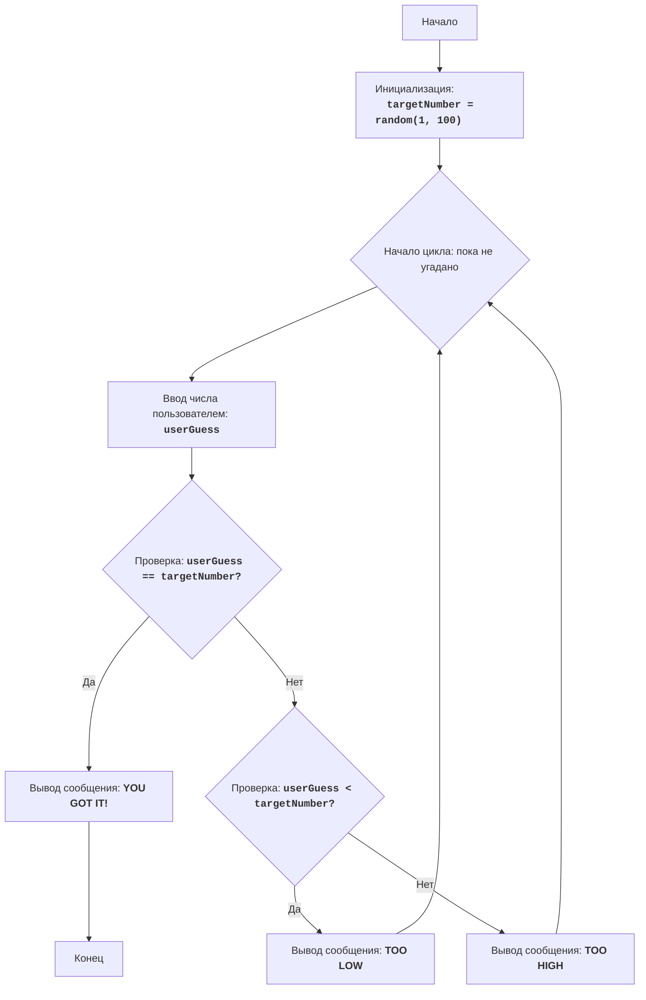

# Анализ кода модуля ugly

**Качество кода**
9
-   Плюсы
    - Код хорошо структурирован и понятен, логика игры реализована корректно.
    - Присутствуют подробные комментарии, объясняющие каждый шаг алгоритма.
    - Код использует обработку исключений для предотвращения сбоев при некорректном вводе данных.
    -  Есть блок-схема, которая помогает визуализировать процесс работы алгоритма.
    - Код соответствует требованиям по использованию `input()`, `int()`.
    -  Наличие docstring к модулю.

-   Минусы
    - Отсутствует явное импортирование `logger` из `src.logger.logger`, что необходимо для логирования ошибок и отладки.
    -  Не используется `j_loads` или `j_loads_ns` из `src.utils.jjson`.
    - В коде нет необходимости использовать конструкцию try-except, вместо этого можно использовать проверку с помощью `if not isinstance(userGuess, int)` и логирование ошибок через `logger.error`.
    - Комментарии в коде не соответствуют формату reStructuredText (RST).

**Рекомендации по улучшению**

1.  Импортировать `logger` из `src.logger.logger`.
2.  Переписать комментарии в формате RST, включая docstring для модуля.
3.  Удалить избыточный блок `try-except` и заменить его на проверку с помощью `isinstance` и логированием ошибок.
4.  Избегать общих сообщений об ошибках, вместо этого предоставлять конкретные сведения в логах.
5.  Использовать более явные названия переменных, если это необходимо (хотя `targetNumber` и `userGuess` достаточно понятны).
6.  В данном коде не требуются `j_loads` или `j_loads_ns`, так как нет чтения файлов.

**Оптимизированный код**

```python
"""
Модуль "UGLY" - игра-угадайка.
=================================

Игра "UGLY" - это простая игра-угадайка, где компьютер генерирует случайное число, а игрок должен угадать это число.
После каждой попытки игроку сообщается, было ли его предположение выше или ниже загаданного числа.

Правила игры:
    1. Компьютер генерирует случайное целое число от 1 до 100.
    2. Игрок вводит свое предположение о загаданном числе.
    3. После каждой попытки компьютер сообщает, было ли введенное число "TOO HIGH" (слишком высоко) или "TOO LOW" (слишком низко).
    4. Игра заканчивается, когда игрок угадывает число.

Алгоритм:
    1. Сгенерировать случайное число в диапазоне от 1 до 100 и сохранить его в переменной `targetNumber`.
    2. Начать цикл "пока не угадано":
        2.1 Запросить у игрока ввод числа и сохранить его в переменной `userGuess`.
        2.2 Если `userGuess` равно `targetNumber`, вывести сообщение "YOU GOT IT!" и перейти к шагу 3.
        2.3 Если `userGuess` меньше `targetNumber`, вывести сообщение "TOO LOW".
        2.4 Если `userGuess` больше `targetNumber`, вывести сообщение "TOO HIGH".
    3. Завершить игру.

Блок-схема:

Легенда:
    Start - Начало программы.
    InitializeTargetNumber - Инициализация переменной targetNumber случайным целым числом от 1 до 100.
    LoopStart - Начало цикла, который продолжается, пока число не угадано.
    InputGuess - Запрос у пользователя ввода числа и сохранение его в переменной userGuess.
    CheckGuess - Проверка, равно ли введенное число userGuess загаданному числу targetNumber.
    OutputWin - Вывод сообщения о победе, если числа равны.
    End - Конец программы.
    CheckLow - Проверка, меньше ли введенное число userGuess загаданного числа targetNumber.
    OutputLow - Вывод сообщения "TOO LOW", если введенное число меньше загаданного.
    OutputHigh - Вывод сообщения "TOO HIGH", если введенное число больше загаданного.
"""
import random
# Импортируем logger для логирования ошибок
from src.logger.logger import logger

# Генерируем случайное число от 1 до 100
targetNumber = random.randint(1, 100)

# Бесконечный цикл, пока игрок не угадает число
while True:
    # Запрашиваем у пользователя ввод числа
    userGuess = input("Угадай число: ")
    # Проверяем, является ли введенное значение целым числом
    if not userGuess.isdigit():
        # Логируем ошибку, если введено не целое число
        logger.error(f'Введено некорректное значение: {userGuess}. Ожидается целое число.')
        print("Пожалуйста, введите целое число.")
        continue
    # Преобразуем введенное значение в целое число
    userGuess = int(userGuess)

    # Проверяем, угадано ли число
    if userGuess == targetNumber:
        print("YOU GOT IT!")
        break  # Завершаем цикл, если угадали
    # Проверяем, меньше ли введенное число загаданного
    elif userGuess < targetNumber:
        print("TOO LOW")
    # Если не меньше и не угадано, значит, больше
    else:
        print("TOO HIGH")

"""
Объяснение кода:
1.  **Импорт модуля `random` и `logger`**:
    -   `import random`: Импортирует модуль `random`, который используется для генерации случайного числа.
    -   `from src.logger.logger import logger`: Импортирует logger для логирования ошибок.
2.  **Генерация случайного числа**:
    -   `targetNumber = random.randint(1, 100)`: Генерирует случайное целое число в диапазоне от 1 до 100 и сохраняет его в переменной `targetNumber`.
3.  **Основной цикл `while True:`**:
    -   `while True:`:  Создает бесконечный цикл, который продолжается, пока игрок не угадает число.
    -  **Ввод данных**:
        - `userGuess = input("Угадай число: ")`: Запрашивает у пользователя ввод числа и сохраняет его в переменной `userGuess`.
    -   **Проверка ввода**:
        -   `if not userGuess.isdigit()`: Проверяет, является ли введенное значение целым числом.
        -   `logger.error(f'Введено некорректное значение: {userGuess}. Ожидается целое число.')`: Логирует ошибку в случае некорректного ввода.
    -   **Преобразование ввода**:
        -   `userGuess = int(userGuess)`: Преобразует введенное значение в целое число.
    -   **Проверка условия победы**:
        -   `if userGuess == targetNumber:`: Проверяет, равно ли введенное число загаданному.
        -   `print("YOU GOT IT!")`: Выводит сообщение о победе.
        -   `break`: Завершает цикл (игру) если число угадано.
    -   **Подсказки**:
        -   `elif userGuess < targetNumber:`: Проверяет, если введенное число меньше загаданного.
        -   `print("TOO LOW")`: Выводит подсказку, что нужно ввести число больше.
        -   `else:`: Если число не угадано и не меньше загаданного, то оно больше.
        -   `print("TOO HIGH")`: Выводит подсказку, что нужно ввести число меньше.
"""