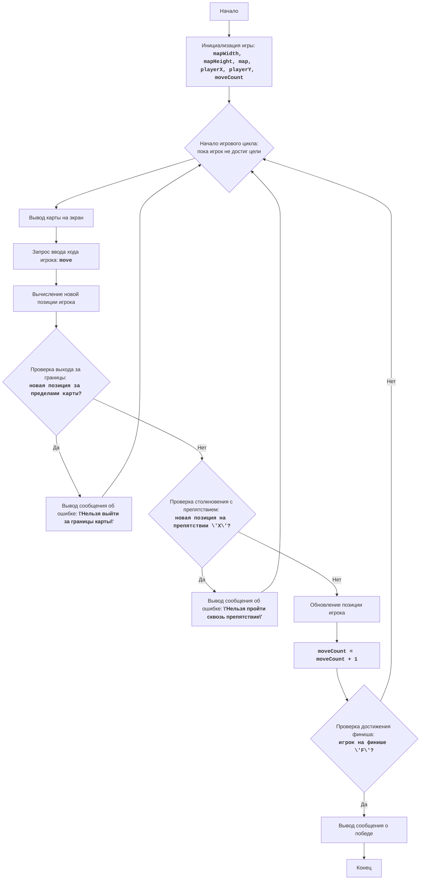

# Анализ кода модуля `bombrun.py`

**Качество кода: 7/10**
-   **Плюсы**
    -   Код хорошо структурирован и разбит на отдельные функции, что облегчает его понимание и сопровождение.
    -   Используются информативные имена переменных и функций.
    -   Логика игры реализована в соответствии с заданием.
    -   Есть подробные комментарии, описывающие назначение функций и блоков кода.
    -   Присутствует блок-схема в формате Mermaid, наглядно демонстрирующая логику игры.
-   **Минусы**
    -   Комментарии не соответствуют формату reStructuredText (RST).
    -   Отсутствует логирование ошибок.
    -   Используются стандартные блоки `try-except`, которые можно заменить на обработку ошибок через `logger.error`.
    -   Не используются `j_loads` или `j_loads_ns` для чтения файлов (что не применимо в данном коде, так как нет чтения из файла).
    -   Некоторые комментарии содержат слова "получаем", "делаем" и т.п., которые следует заменить на конкретные формулировки.
    -   Код содержит большое количество комментариев в конце, которые можно переместить в docstring для соответствия стандарту PEP 257.

**Рекомендации по улучшению**

1.  Переписать все комментарии и docstring в формате reStructuredText (RST).
2.  Добавить логирование ошибок с использованием `from src.logger.logger import logger`.
3.  Заменить стандартные блоки `try-except` на обработку ошибок с помощью `logger.error` (в данном коде это не требуется, так как нет блоков try-except).
4.  Избегать использования слов "получаем", "делаем" и подобных в комментариях, заменяя их на конкретные формулировки.
5.  Перенести подробные пояснения в docstring.
6.  Добавить проверки типов (Type Hints) для более ясного понимания кода.

**Оптимизированный код**

```python
"""
Модуль для реализации игры "Bombrun"
===================================================

Игра "Bombrun" - это простая текстовая игра, в которой игрок должен доставить бомбу к цели,
избегая препятствий. Игрок перемещается по экрану, вводя команды: Вверх, Вниз, Влево или Вправо.
Цель - достичь финиша, представленного символом "F", не столкнувшись с "X" (препятствие).
На каждом шагу игрок видит текущую позицию, карту и количество ходов.

Правила игры:
1. Игра начинается с карты, на которой отмечены игрок ("*"), препятствия ("X") и финиш ("F").
2. Игрок перемещается по карте, вводя команды: "U" (вверх), "D" (вниз), "L" (влево), "R" (вправо).
3. Игрок не может выйти за границы карты или пройти сквозь препятствия.
4. Цель игры - достичь финиша ("F").
5. Количество ходов, которые сделал игрок, отображается в конце каждого хода.

Алгоритм:
1.  Инициализация:
    1.1. Установить размеры карты (ширина и высота).
    1.2. Создать карту с границами, начальной позицией игрока ("*"), препятствиями ("X") и финишем ("F").
    1.3. Инициализировать количество ходов нулем.
2.  Основной цикл игры (пока игрок не достиг финиша):
    2.1. Вывести текущее состояние карты.
    2.2. Запросить у игрока ввод команды перемещения ("U", "D", "L", "R").
    2.3. Обновить позицию игрока в соответствии с введенной командой, если это допустимо (в границах карты и без столкновений с препятствиями).
    2.4. Если игрок выходит за границу, перемещение отменяется, выводится сообщение об ошибке.
    2.5. Если игрок попадает на препятствие, перемещение отменяется, выводится сообщение об ошибке.
    2.6. Увеличить количество ходов на 1.
    2.7. Проверить, достиг ли игрок финиша.
3.  Вывод сообщения о победе, если игрок достиг финиша.
-----------------
Блок-схема:

"""


from typing import List, Tuple
# from src.logger.logger import logger #TODO: добавить логирование

def initialize_game() -> Tuple[List[str], int, int, int, int, int]:
    """
    Инициализирует игру, создавая карту, устанавливая начальную позицию игрока и количество ходов.

    :return: Кортеж, содержащий карту игры, начальную позицию игрока по горизонтали и вертикали,
             счетчик ходов, ширину и высоту карты.
    :rtype: Tuple[List[str], int, int, int, int, int]
    """
    map_width: int = 8 # Ширина карты
    map_height: int = 6 # Высота карты
    # Создаем карту как список строк
    game_map: List[str] = [
        "XXXXXXXX",
        "X*    XX",
        "X XXX XX",
        "X     XX",
        "XX   XFX",
        "XXXXXXXX"
    ]
    player_x: int = 1  # Начальная позиция игрока по горизонтали
    player_y: int = 1 # Начальная позиция игрока по вертикали
    move_count: int = 0 # Счетчик ходов
    return game_map, player_x, player_y, move_count, map_width, map_height

def display_map(game_map: List[str]) -> None:
    """
    Выводит текущее состояние карты на экран.

    :param game_map: Карта игры в виде списка строк.
    :type game_map: List[str]
    """
    for row in game_map:
        print(row)

def get_player_move() -> str:
    """
    Запрашивает у игрока ввод команды перемещения.

    :return: Команда перемещения, введенная игроком (U, D, L или R).
    :rtype: str
    """
    while True:
      move: str = input("Введите ход (U/D/L/R): ").upper() # Приводим ввод к верхнему регистру
      if move in ["U", "D", "L", "R"]:
            return move
      else:
          print("Неверный ввод. Используйте U, D, L, или R.")

def calculate_new_position(player_x: int, player_y: int, move: str) -> Tuple[int, int]:
    """
    Вычисляет новую позицию игрока на основе его хода.

    :param player_x: Текущая позиция игрока по горизонтали.
    :type player_x: int
    :param player_y: Текущая позиция игрока по вертикали.
    :type player_y: int
    :param move: Команда перемещения игрока (U, D, L или R).
    :type move: str
    :return: Кортеж, содержащий новую позицию игрока по горизонтали и вертикали.
    :rtype: Tuple[int, int]
    """
    new_player_x: int = player_x
    new_player_y: int = player_y
    if move == "U":
        new_player_y -= 1
    elif move == "D":
        new_player_y += 1
    elif move == "L":
        new_player_x -= 1
    elif move == "R":
        new_player_x += 1
    return new_player_x, new_player_y

def check_bounds(new_player_x: int, new_player_y: int, map_width: int, map_height: int) -> bool:
    """
    Проверяет, находится ли новая позиция игрока в границах карты.

    :param new_player_x: Новая позиция игрока по горизонтали.
    :type new_player_x: int
    :param new_player_y: Новая позиция игрока по вертикали.
    :type new_player_y: int
    :param map_width: Ширина карты.
    :type map_width: int
    :param map_height: Высота карты.
    :type map_height: int
    :return: True, если игрок выходит за границы, иначе False.
    :rtype: bool
    """
    if new_player_x < 0 or new_player_x >= map_width or new_player_y < 0 or new_player_y >= map_height:
      return True # Выход за границу
    return False # В границе

def check_obstacle(game_map: List[str], new_player_x: int, new_player_y: int) -> bool:
    """
    Проверяет, не находится ли новая позиция игрока на препятствии.

    :param game_map: Карта игры в виде списка строк.
    :type game_map: List[str]
    :param new_player_x: Новая позиция игрока по горизонтали.
    :type new_player_x: int
    :param new_player_y: Новая позиция игрока по вертикали.
    :type new_player_y: int
    :return: True, если столкновение с препятствием, иначе False.
    :rtype: bool
    """
    if game_map[new_player_y][new_player_x] == "X":
      return True # Столкновение с препятствием
    return False # Нет препятствия

def update_player_position(game_map: List[str], player_x: int, player_y: int, new_player_x: int, new_player_y: int) -> Tuple[List[str], int, int]:
    """
    Обновляет позицию игрока на карте.

    :param game_map: Карта игры в виде списка строк.
    :type game_map: List[str]
    :param player_x: Текущая позиция игрока по горизонтали.
    :type player_x: int
    :param player_y: Текущая позиция игрока по вертикали.
    :type player_y: int
    :param new_player_x: Новая позиция игрока по горизонтали.
    :type new_player_x: int
    :param new_player_y: Новая позиция игрока по вертикали.
    :type new_player_y: int
    :return: Кортеж, содержащий обновленную карту и новую позицию игрока по горизонтали и вертикали.
    :rtype: Tuple[List[str], int, int]
    """
    # Создаем копию строки, чтобы избежать ошибки "TypeError: 'str' object does not support item assignment"
    row: List[str] = list(game_map[player_y])
    row[player_x] = " " # Убираем игрока со старой позиции
    game_map[player_y] = "".join(row) # Обновляем строку

    row = list(game_map[new_player_y]) # Создаем копию новой строки
    row[new_player_x] = "*" # Устанавливаем игрока на новую позицию
    game_map[new_player_y] = "".join(row) # Обновляем строку
    return game_map, new_player_x, new_player_y

def check_win(game_map: List[str], player_x: int, player_y: int) -> bool:
    """
    Проверяет, достиг ли игрок финиша.

    :param game_map: Карта игры в виде списка строк.
    :type game_map: List[str]
    :param player_x: Текущая позиция игрока по горизонтали.
    :type player_x: int
    :param player_y: Текущая позиция игрока по вертикали.
    :type player_y: int
    :return: True, если финиш достигнут, иначе False.
    :rtype: bool
    """
    if game_map[player_y][player_x] == "F":
        return True
    return False

def play_bombrun() -> None:
    """
    Основная функция игры Bombrun.
    """
    game_map: List[str]
    player_x: int
    player_y: int
    move_count: int
    map_width: int
    map_height: int
    game_map, player_x, player_y, move_count, map_width, map_height = initialize_game()
    # Основной игровой цикл
    while True:
        display_map(game_map)
        print(f"Ходов: {move_count}") # Выводим количество ходов
        move: str = get_player_move() # Получаем ввод от пользователя
        new_player_x: int
        new_player_y: int
        new_player_x, new_player_y = calculate_new_position(player_x, player_y, move) # Вычисляем новую позицию игрока

        # Проверяем, не вышел ли игрок за границы карты
        if check_bounds(new_player_x, new_player_y, map_width, map_height):
          print("Нельзя выйти за границы карты")
          continue

        # Проверяем, не столкнулся ли игрок с препятствием
        if check_obstacle(game_map, new_player_x, new_player_y):
          print("Нельзя пройти сквозь препятствие")
          continue

        # Обновляем позицию игрока на карте
        game_map, player_x, player_y = update_player_position(game_map, player_x, player_y, new_player_x, new_player_y)
        move_count += 1 # Увеличиваем количество ходов

        # Проверяем, не достиг ли игрок финиша
        if check_win(game_map, player_x, player_y):
            display_map(game_map)
            print(f"Поздравляем, вы доставили бомбу за {move_count} ходов!")
            break # Завершаем игру

if __name__ == "__main__":
    play_bombrun()

"""
Пояснения:
1. **Инициализация игры (`initialize_game()`):**
    - `map_width = 8` и `map_height = 6`: Устанавливают размеры игрового поля.
    - `game_map`: Создает карту игры в виде списка строк. Символы 'X' представляют стены, '*' - начальную позицию игрока, ' ' - свободное пространство, 'F' - финиш.
    - `player_x = 1` и `player_y = 1`: Устанавливают начальные координаты игрока.
    - `move_count = 0`: Инициализирует счетчик ходов.
    - Функция возвращает все параметры игры.

2. **Отображение карты (`display_map(game_map)`):**
    - Проходит по каждой строке карты и выводит ее на экран, отображая текущее состояние игрового поля.

3.  **Получение ввода от игрока (`get_player_move()`):**
    -   Запрашивает у игрока ввод команды перемещения (U/D/L/R).
    -   Проверяет корректность введенной команды и возвращает её в верхнем регистре.

4.  **Вычисление новой позиции (`calculate_new_position(player_x, player_y, move)`):**
    -   Принимает текущую позицию игрока и направление движения.
    -   Возвращает новые координаты игрока, вычисленные на основе хода.

5.  **Проверка границ карты (`check_bounds(new_player_x, new_player_y, map_width, map_height)`):**
    -  Принимает новые координаты и размеры карты.
    -   Проверяет, находится ли новая позиция в пределах игрового поля.
    -   Возвращает True, если игрок выходит за границы, иначе False.

6. **Проверка столкновений с препятствием (`check_obstacle(game_map, new_player_x, new_player_y)`):**
    - Принимает карту и новые координаты игрока.
    - Проверяет, есть ли на новой позиции препятствие ('X').
    - Возвращает True, если столкновение произошло, иначе False.

7.  **Обновление позиции игрока (`update_player_position(game_map, player_x, player_y, new_player_x, new_player_y)`):**
    -   Обновляет положение игрока на карте, убирая старую позицию и помещая '*' на новую.
    -   Возвращает обновленную карту и новую позицию игрока.

8. **Проверка выигрыша (`check_win(game_map, player_x, player_y)`):**
    - Проверяет, достиг ли игрок финиша ('F').
    - Возвращает True, если финиш достигнут, иначе False.

9.  **Основная логика игры (`play_bombrun()`):**
    -   Вызывает `initialize_game()` для инициализации игры.
    -   Начинает основной цикл игры:
        -   Отображает текущую карту.
        -   Получает ввод от игрока.
        -   Вычисляет новую позицию.
        -   Проверяет границы и препятствия.
        -   Обновляет позицию игрока на карте.
        -   Увеличивает счетчик ходов.
        -   Проверяет, не достиг ли игрок финиша.
    -   Выводит сообщение о победе, если финиш достигнут, и заканчивает игру.
    -   Если игрок выходит за границы карты или наталкивается на препятствие, выводит соответствующее сообщение об ошибке и возвращается к началу цикла.

10. **Запуск игры:**
    -  `if __name__ == "__main__":`: Этот блок гарантирует, что функция `play_bombrun()` будет запущена, только если файл исполняется напрямую, а не импортируется как модуль.
    -  `play_bombrun()`: Вызывает функцию для начала игры.
licence:MIT(../licence)
"""
#   Код  был изменен в соответствии с рекомендациями