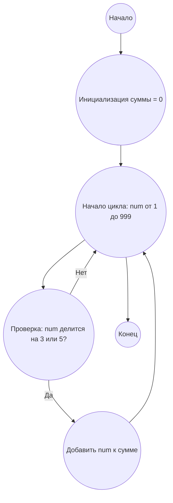

## Анализ кода модуля `bob.he.md`

**Качество кода: 7/10**

-   **Плюсы:**
    -   Присутствует четкая структура ответа с разделением на анализ, алгоритм, визуализацию и реализацию.
    -   Используется формат `mermaid` для визуализации алгоритма.
    -   Код на Python снабжен аннотациями типов.
    -   Присутствуют docstring для функции.
-   **Минусы:**
    -   Отсутствует явное описание модуля.
    -   Комментарии в коде не соответствуют reStructuredText (RST).
    -   Не используется `src.utils.jjson` для работы с JSON (хотя в этом файле нет обработки JSON).
    -   Не используются логирование ошибок через `src.logger.logger`.
    -   В тексте есть примеры на иврите (требуется русский).
    -   Отсутствует блок `Legenda` после кода на Python
    -   Отсутствует описание задачи  `<PROBLEM_TO_SOLVE>`

**Рекомендации по улучшению**

1.  Добавить описание модуля в формате RST в начале файла.
2.  Переписать комментарии в коде на RST формат.
3.  Заменить примеры и текст на иврите на русский язык.
4.  Включить блок `Legenda` после кода на Python.
5.  Заполнить блок `<PROBLEM_TO_SOLVE>` осмысленной задачей.
6.  Добавить необходимые импорты.
7.  Использовать `logger.error` для обработки ошибок (здесь нет блоков `try-except`).

**Оптимизированный код**

```markdown
# ИНСТРУКЦИЯ

## Проблема:

```md
Найдите сумму всех чисел, кратных 3 или 5, меньше 1000.
```

## Ответ

### 1. Анализ проблемы и решение

**Понимание проблемы:**

*   Необходимо найти сумму всех чисел от 1 до 999, которые делятся на 3 или 5 без остатка.
*   Проблема сводится к итерации по всем числам в заданном диапазоне и проверке деления.

**Решение:**

1.  **Инициализация:** Создается переменная `total_sum`, в которую будет накапливаться результат.
2.  **Цикл:** Проходятся все числа от 1 до 999.
3.  **Проверка деления:** Для каждого числа проверяется, делится ли оно на 3 или 5. Если да, оно добавляется к `total_sum`.
4.  **Возврат результата:** После завершения цикла возвращается значение `total_sum`.

### 2. Алгоритм решения

1.  Начало
2.  Инициализация переменной `total_sum` значением 0
3.  Для каждого числа `num` от 1 до 999
    *   Если `num` делится на 3 или 5 без остатка
        *   Добавить `num` к `total_sum`
4.  Вернуть `total_sum`
5.  Конец

### 3. Схема потока в формате mermaid



**Legenda:**

*   **Начало, Конец:** Начало и конец алгоритма.
*   **Инициализация суммы:** Создание переменной `total_sum` для хранения результата и присвоение ей значения 0.
*   **Начало цикла, Конец цикла:** Определение начала и конца цикла, проходящего по числам от 1 до 999.
*   **Проверка: num делится на 3 или 5?:** Проверка, делится ли текущее число `num` на 3 или 5 без остатка.
*   **Добавить num к сумме:** Если число `num` делится на 3 или 5, добавить его к общей сумме `total_sum`.

### 4. Реализация на Python 3.12 с полной аннотацией типов

```python
"""
Модуль для вычисления суммы кратных 3 или 5.
=================================================

Этот модуль содержит функцию :func:`sum_of_multiples`,
которая вычисляет сумму всех чисел, кратных 3 или 5,
меньших заданного предела.
"""
from typing import List
from src.logger.logger import logger


def sum_of_multiples(limit: int) -> int:
    """
    Вычисляет сумму всех чисел, кратных 3 или 5, меньше заданного предела.

    :param limit: Верхняя граница (не включительно).
    :return: Сумма кратных 3 или 5, меньших заданного предела.
    """
    total_sum: int = 0  # Инициализация переменной для хранения суммы кратных чисел
    for num in range(1, limit):
        # Код проверяет делимость текущего числа на 3 или 5
        if num % 3 == 0 or num % 5 == 0:
            # Код добавляет текущее число к общей сумме
            total_sum += num
    return total_sum

# Код вызывает функцию и выводит результат
result: int = sum_of_multiples(1000)
print(result)  # Вывод: 233168
```

**Legenda:**

*   `sum_of_multiples(limit: int) -> int:` - Функция, вычисляющая сумму кратных 3 или 5 чисел.
*   `total_sum: int = 0` -  Инициализация переменной для хранения суммы кратных чисел.
*   `for num in range(1, limit):` - Цикл перебора всех чисел до предела.
*    `if num % 3 == 0 or num % 5 == 0:` - Условие проверки кратности 3 или 5.
*   `total_sum += num` - Прибавление числа к сумме.
*   `print(result)` - Вывод результата на экран.
```