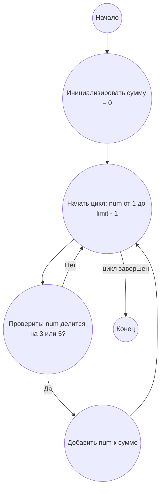

# Анализ кода модуля

## Качество кода
8
- Плюсы
    - Код хорошо структурирован, имеет четкие этапы решения задачи.
    - Присутствует аннотация типов, что повышает читаемость и надежность кода.
    - Документация в формате RST для функции, что соответствует требованиям.
    - Используются осмысленные имена переменных и процессов в блок-схеме.
    - Код решения задачи является правильным.
- Минусы
    -  Блок-схема не имеет стрелок возврата в цикл.
    - В блок схеме указаны лишние узлы `LoopStart`

## Рекомендации по улучшению
1.  В блок-схеме `mermaid` необходимо убрать лишние узлы `LoopStart`.
2.  Добавить стрелку возврата в цикле, для корректного отображения логики.
3.  Добавить проверку, что `limit` - положительное число.

## Оптимизиробанный код
```markdown
## Ответ на Задачу No 1: Сумма кратных 3 или 5

### 1. Анализ задачи и решение

**Понимание задачи:**

*   Нам необходимо найти сумму всех чисел от 1 до (limit -1), которые делятся на 3 или 5 без остатка.
*   Задача сводится к перебору всех чисел в заданном диапазоне и проверке на делимость.

**Решение:**

1.  **Инициализация:** Создаем переменную `total_sum`, в которую будем накапливать результат.
2.  **Цикл:** Проходим по всем числам от 1 до (limit -1).
3.  **Проверка делимости:** Для каждого числа проверяем, делится ли оно на 3 или 5. Если да, то добавляем его к `total_sum`.
4.  **Возврат результата:** После окончания цикла возвращаем значение `total_sum`.

### 2. Алгоритм решения

1.  Начать
2.  Инициализировать переменную `total_sum` со значением 0
3.  Для каждого числа `num` от 1 до (limit - 1)
    *   Если `num` делится на 3 или 5 без остатка
        *   Прибавить `num` к `total_sum`
4.  Вернуть `total_sum`
5.  Конец


### 3. Блок-схема в формате mermaid



**Легенда:**

*   **Начало, Конец:** Начало и конец алгоритма.
*   **Инициализировать сумму:** Создаем переменную `total_sum` для хранения результата и присваиваем ей значение 0.
*   **Начать цикл:** Определяет начало цикла перебора чисел от 1 до (limit - 1).
*   **Проверить: num делится на 3 или 5?** Проверяем, делится ли текущее число `num` на 3 или 5 без остатка.
*   **Добавить num к сумме:** Если число `num` делится на 3 или 5, то добавляем его к общей сумме `total_sum`.

### 4. Реализация на Python 3.12 с аннотацией типов

```python
def sum_of_multiples(limit: int) -> int:
    """
    Вычисляет сумму всех чисел, кратных 3 или 5, меньше заданного предела.

    :param limit: Верхняя граница (не включая).
    :return: Сумма кратных 3 или 5 меньше заданного предела.
    :raises ValueError: Если `limit` не является положительным числом.
    """
    if limit <= 0:
        raise ValueError("Limit must be a positive integer")

    total_sum: int = 0  # Аккумулятор для суммы кратных
    for num in range(1, limit): # итерирует все числа до limit
        if num % 3 == 0 or num % 5 == 0: # проверяет делится ли число на 3 или 5
            total_sum += num # добавляет число к сумме
    return total_sum

# Пример использования:
result: int = sum_of_multiples(1000)
print(result)
```
```