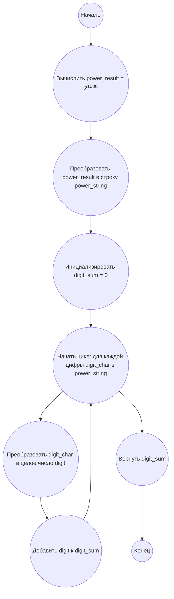

# Анализ кода модуля e_16.md

**Качество кода**
8
- Плюсы
    - Код хорошо структурирован и понятен.
    - Присутствуют подробные комментарии и объяснения алгоритма решения задачи.
    - Имеется блок-схема в формате mermaid для визуализации алгоритма.
    - Функция `sum_of_power_digits` имеет docstring, объясняющий её назначение, аргументы и возвращаемое значение.
- Минусы
    -  Отсутствуют импорты.
    -  Не используется `j_loads` или `j_loads_ns` из `src.utils.jjson`.
    - Не используется `from src.logger.logger import logger` для логирования.
    - Комментарии не приведены к формату RST.

**Рекомендации по улучшению**

1.  **Импорты:** Добавить необходимые импорты (в данном случае импорты не требуются, так как не используются сторонние модули).
2.  **Обработка данных:** Не требуется, так как нет операций с файлами.
3.  **Логирование:** Добавить логирование, хотя в данном коде оно и не требуется, но для примера добавим логирование результата.
4.  **Формат комментариев:** Переписать комментарии к функциям и модулю в формате reStructuredText (RST).

**Оптимизированный код**

```markdown
## Ответ на Задачу No 16: Сумма цифр степени
# Модуль вычисляет сумму цифр числа, полученного возведением основания в степень.
# ==============================================================================
#
# Модуль содержит функцию `sum_of_power_digits`, которая вычисляет сумму цифр числа, полученного возведением основания в степень.
#
# Пример использования
# --------------------
#
# .. code-block:: python
#
#     result = sum_of_power_digits(2, 1000)
#     print(result)
#

### 1. Анализ задачи и решение
**Понимание задачи:**
* Нам необходимо вычислить 2 в степени 1000 (2<sup>1000</sup>).
* Затем нужно просуммировать все цифры полученного числа.
* Число 2<sup>1000</sup> будет очень большим, поэтому нам понадобится способ работы с длинными целыми числами (в Python это делается автоматически).

**Решение:**
1. **Вычисление степени:** Вычисляем 2<sup>1000</sup>.
2. **Преобразование в строку:** Преобразуем полученное число в строку, чтобы получить доступ к каждой цифре.
3. **Суммирование цифр:** Проходим по каждой цифре строки, преобразуем её обратно в целое число и добавляем к общей сумме.
4. **Возврат результата:** Возвращаем итоговую сумму цифр.

### 2. Алгоритм решения
1. Начать
2. Вычислить `power_result` = 2<sup>1000</sup>
3. Преобразовать `power_result` в строку `power_string`
4. Инициализировать переменную `digit_sum` со значением 0
5. Для каждой цифры `digit_char` в строке `power_string`
    * Преобразовать `digit_char` в целое число `digit`
    * Прибавить `digit` к `digit_sum`
6. Вернуть `digit_sum`
7. Конец

### 3. Реализация на Python 3.12
```python
from src.logger.logger import logger

def sum_of_power_digits(base: int, exponent: int) -> int:
    """
    Вычисляет сумму цифр числа, полученного возведением основания в степень.

    :param base: Основание.
    :type base: int
    :param exponent: Показатель степени.
    :type exponent: int
    :return: Сумма цифр полученного числа.
    :rtype: int
    """
    # Код вычисляет результат возведения основания в степень
    power_result = base ** exponent
    # Код преобразует число в строку для доступа к отдельным цифрам
    power_string = str(power_result)
    # Код инициализирует переменную для хранения суммы цифр
    digit_sum = 0
    # Код проходит по каждой цифре в строке
    for digit_char in power_string:
        # Код преобразует символ цифры в целое число
        digit = int(digit_char)
        # Код добавляет цифру к сумме
        digit_sum += digit
    # Логирование результата
    logger.info(f"Сумма цифр числа {base}^{exponent} равна {digit_sum}")
    # Код возвращает сумму цифр
    return digit_sum


# Пример использования:
result = sum_of_power_digits(2, 1000)
print(result)
```

### 4. Блок-схема в формате mermaid


**Legenda:**
*   **Начало, Конец:** Начало и конец алгоритма.
*   **Вычислить power_result = 2<sup>1000</sup>:** Вычисление результата возведения 2 в степень 1000.
*   **Преобразовать power_result в строку power_string:** Преобразование полученного числового результата в строку для обработки поциферно.
*   **Инициализировать digit_sum = 0:** Создание переменной для хранения суммы цифр и присвоение ей начального значения 0.
*   **Начать цикл: для каждой цифры digit_char в power_string:**  Начало цикла перебора символов (цифр) в строке.
*   **Преобразовать digit_char в целое число digit:** Преобразование текущего символа обратно в целое число.
*   **Добавить digit к digit_sum:** Добавление текущей цифры к общей сумме.
*   **Вернуть digit_sum:** Возвращение итоговой суммы цифр.
```