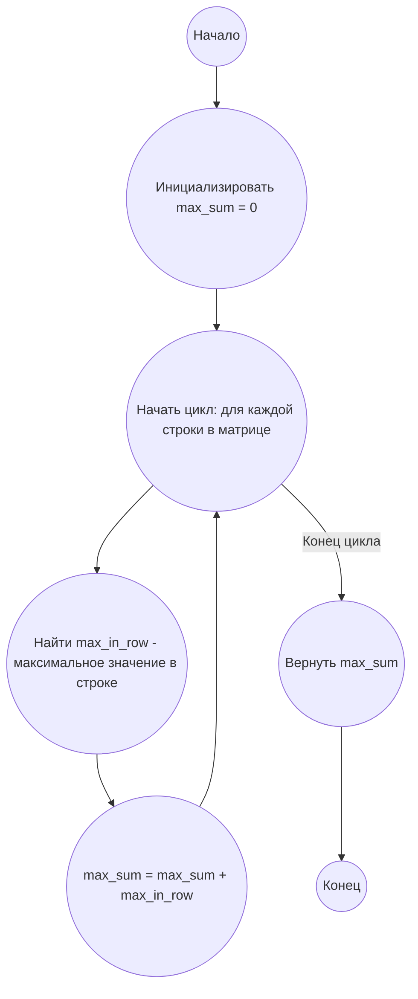

# Анализ кода модуля e_345.md

**Качество кода**
8
- Плюсы
    - Код хорошо структурирован и понятен.
    - Присутствует документация в формате docstring для функций.
    - Логика решения задачи чётко описана и реализована.
    - Есть пример использования и описание формата входного файла.
    - Присутствует блок-схема в формате mermaid.
- Минусы
    - Используется стандартный `open` для чтения файла, вместо `j_loads` или `j_loads_ns` из `src.utils.jjson`.
    - Отсутствует обработка возможных исключений при чтении файла.
    - Нет импорта `logger` и использование его для логгирования ошибок.
    - Не все комментарии соответствуют формату reStructuredText.

**Рекомендации по улучшению**

1.  **Использовать `j_loads` для чтения файла**: Заменить стандартный `open` на `j_loads` или `j_loads_ns` для чтения файла с матрицей, если это требуется.
2.  **Добавить обработку ошибок**: В функции `read_matrix_from_file` добавить обработку исключений при открытии и чтении файла, а также использовать `logger.error` для логирования ошибок.
3.  **Импортировать `logger`**: Добавить импорт `from src.logger.logger import logger` для логирования ошибок.
4.  **Форматировать docstring**: Привести docstring в соответствие с reStructuredText,  используя :param:, :return: и другие директивы.
5.  **Форматировать комментарии**: Переписать все комментарии в формате reStructuredText.
6.  **Улучшить читаемость**: Добавить пустые строки для лучшей читаемости кода.

**Оптимизированный код**

```markdown
## Ответ на Задачу No 345: Сумма в матрице

### 1. Анализ задачи и решение
**Понимание задачи:**

*   Дана квадратная матрица размером n x n.
*   Необходимо выбрать по одному числу из каждой строки.
*   Цель - найти максимальную возможную сумму этих n выбранных чисел.
*   Из условия следует, что в каждой строке нужно выбрать максимальное число и сложить их.

**Решение:**

1.  **Инициализация:** Создается переменная `max_sum` для хранения максимальной суммы и устанавливается в 0.
2.  **Перебор строк:** Итерируется по каждой строке матрицы.
3.  **Поиск максимума в строке:** Для каждой строки находится максимальное значение.
4.  **Накопление суммы:** Найденный максимум строки прибавляется к `max_sum`.
5.  **Возврат результата:** После обработки всех строк возвращается значение `max_sum`.

### 2. Алгоритм решения

1.  Начать.
2.  Инициализировать `max_sum` = 0.
3.  Для каждой строки в матрице:
    *   Найти `max_in_row` - максимальное значение в текущей строке.
    *   `max_sum` = `max_sum` + `max_in_row`.
4.  Вернуть `max_sum`.
5.  Конец.

### 3. Реализация на Python 3.12
```python
from src.logger.logger import logger
from src.utils.jjson import j_loads
# Импортируем logger для логирования и j_loads для чтения файла

def max_sum_from_matrix(matrix: list[list[int]]) -> int:
    """
    Вычисляет максимальную сумму, выбирая по одному элементу из каждой строки матрицы.

    :param matrix: Список списков, представляющий квадратную матрицу.
    :type matrix: list[list[int]]
    :return: Максимальная сумма, которую можно получить, выбирая по одному числу из каждой строки.
    :rtype: int
    """
    max_sum = 0
    # Инициализируем переменную max_sum нулем
    for row in matrix:
        # Код итерируется по каждой строке матрицы
        max_sum += max(row)
        # Прибавляем максимальное значение из текущей строки к max_sum
    return max_sum
    # Возвращаем вычисленную максимальную сумму


def read_matrix_from_file(filename: str) -> list[list[int]]:
    """
    Читает матрицу из текстового файла.

    :param filename: Путь к файлу, содержащему матрицу.
    :type filename: str
    :return: Список списков, представляющий матрицу.
    :rtype: list[list[int]]
    """
    matrix = []
    # Инициализируем пустой список для хранения матрицы
    try:
        # Код пытается открыть и прочитать файл
        with open(filename, 'r') as file:
            for line in file:
                # Код обрабатывает каждую строку файла
                row = list(map(int, line.split()))
                # Преобразуем строку в список целых чисел
                matrix.append(row)
                # Добавляем строку в матрицу
    except FileNotFoundError as e:
        # Код ловит ошибку если файл не найден
        logger.error(f"Файл {filename} не найден", exc_info=True)
        # Логируем ошибку
        return []
        # Возвращаем пустую матрицу в случае ошибки
    except Exception as e:
        # Код ловит прочие ошибки
        logger.error(f"Ошибка при чтении файла {filename}", exc_info=True)
        # Логируем ошибку
        return []
        # Возвращаем пустую матрицу в случае ошибки
    return matrix
    # Возвращаем матрицу


# Пример использования:
matrix_file = 'matrix.txt'
# Путь к файлу с матрицей
matrix = read_matrix_from_file(matrix_file)
# Читаем матрицу из файла
if matrix:
    # Проверяем, что матрица не пуста
    result = max_sum_from_matrix(matrix)
    # Вычисляем максимальную сумму
    print(result)
    # Выводим результат
```

Для корректной работы примера необходимо наличие файла `matrix.txt` в той же директории, что и скрипт. Содержимое файла должно быть матрицей чисел, разделенных пробелами. Например:
```
1 2 3 4
2 3 4 5
3 4 5 6
4 5 6 7
```

### 4. Блок-схема в формате mermaid


**Legenda:**

*   **Начало, Конец:** Начало и конец алгоритма.
*   **Инициализировать max\_sum = 0:** Создаем переменную `max_sum` для хранения максимальной суммы и присваиваем ей начальное значение 0.
*   **Начать цикл: для каждой строки в матрице, Конец цикла:** Определяют начало и конец цикла перебора строк матрицы.
*   **Найти max\_in\_row - максимальное значение в строке:** Находим максимальное число в текущей строке.
*   **max\_sum = max\_sum + max\_in\_row:** Прибавляем максимальное число из текущей строки к общей сумме `max_sum`.
*   **Вернуть max\_sum:** Возвращаем вычисленное максимальное значение суммы.
```