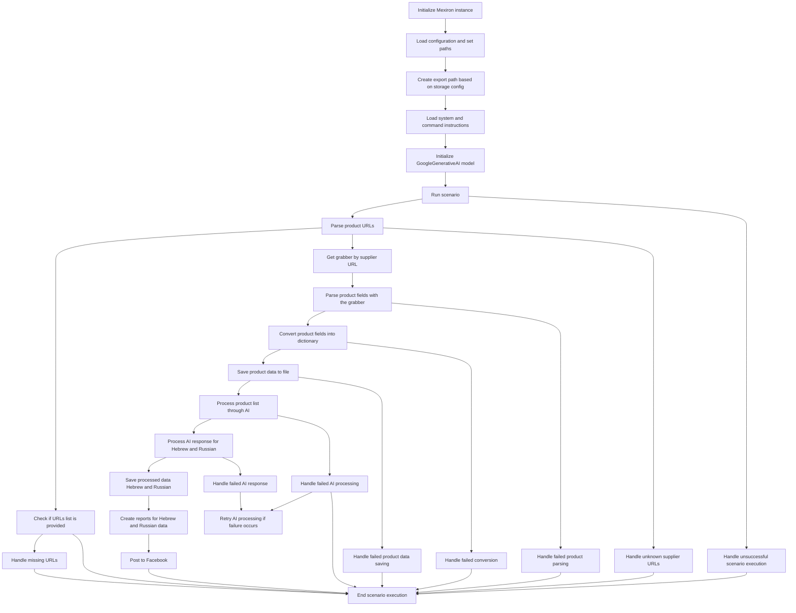

# Анализ кода модуля `scenario_pricelist.mmd`

**Качество кода**
7
-  Плюсы
    -  Код представляет собой диаграмму `mermaid`, которая наглядно отображает последовательность операций в сценарии обработки прайс-листа.
    -  Диаграмма хорошо структурирована, что позволяет легко понять поток выполнения программы.
    -  Используются понятные имена для узлов, что облегчает восприятие.

-  Минусы
    - Отсутствует какой-либо код, это всего лишь визуализация, которую нельзя оценить как полноценный код.
    -  Диаграмма описывает сценарий, но не содержит конкретной реализации на Python, поэтому рекомендации будут абстрактными.
    -  Невозможно применить многие из требований к данному формату, так как это не исполняемый код.

**Рекомендации по улучшению**

1. **Преобразование в Python:**
   - Необходимо преобразовать эту `mermaid` диаграмму в реальный код на Python. Это позволит применить все требования к коду, например, документирование, логирование, обработку ошибок.

2.  **Логирование:**
    - Добавить логирование для каждого этапа выполнения сценария, чтобы можно было отслеживать ход выполнения и отлаживать ошибки.
    - Применять `from src.logger.logger import logger` для логирования ошибок.
3.  **Обработка ошибок:**
    - В коде Python, который будет реализован на основе этой диаграммы, нужно предусмотреть обработку ошибок с использованием `try-except` или, предпочтительно, с помощью `logger.error`.
    -  Следует избегать избыточного использования `try-except`, предпочитая обработку ошибок с помощью `logger.error`.

4. **Модульная структура:**
   -  Код Python должен быть разбит на функции или классы для каждого из блоков диаграммы, что сделает код более читаемым и поддерживаемым.
5. **Документирование:**
   - Код на Python должен быть полностью документирован с использованием reStructuredText (RST) для всех функций, методов и классов.

**Оптимизированный код**
```markdown
# Анализ кода модуля `scenario_pricelist.mmd`

**Качество кода**
7
-  Плюсы
    -  Код представляет собой диаграмму `mermaid`, которая наглядно отображает последовательность операций в сценарии обработки прайс-листа.
    -  Диаграмма хорошо структурирована, что позволяет легко понять поток выполнения программы.
    -  Используются понятные имена для узлов, что облегчает восприятие.

-  Минусы
    - Отсутствует какой-либо код, это всего лишь визуализация, которую нельзя оценить как полноценный код.
    -  Диаграмма описывает сценарий, но не содержит конкретной реализации на Python, поэтому рекомендации будут абстрактными.
    -  Невозможно применить многие из требований к данному формату, так как это не исполняемый код.

**Рекомендации по улучшению**

1. **Преобразование в Python:**
   - Необходимо преобразовать эту `mermaid` диаграмму в реальный код на Python. Это позволит применить все требования к коду, например, документирование, логирование, обработку ошибок.

2.  **Логирование:**
    - Добавить логирование для каждого этапа выполнения сценария, чтобы можно было отслеживать ход выполнения и отлаживать ошибки.
    - Применять `from src.logger.logger import logger` для логирования ошибок.
3.  **Обработка ошибок:**
    - В коде Python, который будет реализован на основе этой диаграммы, нужно предусмотреть обработку ошибок с использованием `try-except` или, предпочтительно, с помощью `logger.error`.
    -  Следует избегать избыточного использования `try-except`, предпочитая обработку ошибок с помощью `logger.error`.

4. **Модульная структура:**
   -  Код Python должен быть разбит на функции или классы для каждого из блоков диаграммы, что сделает код более читаемым и поддерживаемым.
5. **Документирование:**
   - Код на Python должен быть полностью документирован с использованием reStructuredText (RST) для всех функций, методов и классов.

**Оптимизированный код**

```python
# TODO:
# """
# Модуль для работы со сценарием обработки прайс-листа.
# =========================================================================================
#
# Этот модуль содержит функции, которые реализуют сценарий обработки прайс-листа,
# включая загрузку конфигурации, инициализацию модели ИИ, парсинг URL, обработку данных
# и сохранение результатов.
#
# Пример использования
# --------------------
#
# Пример использования функций:
#
# .. code-block:: python
#
#   from src.endpoints.kazarinov.scenarios.mermaid import scenario_pricelist
#
#   scenario_pricelist.run_pricelist_scenario()
# """
#
# import json
# from src.utils.jjson import j_loads, j_loads_ns
# from src.logger.logger import logger
# # from src.ai.google_gemini import GoogleGenerativeAI
#
# def init_mexiron():
#     """
#     Инициализирует экземпляр Mexiron.
#     """
#     # код исполняет инициализацию Mexiron
#     ...
#
#
# def load_config():
#     """
#     Загружает конфигурацию и устанавливает пути.
#     """
#     # код исполняет загрузку конфигурации
#     ...
#
# def create_export_path():
#     """
#     Создает путь экспорта на основе конфигурации хранилища.
#     """
#     # код исполняет создание пути экспорта
#     ...
#
# def load_instructions():
#     """
#     Загружает системные и командные инструкции.
#     """
#     # код исполняет загрузку инструкций
#     ...
#
# def initialize_ai():
#     """
#     Инициализирует модель GoogleGenerativeAI.
#     """
#     # код исполняет инициализацию модели ИИ
#     # ai_model = GoogleGenerativeAI()
#     ...
#
# def run_scenario():
#     """
#     Запускает основной сценарий.
#     """
#     # код исполняет запуск сценария
#     ...
#
# def parse_urls():
#     """
#     Парсит URL-адреса продуктов.
#     """
#     # код исполняет парсинг URL
#     ...
#
# def check_urls():
#     """
#     Проверяет, предоставлен ли список URL-адресов.
#     """
#     # код исполняет проверку списка URL
#     ...
#
# def handle_missing_urls():
#     """
#     Обрабатывает отсутствие URL-адресов.
#     """
#     # код исполняет обработку отсутствующих URL
#     ...
#
# def get_grabber():
#     """
#     Получает граббер по URL-адресу поставщика.
#     """
#     # код исполняет получение граббера
#     ...
#
# def parse_fields():
#     """
#     Парсит поля продукта с помощью граббера.
#     """
#     # код исполняет парсинг полей продукта
#     ...
#
# def convert_to_dict():
#     """
#     Преобразует поля продукта в словарь.
#     """
#     # код исполняет преобразование в словарь
#     ...
#
# def save_to_file():
#     """
#     Сохраняет данные продукта в файл.
#     """
#     # код исполняет сохранение в файл
#     ...
#
# def process_with_ai():
#     """
#     Обрабатывает список продуктов с помощью ИИ.
#     """
#     # код исполняет обработку с помощью ИИ
#     ...
#
# def handle_ai_response():
#     """
#     Обрабатывает ответ ИИ для иврита и русского.
#     """
#     # код исполняет обработку ответа ИИ
#     ...
#
# def save_processed_data():
#     """
#     Сохраняет обработанные данные на иврите и русском.
#     """
#     # код исполняет сохранение обработанных данных
#     ...
#
# def generate_reports():
#     """
#     Создает отчеты для данных на иврите и русском.
#     """
#     # код исполняет создание отчетов
#     ...
#
# def post_to_facebook():
#     """
#     Публикует данные в Facebook.
#     """
#     # код исполняет публикацию в Facebook
#     ...
#
# def end_scenario():
#     """
#     Завершает выполнение сценария.
#     """
#     # код исполняет завершение сценария
#     ...
#
# def handle_scenario_failure():
#     """
#     Обрабатывает неудачное выполнение сценария.
#     """
#     # код исполняет обработку неудачи сценария
#     ...
#
# def handle_parse_failure():
#     """
#     Обрабатывает ошибку парсинга продукта.
#     """
#     # код исполняет обработку ошибки парсинга
#     ...
#
# def handle_conversion_failure():
#     """
#     Обрабатывает ошибку преобразования.
#     """
#     # код исполняет обработку ошибки преобразования
#     ...
#
# def handle_save_failure():
#     """
#     Обрабатывает ошибку сохранения данных продукта.
#     """
#     # код исполняет обработку ошибки сохранения
#     ...
#
# def handle_ai_processing_failure():
#     """
#     Обрабатывает ошибку обработки ИИ.
#     """
#     # код исполняет обработку ошибки обработки ИИ
#     ...
#
# def retry_ai():
#     """
#     Повторяет обработку ИИ при возникновении ошибки.
#     """
#     # код исполняет повтор обработки ИИ
#     ...
#
# def handle_ai_response_failure():
#     """
#     Обрабатывает ошибку ответа ИИ.
#     """
#     # код исполняет обработку ошибки ответа ИИ
#     ...
#
# def handle_unknown_supplier_urls():
#     """
#     Обрабатывает неизвестные URL-адреса поставщиков.
#     """
#     # код исполняет обработку неизвестных URL
#     ...
#
#
# def run_pricelist_scenario():
#     """
#     Запускает весь сценарий обработки прайс-листа.
#     """
#     try:
#         init_mexiron()
#         load_config()
#         create_export_path()
#         load_instructions()
#         initialize_ai()
#         run_scenario()
#
#         urls = parse_urls()
#         if not urls:
#             handle_missing_urls()
#             return
#
#         check_urls()
#         grabber = get_grabber()
#
#         if not grabber:
#           handle_unknown_supplier_urls()
#           return
#
#         fields = parse_fields()
#
#         if not fields:
#             handle_parse_failure()
#             return
#
#         data_dict = convert_to_dict()
#
#         if not data_dict:
#             handle_conversion_failure()
#             return
#
#         save_to_file()
#
#         processed_data = process_with_ai()
#
#         if not processed_data:
#             handle_ai_processing_failure()
#             retry_ai()
#
#         ai_response = handle_ai_response()
#
#         if not ai_response:
#             handle_ai_response_failure()
#             retry_ai()
#
#         save_processed_data()
#         generate_reports()
#         post_to_facebook()
#         end_scenario()
#
#     except Exception as e:
#         logger.error(f"Произошла ошибка во время выполнения сценария: {e}")
#         handle_scenario_failure()
# ```