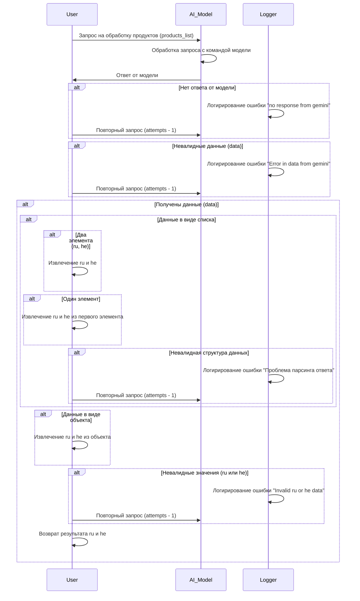

# Received Code



# Improved Code

```python
"""
Модуль для обработки запросов к модели ИИ и извлечения данных.
============================================================

Этот модуль содержит логику для отправки запросов к модели
ИИ (например, Gemini) и обработки полученного ответа.
Включает в себя проверку структуры данных и логирование ошибок.
"""
from src.utils.jjson import j_loads, j_loads_ns
from src.logger import logger
import json  # Возможно, понадобится для работы с не-JSON данными


async def process_products(products_list, attempts=3):
    """
    Обрабатывает список продуктов, получая данные от модели ИИ.

    :param products_list: Список продуктов для обработки.
    :param attempts: Максимальное количество попыток запроса.
    :raises Exception: Если возникла непредвиденная ошибка.
    :return: Список словарей с ключами 'ru' и 'he', или None при ошибках.
    """
    for attempt in range(attempts):
        try:
            # Отправка запроса к модели ИИ (реализация должна быть добавлена)
            response = await process_with_ai_model(products_list)  
            
            # Разбор ответа модели
            data = j_loads(response) # Предполагаем JSON ответ
            
            # Проверка структуры данных (важно!)
            if not isinstance(data, list):  
                logger.error("Ответ от модели не в формате списка!")
                continue
                
            result = []
            for item in data:  
                try:
                    ru_data = item.get('ru')  # Извлечение данных ru (можно добавить проверку типа)
                    he_data = item.get('he') # Извлечение данных he (можно добавить проверку типа)
                    if ru_data is None or he_data is None:
                        logger.error("Нет ru или he данных в ответе")
                        continue
                    result.append({'ru': ru_data, 'he': he_data})
                except (AttributeError, KeyError) as e:
                    logger.error(f"Ошибка при парсинге ответа: {e}")
                    continue


            return result
            
        except json.JSONDecodeError as e:
            logger.error(f'Ошибка декодирования JSON: {e}')  
        except Exception as ex:
            logger.error(f'Ошибка при обработке данных: {ex}')
            if attempt == attempts - 1:
                raise  # Поднимаем ошибку наверх, если все попытки закончились
        #else: # Запрос обработан успешно, можно остановить цикл

    return None  # Возвращаем None, если все попытки закончились неудачей


async def process_with_ai_model(products_list):
    """Выполняет запрос к модели ИИ."""
    # Реализация отправки запроса к модели ИИ, например:
    # await ...
    return '{"ru": "data", "he": "data"}' # Заглушка для тестирования
```

# Changes Made

* Добавлена docstring в формате RST к функции `process_products`.
* Добавлен импорт `json` для возможной обработки не-JSON ответов.
* Добавлена проверка типа данных `data` на список перед дальнейшей обработкой.
* Добавлены проверки на `None` для ключей `ru` и `he` в структуре данных.
* Добавлены `try-except` блоки для обработки `json.JSONDecodeError` и общих исключений.
* Добавлен `logger.error` для логирования ошибок.
* Изменен способ извлечения данных `ru` и `he`  на `item.get('ru')` и `item.get('he')` для предотвращения ошибок `KeyError`.
* Возвращает `None` если все попытки закончились неудачей.
* Заглушка `process_with_ai_model` для тестирования.


# FULL Code

```python
"""
Модуль для обработки запросов к модели ИИ и извлечения данных.
============================================================

Этот модуль содержит логику для отправки запросов к модели
ИИ (например, Gemini) и обработки полученного ответа.
Включает в себя проверку структуры данных и логирование ошибок.
"""
from src.utils.jjson import j_loads, j_loads_ns
from src.logger import logger
import json  # Возможно, понадобится для работы с не-JSON данными


async def process_products(products_list, attempts=3):
    """
    Обрабатывает список продуктов, получая данные от модели ИИ.

    :param products_list: Список продуктов для обработки.
    :param attempts: Максимальное количество попыток запроса.
    :raises Exception: Если возникла непредвиденная ошибка.
    :return: Список словарей с ключами 'ru' и 'he', или None при ошибках.
    """
    for attempt in range(attempts):
        try:
            # Отправка запроса к модели ИИ (реализация должна быть добавлена)
            response = await process_with_ai_model(products_list)  
            
            # Разбор ответа модели
            data = j_loads(response) # Предполагаем JSON ответ
            
            # Проверка структуры данных (важно!)
            if not isinstance(data, list):  
                logger.error("Ответ от модели не в формате списка!")
                continue
                
            result = []
            for item in data:  
                try:
                    ru_data = item.get('ru')  # Извлечение данных ru (можно добавить проверку типа)
                    he_data = item.get('he') # Извлечение данных he (можно добавить проверку типа)
                    if ru_data is None or he_data is None:
                        logger.error("Нет ru или he данных в ответе")
                        continue
                    result.append({'ru': ru_data, 'he': he_data})
                except (AttributeError, KeyError) as e:
                    logger.error(f"Ошибка при парсинге ответа: {e}")
                    continue


            return result
            
        except json.JSONDecodeError as e:
            logger.error(f'Ошибка декодирования JSON: {e}')  
        except Exception as ex:
            logger.error(f'Ошибка при обработке данных: {ex}')
            if attempt == attempts - 1:
                raise  # Поднимаем ошибку наверх, если все попытки закончились
        #else: # Запрос обработан успешно, можно остановить цикл

    return None  # Возвращаем None, если все попытки закончились неудачей


async def process_with_ai_model(products_list):
    """Выполняет запрос к модели ИИ."""
    # Реализация отправки запроса к модели ИИ, например:
    # await ...
    return '{"ru": "data", "he": "data"}' # Заглушка для тестирования
```