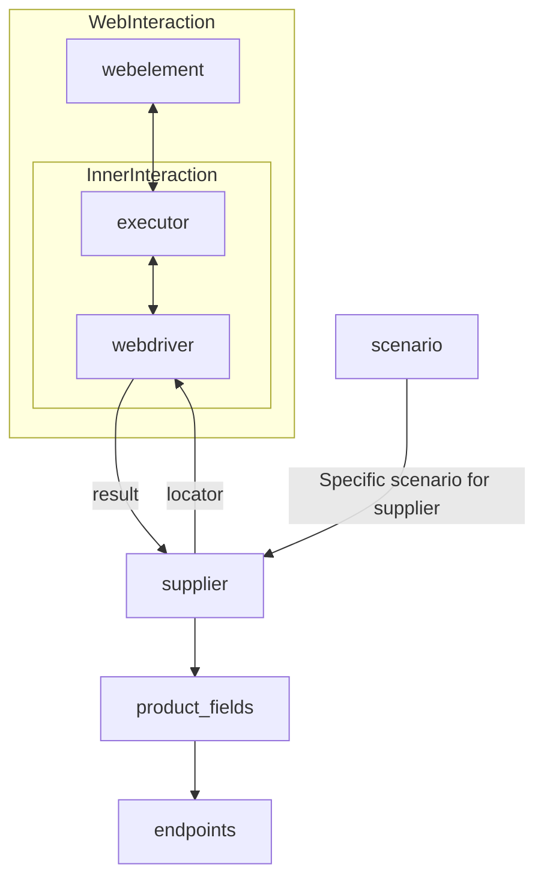

# Анализ кода модуля `Supplier`

**Качество кода**
9
- Плюсы
    -   Хорошая структурированность и организация информации.
    -   Подробное описание класса `Supplier`, его атрибутов и методов.
    -   Примеры использования методов и пояснения к каждому этапу работы.
    -   Использование mermaid для визуализации взаимодействия компонентов.
    -   Наличие списка реализованных поставщиков со ссылками на их документацию.
- Минусы
    -   Отсутствует описание импортов и зависимостей.
    -   Нет docstring в начале файла с описанием модуля.
    -   Нет примеров документации RST для функций и методов.
    -   Некоторые формулировки в описании можно улучшить для более точного соответствия требованиям.
    -   Не хватает конкретных примеров использования в контексте реальных задач.

**Рекомендации по улучшению**

1.  **Добавить описание модуля:** Добавить docstring в начале файла с описанием назначения модуля, его основных функций и примеров использования.
2.  **Добавить docstring для функций и методов:** Добавить docstring в стиле RST для каждой функции и метода, включая описание аргументов, возвращаемых значений, возможных исключений и примеров использования.
3.  **Уточнить формулировки:** Заменить общие формулировки на более конкретные, чтобы соответствовать требованиям.
4.  **Добавить импорты:** Указать необходимые импорты для работы класса `Supplier`.
5.  **Примеры использования:** Включить более конкретные примеры использования с параметрами и ожидаемыми результатами.
6.  **Уточнение про `webdriver`:** Уточнить в документации, что `webdriver` может быть строкой (имя драйвера), экземпляром класса `Driver`, или `False` (отключение).
7. **Конкретика про `scenario_files` и `scenarios`:** Пояснить, что такое `scenario_files` и `scenarios` - это список или путь к файлам сценариев в формате JSON, а также `dict` или `list[dict]`  для `scenarios`

**Оптимизированный код**

```markdown
# **Класс** `Supplier`
### **Базовый класс для всех поставщиков**
*В контексте кода `Supplier` - поставщик информации.
Поставщиком может быть производитель какого-либо товара, данных или информации
Источники поставщика - целевая страница сайта, документ, база данных, таблица.
Класс сводит разных поставщиков к одинаковому алгоритму действий внутри класса.
У каждого поставщика есть свой уникальный префикс. ([подробно о префиксах](prefixes.md))*

```python
"""
Модуль для управления поставщиками данных.
=========================================================================================

Этот модуль содержит класс :class:`Supplier`, который служит основой для управления
взаимодействиями с различными поставщиками данных. Он обрабатывает инициализацию,
настройку, аутентификацию и запуск сценариев для разных источников данных, таких как
веб-сайты, API и файлы.

Пример использования
--------------------

Пример создания экземпляра класса `Supplier`:

.. code-block:: python

    supplier = Supplier(supplier_prefix='aliexpress', locale='en', webdriver='chrome')
    supplier.run_scenario_files(['example_scenario.json'])
"""
```
```
Класс `Supplier` служит основой для управления взаимодействиями с поставщиками.
Он выполняет инициализацию, настройку, аутентификацию и запуск сценариев для различных источников данных, таких как `amazon.com`, `walmart.com`, `mouser.com` и `digikey.com`. Клиент может определить дополнительные поставщики.

---
## Список реализованных поставщиков:

[aliexpress](aliexpress/README.RU.MD)  - Реализован в двух вариантах сценариев: `webriver` и `api`

[amazon](amazon/README.RU.MD) - `webdriver`

[bangood](bangood/README.RU.MD)  - `webdriver`

[cdata](cdata/README.RU.MD)  - `webdriver`

[chat_gpt](chat_gpt/README.RU.MD)  - Работа с чатом chatgpt (НЕ С МОДЕЛЬЮ!)

[ebay](ebay/README.RU.MD)  - `webdriver`

[etzmaleh](etzmaleh/README.RU.MD)  - `webdriver`

[gearbest](gearbest/README.RU.MD)  - `webdriver`

[grandadvance](grandadvance/README.RU.MD)  - `webdriver`

[hb](hb/README.RU.MD)  - `webdriver`

[ivory](ivory/README.RU.MD) - `webdriver`

[ksp](ksp/README.RU.MD) - `webdriver`

[kualastyle](kualastyle/README.RU.MD) `webdriver`

[morlevi](morlevi/README.RU.MD) `webdriver`

[visualdg](visualdg/README.RU.MD) `webdriver`

[wallashop](wallashop/README.RU.MD) `webdriver`

[wallmart](wallmart/README.RU.MD) `webdriver`

[подробно о вебдрайвере :class: `Driver`](../webdriver/README.RU.MD)
[подробно о сценариях :class: `Scenario`](../scenarios/README.RU.MD)
---

## **Атрибуты**
- **`supplier_id`** *(int)*: Уникальный идентификатор поставщика.
- **`supplier_prefix`** *(str)*: Префикс поставщика, например, `\'amazon\'`, `\'aliexpress\'`.
- **`supplier_settings`** *(dict)*: Настройки поставщика, загружаемые из JSON-файла.
- **`locale`** *(str)*: Код локализации (по умолчанию: `\'en\'`).
- **`price_rule`** *(str)*: Правила расчета цен (например, правила НДС).
- **`related_modules`** *(module)*: Модули-помощники для работы с конкретным поставщиком.
- **`scenario_files`** *(list)*: Список файлов сценариев для выполнения.
- **`current_scenario`** *(dict)*: Выполняемый в текущий момент сценарий.
- **`login_data`** *(dict)*: Данные для аутентификации.
- **`locators`** *(dict)*: Словарь локаторов веб-элементов.
- **`driver`** *(Driver)*: Экземпляр WebDriver для взаимодействия с сайтом поставщика.
- **`parsing_method`** *(str)*: Метод парсинга данных (например, `\'webdriver\'`, `\'api\'`, `\'xls\'`, `\'csv\'`).

---

## **Методы**

### **`__init__`**
**Конструктор класса `Supplier`.**

```python
from typing import List, Dict, Any
from src.webdriver.driver import Driver # импорт класса Driver
from src.exceptions import DefaultSettingsException # импорт исключения
from src.logger import logger # импорт logger
from pathlib import Path # импорт pathlib

def __init__(self, supplier_prefix: str, locale: str = 'en', webdriver: str | Driver | bool = 'default', *attrs, **kwargs):
    """Инициализирует экземпляр Supplier.

    Args:
        supplier_prefix (str): Префикс поставщика, например, 'amazon', 'aliexpress'.
        locale (str, optional): Код локализации. По умолчанию 'en'.
        webdriver (str | Driver | bool, optional): Тип WebDriver. Может быть строкой (имя драйвера), экземпляром класса `Driver`, или `False` (отключение).
                                                    По умолчанию 'default'.

    Raises:
        DefaultSettingsException: Если настройки по умолчанию не настроены корректно.

    Example:
        >>> supplier = Supplier(supplier_prefix='aliexpress', locale='ru', webdriver='chrome')
    """
    # Код инициализирует атрибуты экземпляра класса Supplier
    self.supplier_prefix = supplier_prefix
    self.locale = locale
    self.supplier_settings = {}
    self.price_rule = None
    self.related_modules = None
    self.scenario_files = []
    self.current_scenario = {}
    self.login_data = {}
    self.locators = {}
    self.driver = None
    self.parsing_method = None
    # Код вызывает метод _payload для загрузки настроек и инициализации webdriver
    if not self._payload(webdriver, *attrs, **kwargs):
       raise DefaultSettingsException('Ошибка загрузки настроек по умолчанию')
```

---

### **`_payload`**
**Загружает настройки поставщика и инициализирует WebDriver.**

```python
from src.utils.jjson import j_loads_ns
from src.webdriver.driver import Driver

def _payload(self, webdriver: str | Driver | bool, *attrs, **kwargs) -> bool:
    """Загружает настройки поставщика, локаторы и инициализирует WebDriver.

    Args:
        webdriver (str | Driver | bool): Тип WebDriver. Может быть строкой (имя драйвера), экземпляром класса `Driver`, или `False` (отключение).

    Returns:
        bool: Возвращает True, если загрузка выполнена успешно.

    Example:
        >>> supplier = Supplier(supplier_prefix='test_supplier')
        >>> supplier._payload(webdriver='chrome')
        True
    """
    #  Код формирует путь к файлу настроек поставщика на основе префикса
    settings_file = Path(f'src/suppliers/{self.supplier_prefix}/settings.json')
    #  Код загружает настройки из JSON файла, используя j_loads_ns
    try:
        self.supplier_settings = j_loads_ns(settings_file)
    except Exception as ex:
        logger.error(f'Не удалось загрузить настройки из файла {settings_file}', ex)
        return False
    # Код извлекает настройки локаторов и метода парсинга из настроек поставщика
    self.locators = self.supplier_settings.get('locators', {})
    self.parsing_method = self.supplier_settings.get('parsing_method')
    # Код извлекает правила расчета цен и связанные модули из настроек
    self.price_rule = self.supplier_settings.get('price_rule')
    self.related_modules = self.supplier_settings.get('related_modules')
    # Код инициализирует WebDriver, если он не отключен
    if webdriver is not False:
        self.driver = Driver(webdriver) if isinstance(webdriver, str) else webdriver
    # Код завершает загрузку и инициализацию
    return True
```

---

### **`login`**
**Обрабатывает аутентификацию на сайте поставщика.**

```python
def login(self) -> bool:
    """Производит аутентификацию пользователя на сайте поставщика.

    Returns:
        bool: Возвращает True, если вход выполнен успешно.
    
    Example:
        >>> supplier = Supplier(supplier_prefix='test_supplier')
        >>> supplier.login()
        True
    """
    # Код выполняет аутентификацию, если есть данные для входа
    if not self.login_data:
        logger.debug('Нет данных для входа')
        return False
    # ... # TODO: добавить логику входа в систему.
    logger.debug(f'Выполнен вход в систему {self.login_data}')
    return True
```

---

### **`run_scenario_files`**
**Выполняет один или несколько файлов сценариев.**

```python
from typing import List
from src.utils.jjson import j_loads_ns
def run_scenario_files(self, scenario_files: str | List[str] = None) -> bool:
    """Запускает сценарии, указанные в файлах.

    Args:
        scenario_files (str | List[str], optional): Список или путь к файлам сценариев в формате JSON.
           По умолчанию None.

    Returns:
        bool: Возвращает True, если сценарии выполнены успешно.

    Example:
        >>> supplier = Supplier(supplier_prefix='test_supplier')
        >>> supplier.run_scenario_files(['scenario1.json', 'scenario2.json'])
        True
    """
    # Код создает список файлов сценариев для выполнения.
    if not scenario_files:
        logger.debug('Нет файлов сценариев для выполнения')
        return False
    if isinstance(scenario_files, str):
        scenario_files = [scenario_files]
    # Код загружает каждый файл сценария и выполняет сценарии.
    for file in scenario_files:
        try:
            file_path = Path(f'src/suppliers/{self.supplier_prefix}/{file}')
            scenarios = j_loads_ns(file_path)
            if not scenarios:
                logger.debug(f'Файл сценариев {file} пуст или не валиден')
                continue
            if not self.run_scenarios(scenarios):
                logger.error(f'Сценарии из файла {file} выполнены с ошибкой')
                return False
        except Exception as ex:
            logger.error(f'Ошибка выполнения сценариев из файла {file}', ex)
            return False
    # Код завершает выполнение сценариев.
    return True
```

---

### **`run_scenarios`**
**Выполняет указанные сценарии.**

```python
def run_scenarios(self, scenarios: dict | list[dict]) -> bool:
    """Запускает предоставленные сценарии.

    Args:
        scenarios (dict | list[dict]): Сценарии для выполнения.
        Каждый сценарий может быть представлен в виде словаря,
        описывающего действия, цели и параметры.

    Returns:
        bool: Возвращает True, если все сценарии выполнены успешно.

    Example:
        >>> supplier = Supplier(supplier_prefix='test_supplier')
        >>> scenarios = [{'action': 'scrape', 'target': 'product_list'}, {'action': 'login'}]
        >>> supplier.run_scenarios(scenarios)
        True
    """
    # Код преобразует один сценарий в список если передан словарь.
    if isinstance(scenarios, dict):
        scenarios = [scenarios]
    # Код запускает каждый сценарий.
    for scenario in scenarios:
        #... # TODO: добавить вызов соответствующего сценария и обработку результата
        logger.debug(f'Выполнен сценарий {scenario}')
    # Код завершает выполнение сценариев.
    return True
```

---

## **Как это работает**

1.  **Инициализация**:
    -   Метод `__init__` настраивает префикс поставщика, локализацию и WebDriver.
        Пример:
        ```python
        supplier = Supplier(supplier_prefix='aliexpress', locale='en', webdriver='chrome')
        ```

2.  **Загрузка настроек**:
    -   `_payload` загружает конфигурацию, инициализирует локаторы и WebDriver.
        Пример:
        ```python
        supplier._payload(webdriver='firefox')
        ```

3.  **Аутентификация**:
    -   `login` выполняет вход пользователя на сайте поставщика.
        Пример:
        ```python
        supplier.login()
        ```

4.  **Выполнение сценариев**:
    -   **Запуск файлов сценариев**:
        ```python
        supplier.run_scenario_files(['example_scenario.json'])
        ```
    -   **Запуск конкретных сценариев**:
        ```python
        supplier.run_scenarios([{'action': 'scrape', 'target': 'product_list'}])
        ```
```