# Документация модуля `hypotez/src/ai/prompts/developer/doc_writer_md_ru.md`

## Обзор

Этот модуль содержит инструкции для создания документации разработчика в формате Markdown (`.md`) для Python-кода. Инструкции описывают требования к форматированию, содержанию и структуре документации, а также предоставляют примеры для наглядности.

## Содержание

1. [Инструкция](#инструкция)
2. [Конец инструкции](#конец-инструкции)
3. [Prompt](#prompt)

## Инструкция

### Формат документации

- Документация должна быть в формате Markdown (`.md`).
- Каждый файл документации начинается с заголовка и краткого описания содержимого.
- Для классов и функций используется формат комментариев:

  ```python
  def function(param: str, param1: Optional[str | dict | str] = None) -> dict | None:
      """
      Args:
          param (str): Описание параметра `param`.
          param1 (Optional[str | dict | str], optional): Описание параметра `param1`. По умолчанию `None`.

      Returns:
          dict | None: Описание возвращаемого значения. Возвращает словарь или `None`.

      Raises:
          SomeError: Описание ситуации, в которой возникает исключение `SomeError`.
      """
  ```
- В блоках обработки исключений используется `ex` вместо `e`.

### Содержание (TOC)

- В начале каждого файла документации добавляется оглавление.
- Оглавление включает ссылки на основные разделы документации модуля.

### Форматирование документации

- Используется правильный синтаксис Markdown для заголовков, списков и ссылок.
- Для классов, функций и методов создаются структурированные разделы с описаниями, деталями параметров, возвращаемых значений и исключений.

  ```markdown
  ## Функции

  ### `function_name`

  **Описание**: Краткое описание функции.

  **Параметры**:
  - `param` (str): Описание параметра `param`.
  - `param1` (Optional[str | dict | str], optional): Описание параметра `param1`. По умолчанию `None`.

  **Возвращает**:
  - `dict | None`: Описание возвращаемого значения.

  **Вызывает исключения**:
  - `SomeError`: Описание ситуации, в которой возникает исключение `SomeError`.
  ```

### Заголовки разделов

- Используются заголовки уровней 1 (`#`), 2 (`##`), 3 (`###`) и 4 (`####`) последовательно.

### Пример файла

```markdown
# Название модуля

## Обзор

Краткое описание назначения модуля.

## Классы

### `ClassName`

**Описание**: Краткое описание класса.

**Методы**:
- `method_name`: Краткое описание метода.
- `method_name`: Краткое описание метода.

**Параметры**:
- `param` (str): Описание параметра `param`.
- `param1` (Optional[str | dict | str], optional): Описание параметра `param1`. По умолчанию `None`.

## Функции

### `function_name`

**Описание**: Краткое описание функции.

**Методы**:
- `method_name`: Краткое описание метода.
- `method_name`: Краткое описание метода.

**Параметры**:
- `param` (str): Описание параметра `param`.
- `param1` (Optional[str | dict | str], optional): Описание параметра `param1`. По умолчанию `None`.

**Возвращает**:
- `dict | None`: Описание возвращаемого значения.

**Вызывает исключения**:
- `SomeError`: Описание ситуации, в которой возникает исключение `SomeError`.
```

## Конец инструкции

Инструкции завершены.

## PROMPT

### Описание

Этот раздел описывает требования к технической документации для проекта `hypotez`. Документация должна быть создана в формате `markdown` на русском языке (RU). Комментарии в коде должны быть в формате `RST`. Документация должна быть максимально полной для каждого класса, функции и метода, включая анализ импортов.

### Модули

#### Описание

Описание модуля должно находиться в начале и содержать информацию о его назначении, примеры использования, платформы и краткое описание.

#### Пример

```markdown
# Модуль: <Название модуля>

Этот модуль содержит класс `CodeAssistant`, который используется для взаимодействия с различными AI-моделями, такими как Google Gemini и OpenAI, для выполнения задач по обработке кода.

## Пример использования

Пример использования класса `CodeAssistant`:

```python
assistant = CodeAssistant(role='code_checker', lang='ru', model=['gemini'])
assistant.process_files()
```
```

### Классы

#### Описание

Каждый класс должен быть описан в соответствии с его назначением, включая описание класса, его атрибутов и методов. Для каждого метода необходимо указать назначение и примеры использования, а также описания параметров и возвращаемых значений.

#### Пример

```markdown
# Класс: CodeAssistant

Класс `CodeAssistant` используется для взаимодействия с различными AI-моделями, такими как Google Gemini, и предоставляет методы для анализа и генерации документации для кода.

## Атрибуты
- `role`: Роль ассистента (например, 'code_checker').
- `lang`: Язык, который будет использовать ассистент (например, 'ru').
- `model`: Список используемых AI-моделей (например, `['gemini']`).

## Методы
### `process_files`

Метод для обработки файлов кода.

## Пример использования

```python
assistant = CodeAssistant(role='code_checker', lang='ru', model=['gemini'])
assistant.process_files()
```
```

### Функции и методы

#### Описание

Для каждой функции или метода указываются описания параметров, возвращаемых значений, назначение и примеры использования.

#### Пример

```markdown
# Метод: process_files

Этот метод используется для анализа и обработки файлов кода.

## Параметры
- `files`: Список файлов для обработки.
- `options`: Дополнительные параметры для настройки обработки.

## Возвращаемое значение
- Возвращает результат обработки в виде списка анализированных данных.

## Пример использования

```python
assistant = CodeAssistant(role='code_checker', lang='ru', model=['gemini'])
result = assistant.process_files(files=['file1.py', 'file2.py'], options={})
```
```

### Комментарии в коде

#### Описание

Все комментарии в коде должны быть написаны в формате Markdown и объяснять, что делает конкретная часть кода.

#### Пример

```markdown
# Здесь исключение обрабатывается для продолжения выполнения, если файл не найден
try:
    process_file(file)
except FileNotFoundError as ex:
    handle_exception(ex)
```

### Исключения

#### Описание

Документируются исключения для классов, методов и функций с указанием, какие исключения могут возникнуть и при каких обстоятельствах.

#### Пример

```markdown
# Исключение: Файл не найден

Это исключение возникает, если файл не найден во время обработки.

## Параметры
- `file`: Путь к файлу, который не был найден.

## Пример использования

```python
try:
    open(file)
except FileNotFoundError as ex:
    raise FileNotFoundError("File not found") from ex
```
```

### Инструкция для создания Mermaid flowchart диаграмм с использованием HTML в описании узлов

#### 1. Тип графа
- Используйте `flowchart` (например, `flowchart TD` для направленного графа сверху вниз).

#### 2. Названия узлов
- Узлы должны иметь осмысленные и описательные названия.

#### 3. Использование HTML
- Для оформления текста узлов применяйте HTML-теги.

#### 4. Связи между узлами
- Указывайте логический переход между узлами с использованием стрелок: `-->` для однонаправленных или `---` для ассоциативных связей.

#### 5. Пример использования

```mermaid
flowchart TD
    Start[<html>Начало процесса<br><b>Создание экземпляра</b></html>] 
        --> InitSupplier[<html>Инициализация Supplier<br><code>_payload&#40;params&#41;</code></html>]
    InitSupplier --> Validate[<html>Проверка параметров<br><i>is_valid&#40;params&#41;</i></html>]
    Validate -->|Проверка успешна| Success[<html><b>Успех</b><br>Создание завершено</html>]
    Validate -->|Ошибка| Error[<html>Ошибка<br><span style="color:red;">Некорректные параметры</span></html>]
```



#### 6. Генерация узлов
- Генерируйте названия узлов на основе действия или состояния.

#### 7. Использование меток и комментариев
- Добавляйте метки на стрелках для пояснения условий перехода.

#### 8. Проверка синтаксиса
- Убедитесь, что HTML-код внутри узлов корректен.

### Требования к стилю

Стиль изложения – техническая документация. Не использовать рекламные слова.

### Указание

Ответ должен быть в формате MD.