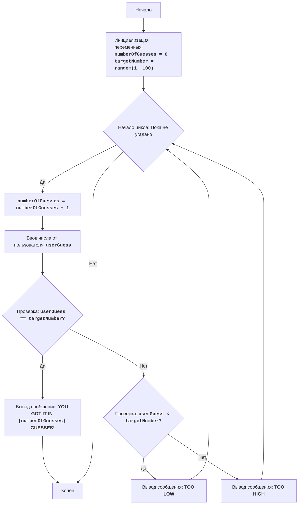

# BATNUM

## Обзор

Игра "Угадай число" - это классическая игра, в которой компьютер выбирает случайное число в диапазоне от 1 до 100, а игрок должен угадать это число, получая подсказки "слишком низко" или "слишком высоко" после каждой попытки. Игра продолжается до тех пор, пока игрок не угадает число.

## Оглавление

- [Обзор](#обзор)
- [Правила игры](#правила-игры)
- [Алгоритм](#алгоритм)
- [Блок-схема](#блок-схема)
- [Легенда](#легенда)
- [Реализация на Python](#реализация-на-python)
- [Описание кода](#описание-кода)

## Правила игры

1. Компьютер выбирает случайное целое число от 1 до 100.
2. Игрок вводит свои предположения о выбранном числе.
3. После каждой попытки компьютер сообщает, было ли введенное число слишком низким, слишком высоким или угадано.
4. Игра продолжается до тех пор, пока игрок не угадает выбранное число.

## Алгоритм

1. Установите количество попыток равным 0.
2. Создайте случайное число в диапазоне от 1 до 100.
3. Начните цикл "пока число не угадано":
   3.1. Увеличьте количество попыток на 1.
   3.2. Попросите игрока ввести число.
   3.3. Если введенное число равно выбранному числу, перейдите к шагу 4.
   3.4. Если введенное число меньше выбранного числа, выведите сообщение "TOO LOW".
   3.5. Если введенное число больше выбранного числа, выведите сообщение "TOO HIGH".
4. Выведите сообщение "YOU GOT IT IN {количество попыток} GUESSES!".
5. Конец игры.

## Блок-схема



## Легенда

-   **Start** - Начало программы.
-   **InitializeVariables** - Инициализация переменных: `numberOfGuesses` (количество попыток) устанавливается в 0, а `targetNumber` (загаданное число) создается случайным образом между 1 и 100.
-   **LoopStart** - Начало цикла, который продолжается, пока число не угадано.
-   **IncreaseGuesses** - Увеличение счетчика попыток на 1.
-   **InputGuess** - Получение числа от пользователя и сохранение его в переменной `userGuess`.
-   **CheckGuess** - Проверка, равно ли введенное число загаданному числу.
-   **OutputWin** - Вывод сообщения о победе, если число угадано, с указанием количества попыток.
-   **End** - Конец программы.
-   **CheckLow** - Проверка, меньше ли введенное число загаданного числа.
-   **OutputLow** - Вывод сообщения "TOO LOW", если введенное число меньше загаданного числа.
-   **OutputHigh** - Вывод сообщения "TOO HIGH", если введенное число больше загаданного числа.

## Реализация на Python

```python
import random

# Инициализация счетчика попыток
numberOfGuesses = 0
# Генерация случайного числа от 1 до 100
targetNumber = random.randint(1, 100)

# Основной игровой цикл
while True:
    # Увеличение счетчика попыток
    numberOfGuesses += 1
    # Запрос ввода числа от пользователя
    try:
        userGuess = int(input("Угадайте число от 1 до 100: "))
    except ValueError:
        print("Пожалуйста, введите целое число.")
        continue

    # Проверка, угадано ли число
    if userGuess == targetNumber:
        print(f"Поздравляю! Вы угадали число за {numberOfGuesses} попыток!")
        break  # Завершение цикла, если число угадано
    elif userGuess < targetNumber:
        print("Слишком низко")  # Сообщение о том, что загаданное число больше
    else:
        print("Слишком высоко")  # Сообщение о том, что загаданное число меньше
```

## Описание кода

1.  **Импорт модуля `random`**:
    -   `import random`: Импорт модуля `random`, который используется для генерации случайного числа.
2.  **Инициализация переменных**:
    -   `numberOfGuesses = 0`: Инициализация переменной `numberOfGuesses` для подсчета количества попыток.
    -   `targetNumber = random.randint(1, 100)`: Генерация случайного целого числа между 1 и 100 и сохранение его в переменной `targetNumber`.
3.  **Основной цикл игры `while True:`**:
    -   Бесконечный цикл, который продолжается, пока пользователь не угадает число (инструкция `break` завершит цикл).
    -   `numberOfGuesses += 1`: Увеличение счетчика попыток на 1 при каждой итерации цикла.
    -   **Ввод данных**:
        -   `try...except ValueError`: Блок `try-except` обрабатывает возможные ошибки ввода. Если пользователь введет не целое число, будет выведено сообщение об ошибке.
        -   `userGuess = int(input("Угадайте число от 1 до 100: "))`: Запрос числа у пользователя, преобразование его в целое число и сохранение в переменной `userGuess`.
    -   **Условие победы**:
        -   `if userGuess == targetNumber:`: Проверка, равно ли введенное число загаданному числу.
        -   `print(f"Поздравляю! Вы угадали число за {numberOfGuesses} попыток!")`: Вывод сообщения о победе с количеством попыток.
        -   `break`: Завершение цикла (и игры), если число угадано.
    -   **Подсказки**:
        -   `elif userGuess < targetNumber:`: Проверка, меньше ли введенное число загаданного числа.
        -   `print("Слишком низко")`: Вывод сообщения о том, что нужно угадывать большее число.
        -   `else:`: Если число не угадано и не меньше загаданного, значит оно больше.
        -   `print("Слишком высоко")`: Вывод сообщения о том, что нужно угадывать меньшее число.