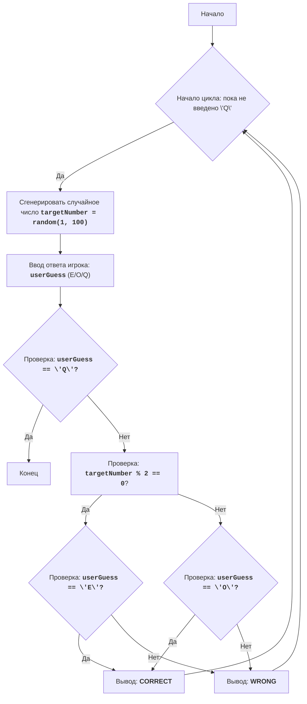

# EVEN

## Обзор

Игра "Четное число" - это простая игра, в которой компьютер генерирует случайное число от 1 до 100, а игрок должен угадать, является ли это число четным или нечетным. Игрок вводит 'E' для четного или 'O' для нечетного. После ввода компьютер сообщает, был ли игрок прав. Игра продолжается до тех пор, пока игрок не решит выйти.

## Содержание

- [Обзор](#обзор)
- [Функции](#функции)
- [Описание алгоритма](#описание-алгоритма)
- [Блок-схема](#блок-схема)
- [Объяснение кода](#объяснение-кода)

## Функции

В данном файле нет явно определенных функций, код выполнен в глобальной области видимости.

## Описание алгоритма

1.  Начать цикл "пока игрок не введет 'Q'":
    1.  1 Сгенерировать случайное целое число от 1 до 100.
    2.  2 Запросить у игрока ввод 'E' для четного или 'O' для нечетного.
    3.  3 Если ввод игрока равен 'Q', завершить программу.
    4.  4 Если сгенерированное число четное и игрок ввел 'E', или если сгенерированное число нечетное и игрок ввел 'O', то вывести "CORRECT".
    5.  5 Иначе, вывести "WRONG".
    6.  6 Перейти к началу цикла.

## Блок-схема

**Легенда**:

*   Start - Начало программы.
*   LoopStart - Начало цикла, который продолжается, пока пользователь не введет 'Q'.
*   GenerateNumber - Генерация случайного целого числа в диапазоне от 1 до 100.
*   InputGuess - Запрос у пользователя ввода 'E' (четное), 'O' (нечетное) или 'Q' (выход).
*   CheckQuit - Проверка, ввел ли пользователь 'Q' для выхода из игры.
*   End - Конец программы.
*   CheckEven - Проверка, является ли сгенерированное число четным.
*   CheckUserEven - Проверка, ввел ли пользователь 'E' (четное) при четном числе.
*   CheckUserOdd - Проверка, ввел ли пользователь 'O' (нечетное) при нечетном числе.
*   OutputCorrect - Вывод сообщения "CORRECT", если пользователь угадал четность числа.
*   OutputWrong - Вывод сообщения "WRONG", если пользователь не угадал четность числа.

## Объяснение кода

1.  **Импорт модуля `random`**:
    *   `import random`: Импортирует модуль `random`, который используется для генерации случайного числа.

2.  **Основной цикл `while True:`**:
    *   `while True:`: Бесконечный цикл, который продолжается до тех пор, пока игрок не решит выйти.
    *   **Генерация случайного числа**:
        *   `targetNumber = random.randint(1, 100)`: Генерирует случайное целое число от 1 до 100 и сохраняет его в переменной `targetNumber`.
    *   **Ввод данных**:
        *   `userGuess = input("Введите 'E' для четного, 'O' для нечетного, 'Q' для выхода: ").upper()`: Запрашивает у пользователя ввод символа (E, O или Q). Применяется метод `.upper()`, чтобы привести ввод к верхнему регистру для корректного сравнения.
    *   **Условие выхода**:
        *   `if userGuess == 'Q':`: Проверяет, ввел ли пользователь 'Q' для выхода из игры.
        *   `print("Выход из игры.")`: Выводит сообщение о выходе.
        *   `break`: Завершает цикл, если пользователь хочет выйти.
    *   **Проверка четности**:
        *   `(targetNumber % 2 == 0 and userGuess == 'E') or (targetNumber % 2 != 0 and userGuess == 'O')`: Проверяет, угадал ли пользователь четность числа. Если число четное и пользователь ввел 'E', или число нечетное и пользователь ввел 'O', условие будет истинным.
        *   `print("CORRECT")`: Выводит сообщение, что пользователь угадал, если условие истинно.
        *   `else:`: В противном случае, пользователь не угадал четность числа.
        *   `print("WRONG")`: Выводит сообщение, что пользователь не угадал.