# PIZZA

## Обзор

Данный модуль представляет собой игру "Пицца", которая моделирует процесс заказа и доставки пиццы. Игрок должен ответить на ряд вопросов о количестве пицц, их стоимости, размере чаевых и т.д. В конце программа выводит полную стоимость заказа, включая налог и чаевые.

## Оглавление
1. [Описание](#описание)
2. [Используемые переменные](#используемые-переменные)
3. [Функции](#функции)
4. [Алгоритм](#алгоритм)
5. [Блок-схема](#блок-схема)

## Описание

Игра "Пицца" моделирует процесс заказа и доставки пиццы. Игрок вводит количество пицц, стоимость каждой пиццы, а также процент чаевых. Программа рассчитывает общую стоимость заказа, включая налог и чаевые, и выводит все данные на экран.

## Используемые переменные

*   `quantity` (int): Количество пицц для заказа.
*   `totalCost` (float): Общая стоимость всех пицц без учета налога и чаевых.
*   `pizzaCost` (float): Стоимость одной пиццы.
*  `tipPercent` (float): Процент чаевых.
*   `tax` (float): Сумма налога (5% от общей стоимости пицц).
*  `tipAmount` (float): Сумма чаевых.
*   `grandTotal` (float): Полная стоимость заказа, включая стоимость пицц, налог и чаевые.

## Функции

### `None`

**Описание**: В данном коде нет явно определенных функций. Весь код выполняется в глобальной области видимости.

## Алгоритм

1.  **Ввод количества пицц**:
    *   Запрашивает у пользователя количество пицц и проверяет, что значение является целым положительным числом.
2.  **Инициализация общей стоимости**:
    *   Устанавливает начальное значение общей стоимости (`totalCost`) в 0.
3.  **Ввод стоимости каждой пиццы**:
    *   В цикле запрашивает стоимость каждой пиццы и добавляет её к общей стоимости (`totalCost`). Проверяет, что вводимое значение - положительное число.
4.  **Ввод процента чаевых**:
    *   Запрашивает у пользователя процент чаевых и проверяет, что значение находится в диапазоне от 0 до 100.
5.  **Вычисление налога**:
    *   Вычисляет налог (`tax`) как 5% от общей стоимости пицц (`totalCost`).
6.  **Вычисление суммы чаевых**:
    *   Вычисляет сумму чаевых (`tipAmount`) на основе введенного процента от общей стоимости (`totalCost`).
7.  **Вычисление общей стоимости заказа**:
    *   Вычисляет полную стоимость заказа (`grandTotal`), которая включает общую стоимость пицц, налог и чаевые.
8.  **Вывод результатов**:
    *   Выводит общую стоимость пицц, налог, сумму чаевых и полную стоимость заказа.

## Блок-схема

```mermaid
flowchart TD
    Start["Начало"] --> InputQuantity["Ввод количества пицц: <code><b>quantity</b></code>"]
    InputQuantity --> InitializeTotal["<code><b>totalCost = 0</b></code>"]
    InitializeTotal --> LoopStart{"Начало цикла: для каждой пиццы"}
    LoopStart -- Да --> InputCost["Ввод стоимости пиццы: <code><b>pizzaCost</b></code>"]
    InputCost --> UpdateTotal["<code><b>totalCost = totalCost + pizzaCost</b></code>"]
    UpdateTotal --> LoopEnd{"Конец цикла: все пиццы обработаны"}
    LoopEnd -- Да --> InputTipPercent["Ввод процента чаевых: <code><b>tipPercent</b></code>"]
    LoopEnd -- Нет --> InputTipPercent
    InputTipPercent --> CalculateTax["<code><b>tax = totalCost * 0.05</b></code>"]
    CalculateTax --> CalculateTip["<code><b>tipAmount = totalCost * tipPercent / 100</b></code>"]
    CalculateTip --> CalculateGrandTotal["<code><b>grandTotal = totalCost + tax + tipAmount</b></code>"]
    CalculateGrandTotal --> OutputTotal["Вывод: <b>Общая стоимость пицц: <code>totalCost</code></b>"]
    OutputTotal --> OutputTax["Вывод: <b>Налог: <code>tax</code></b>"]
    OutputTax --> OutputTip["Вывод: <b>Чаевые: <code>tipAmount</code></b>"]
    OutputTip --> OutputGrandTotal["Вывод: <b>Полная стоимость заказа: <code>grandTotal</code></b>"]
    OutputGrandTotal --> End["Конец"]

```

**Легенда:**

*   **Start**: Начало программы.
*   **InputQuantity**: Запрос у пользователя количества пицц и сохранение значения в переменной `quantity`.
*   **InitializeTotal**: Установка начального значения общей стоимости (`totalCost`) в 0.
*   **LoopStart**: Начало цикла для ввода стоимости каждой пиццы.
*   **InputCost**: Запрос у пользователя стоимости текущей пиццы и сохранение значения в переменной `pizzaCost`.
*   **UpdateTotal**: Добавление стоимости текущей пиццы к общей стоимости (`totalCost`).
*   **LoopEnd**: Конец цикла, проверяет, обработаны ли все пиццы.
*   **InputTipPercent**: Запрос у пользователя процента чаевых и сохранение значения в переменной `tipPercent`.
*   **CalculateTax**: Вычисление налога как 5% от общей стоимости (`totalCost`).
*   **CalculateTip**: Вычисление суммы чаевых на основе введенного процента от общей стоимости (`totalCost`).
*   **CalculateGrandTotal**: Вычисление полной стоимости заказа путем сложения общей стоимости, налога и чаевых.
*   **OutputTotal**: Вывод общей стоимости пицц (`totalCost`).
*   **OutputTax**: Вывод суммы налога (`tax`).
*   **OutputTip**: Вывод суммы чаевых (`tipAmount`).
*   **OutputGrandTotal**: Вывод полной стоимости заказа (`grandTotal`).
*   **End**: Конец программы.