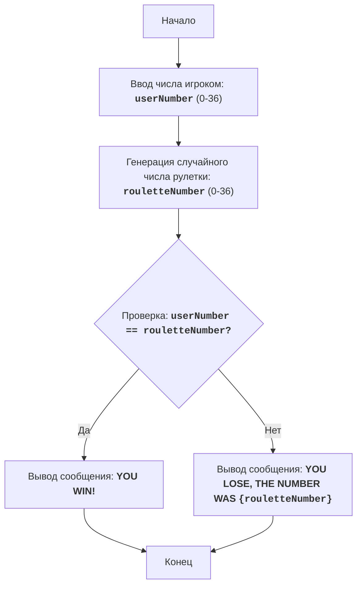

# Модуль ROULET (Рулетка)

## Обзор

Модуль реализует упрощенную версию игры "Рулетка", где игрок делает ставку на число от 0 до 36. Компьютер генерирует случайное число в том же диапазоне, и игрок выигрывает, если его число совпадает с выпавшим.

## Оглавление

- [Обзор](#обзор)
- [Использование](#использование)
- [Алгоритм](#алгоритм)
- [Блок-схема](#блок-схема)
- [Описание кода](#описание-кода)

## Использование

Для запуска игры необходимо выполнить скрипт. Игроку будет предложено ввести число от 0 до 36. После ввода, программа сгенерирует случайное число и сообщит, выиграл игрок или нет.

## Алгоритм

1. Запросить у игрока ввод числа от 0 до 36.
2. Сгенерировать случайное число от 0 до 36 (результат рулетки).
3. Если число игрока равно результату рулетки, то вывести сообщение о выигрыше.
4. Иначе вывести сообщение о проигрыше и результат рулетки.
5. Конец игры.

## Блок-схема



### Легенда:
- `Start`: Начало программы.
- `InputUserNumber`: Запрос у пользователя ввода числа от 0 до 36 и сохранение его в переменной `userNumber`.
- `GenerateRouletteNumber`: Генерация случайного целого числа в диапазоне от 0 до 36 и сохранение его в переменной `rouletteNumber`.
- `CheckWin`: Проверка, равно ли введенное пользователем число `userNumber` случайному числу рулетки `rouletteNumber`.
- `OutputWin`: Вывод сообщения о выигрыше, если числа равны.
- `OutputLose`: Вывод сообщения о проигрыше, если числа не равны, с указанием числа рулетки `rouletteNumber`.
- `End`: Конец программы.

## Описание кода

### Импорт модуля `random`

```python
import random
```

Импортирует модуль `random`, который используется для генерации случайного числа.

### Ввод ставки пользователя

```python
try:
    userNumber = int(input("Введите число от 0 до 36: "))
except ValueError as ex:
    print("Пожалуйста, введите целое число.")
    exit()
```

- `try...except ValueError`: Блок `try-except` обрабатывает возможные ошибки ввода. Если пользователь введет не целое число, то будет выведено сообщение об ошибке, и программа завершится.
- `userNumber = int(input("Введите число от 0 до 36: "))`: Запрашивает у пользователя число, на которое он хочет поставить, и преобразует его в целое число, сохраняя результат в `userNumber`.

### Проверка допустимости ставки

```python
if userNumber < 0 or userNumber > 36:
    print("Число должно быть в диапазоне от 0 до 36.")
    exit()
```

- `if userNumber < 0 or userNumber > 36:`: Проверяет, находится ли введенное число в допустимом диапазоне от 0 до 36.
- `print("Число должно быть в диапазоне от 0 до 36.")`: Выводит сообщение об ошибке, если число вне диапазона.
- `exit()`: Завершает программу, если число вне диапазона.

### Генерация случайного числа рулетки

```python
rouletteNumber = random.randint(0, 36)
```

- `rouletteNumber = random.randint(0, 36)`: Генерирует случайное целое число в диапазоне от 0 до 36, представляющее результат "вращения" рулетки, и сохраняет его в `rouletteNumber`.

### Проверка выигрыша

```python
if userNumber == rouletteNumber:
    print("ПОЗДРАВЛЯЮ! Вы выиграли!")
else:
    print(f"Вы проиграли. Число было {rouletteNumber}")
```

- `if userNumber == rouletteNumber:`: Проверяет, совпадает ли число, введенное пользователем, с числом, выпавшим на рулетке.
- `print("ПОЗДРАВЛЯЮ! Вы выиграли!")`: Если числа совпадают, выводит сообщение о выигрыше.
- `else:`: Если числа не совпадают, выполняет следующий блок кода.
- `print(f"Вы проиграли. Число было {rouletteNumber}")`: Выводит сообщение о проигрыше и выпавшее число на рулетке.