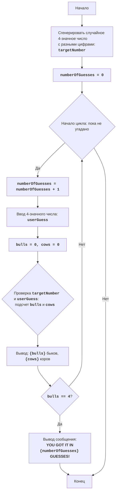

# Игра "Быки и коровы"

## Обзор

Этот модуль реализует игру "Быки и коровы" для одного игрока против компьютера. Компьютер генерирует случайное четырехзначное число с неповторяющимися цифрами, а игрок пытается его угадать, вводя свои предположения. После каждой попытки игрок получает подсказки в виде количества "быков" (цифры угаданы и находятся на правильных местах) и "коров" (цифры угаданы, но находятся на неправильных местах).

## Содержание

- [Функции](#функции)
    - [`generate_target_number`](#generate_target_number)
- [Переменные](#переменные)

## Функции

### `generate_target_number`

**Описание**: Генерирует случайное 4-значное число с неповторяющимися цифрами.

**Возвращает**:
- `int`: Сгенерированное 4-значное число.

## Переменные

- `targetNumber`: Загаданное компьютером 4-значное число.
- `numberOfGuesses`: Количество попыток, сделанных игроком.

## Игровой процесс

1.  Компьютер генерирует случайное 4-значное число с уникальными цифрами.
2.  Игроку предлагается ввести 4-значное число.
3.  После каждого ввода компьютер сообщает количество "быков" и "коров".
4.  Игра продолжается до тех пор, пока игрок не угадает число (не получит 4 "быка").

## Алгоритм

1.  Генерируется случайное 4-значное число с разными цифрами.
2.  Счетчик попыток устанавливается в 0.
3.  Начинается цикл, который продолжается до тех пор, пока число не будет угадано:
    *   Счетчик попыток увеличивается на 1.
    *   Запрашивается ввод 4-значного числа у игрока.
    *   Инициализируются счетчики "быков" (B) и "коров" (C) в 0.
    *   Проходится по каждой цифре загаданного числа и введенного числа игрока:
        *   Если цифры на данной позиции совпадают, увеличивается счетчик "быков" (B).
        *   Иначе, если цифра ввода есть в загаданном числе (но не на этой же позиции), увеличивается счетчик "коров" (C).
    *   Выводится количество "быков" и "коров": "B быков, C коров".
    *   Если количество "быков" равно 4, выводится сообщение "YOU GOT IT IN {число попыток} GUESSES!" и игра завершается.

## Блок-схема

**Legenda**:
   - Start - Начало программы.
   - GenerateTargetNumber - Генерация случайного 4-значного числа с уникальными цифрами.
   - InitializeGuesses - Инициализация счетчика попыток `numberOfGuesses` в 0.
   - LoopStart - Начало цикла, который продолжается, пока число не угадано.
   - IncreaseGuesses - Увеличение счетчика количества попыток на 1.
   - InputGuess - Запрос у пользователя ввода 4-значного числа `userGuess`.
   - InitializeBullsCows - Инициализация счетчиков `bulls` (быки) и `cows` (коровы) в 0.
   - CheckBullsCows - Проверка соответствия цифр в `userGuess` и `targetNumber` для подсчета `bulls` и `cows`.
   - OutputBullsCows - Вывод количества быков и коров на экран.
   - CheckWin - Проверка, равно ли количество быков 4.
   - OutputWin - Вывод сообщения о победе и количестве попыток.
   - End - Конец программы.