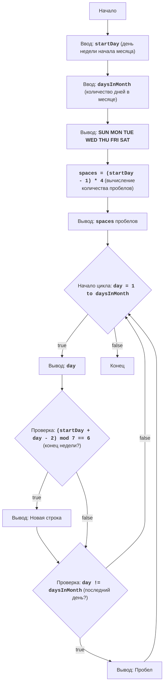

# CALNDR

## Обзор

Модуль представляет собой игру "Календарь", которая выводит на экран календарь на месяц, основываясь на номере дня недели, с которого начинается месяц, и количестве дней в месяце. Пользователь вводит эти два параметра, а программа строит календарь.

## Оглавление

- [Обзор](#обзор)
- [Использование](#использование)

## Использование

### Описание работы

1.  Программа запрашивает у пользователя номер дня недели, с которого начинается месяц (от 1 до 7, где 1 - воскресенье, 7 - суббота).
2.  Программа запрашивает у пользователя общее количество дней в месяце (от 28 до 31).
3.  Программа выводит на экран календарь в виде таблицы, где дни месяца распределены по неделям.
    

### Алгоритм
1.  Запросить у пользователя ввод номера дня недели, с которого начинается месяц (1-7).
2.  Запросить у пользователя ввод общего количества дней в месяце (28-31).
3.  Вывести строку с названиями дней недели: "SUN MON TUE WED THU FRI SAT".
4.  Вычислить количество пробелов перед первым числом, основываясь на введенном номере дня недели.
5.  Вывести необходимое количество пробелов перед первым числом месяца.
6.  Начать цикл от 1 до количества дней в месяце:
    6.1 Вывести текущий день месяца.
    6.2 Если текущий день попадает на конец недели (субботу), вывести переход на новую строку.
    6.3 Если день не последний в месяце, добавить пробел после числа.
7.  Конец вывода календаря.

### Блок-схема

### Легенда к блок-схеме:

    Start - Начало программы.
    InputStartDay - Ввод номера дня недели, с которого начинается месяц (startDay).
    InputDaysInMonth - Ввод общего количества дней в месяце (daysInMonth).
    OutputWeekdays - Вывод заголовка с днями недели.
    CalculateSpaces - Вычисление количества пробелов перед первым числом месяца.
    OutputSpaces - Вывод вычисленного количества пробелов.
    LoopStart - Начало цикла для вывода каждого дня месяца.
    OutputDay - Вывод текущего дня месяца.
    CheckEndOfLine - Проверка, является ли текущий день концом недели (субботой).
    OutputNewline - Вывод новой строки, если текущий день - суббота.
    CheckLastDay - Проверка, является ли текущий день последним днем месяца.
    OutputSpace - Вывод пробела после числа, если день не последний в месяце.
    End - Конец программы.

### Основные блоки кода

1. **Ввод данных**:
    -   Бесконечный цикл `while True:` позволяет повторять ввод данных пока не будут введены корректные значения.
    -   Блок `try...except ValueError` обрабатывает ошибки ввода, выводя сообщение об ошибке если пользователь вводит не целое число.
    -   `startDay = int(input(...))`: Запрашивает у пользователя номер дня недели, с которого начинается месяц, и преобразует его в целое число.
    -   `daysInMonth = int(input(...))`: Запрашивает у пользователя количество дней в месяце и преобразует его в целое число.
    -   `if 1 <= startDay <= 7:`: Проверка корректности ввода значения `startDay` (1 - воскресенье, 7 - суббота).
    -   `if 28 <= daysInMonth <= 31`: Проверка корректности ввода значения `daysInMonth` (количество дней в месяце).
2. **Вывод заголовка**:
    -   `print(" SUN MON TUE WED THU FRI SAT")`: Выводит строку с названиями дней недели.
3. **Вычисление отступов**:
    -   `spaces = (startDay - 1) * 4`: Вычисляет количество пробелов, которые нужно вывести перед первым днем месяца. Каждый день недели занимает 4 символа (3 цифры + пробел).
4. **Вывод пробелов**:
    -   `print(" " * spaces, end="")`: Выводит нужное количество пробелов перед началом календаря, `end=""` убирает автоматический переход на новую строку после `print`.
5. **Цикл вывода календаря**:
    -   `for day in range(1, daysInMonth + 1):`: Цикл перебирает все дни месяца.
    -   `print(f"{day:3}", end=" ")`: Выводит текущий день с форматированием (3 символа) и пробелом после него.
    -   `if (startDay + day - 2) % 7 == 6:`: Проверка, является ли текущий день субботой. Если остаток от деления на 7 равен 6, то это суббота.
    -   `print()`: Если текущий день - суббота, переходит на новую строку.
    -    `elif day != daysInMonth:` если день не последний в месяце, добавляется пробел.