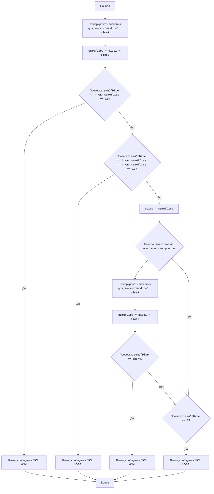

# Игра "Крэпс"

## Обзор

Данный документ описывает правила и алгоритм игры "Крэпс", азартной игры в кости. В документе представлена информация о том, как игрок делает ставки и какие условия приводят к выигрышу или проигрышу. Также приведено подробное описание алгоритма игры, включая блок-схему, для наглядного понимания процесса.

## Содержание

1. [Обзор](#обзор)
2. [Правила игры](#правила-игры)
3. [Алгоритм](#алгоритм)
4. [Блок-схема](#блок-схема)
5. [Легенда](#легенда)

## Правила игры

1. В начале игры игрок бросает две кости.
2. Если сумма очков на костях равна 7 или 11, игрок выигрывает.
3. Если сумма очков равна 2, 3 или 12, игрок проигрывает.
4. Если сумма очков равна 4, 5, 6, 8, 9 или 10, то это число становится "целевым числом" (point).
5. После установления "целевого числа", игрок продолжает бросать кости, пока:
   -  не выпадет "целевое число", тогда игрок выигрывает.
   -  не выпадет 7, тогда игрок проигрывает.

## Алгоритм

1. Сгенерировать случайные значения для двух костей (от 1 до 6).
2. Вычислить сумму выпавших значений.
3. Если сумма равна 7 или 11, вывести сообщение о выигрыше и перейти к шагу 7.
4. Если сумма равна 2, 3 или 12, вывести сообщение о проигрыше и перейти к шагу 7.
5. Сохранить сумму как "целевое число" (point).
6.  Начать цикл:
    6.1 Сгенерировать случайные значения для двух костей.
    6.2 Вычислить сумму выпавших значений.
    6.3 Если сумма равна "целевому числу", вывести сообщение о выигрыше и перейти к шагу 7.
    6.4 Если сумма равна 7, вывести сообщение о проигрыше и перейти к шагу 7.
    6.5 Иначе, повторить цикл с шага 6.
7. Конец игры.

## Блок-схема

## Легенда

    Start - Начало игры.
    RollDice1 - Генерация случайных значений для двух игральных костей (dice1, dice2) в первом броске.
    CalculateSum1 - Вычисление суммы значений костей dice1 и dice2 и сохранение результата в переменной sumOfDice.
    CheckWin1 - Проверка, равна ли сумма sumOfDice 7 или 11. Если да, то игрок выиграл.
    OutputWin1 - Вывод сообщения "YOU WIN!" и завершение игры.
    CheckLose1 - Проверка, равна ли сумма sumOfDice 2, 3 или 12. Если да, то игрок проиграл.
    OutputLose1 - Вывод сообщения "YOU LOSE!" и завершение игры.
    SetPoint - Если не выиграл и не проиграл в первом броске, то сумма sumOfDice сохраняется в переменной point, которая становится "целевым числом".
    LoopStart - Начало цикла, который продолжается пока игрок не выиграет или не проиграет.
    RollDice2 - Генерация случайных значений для двух игральных костей (dice1, dice2) в последующих бросках.
    CalculateSum2 - Вычисление суммы значений костей dice1 и dice2 и сохранение результата в переменной sumOfDice.
    CheckWin2 - Проверка, равна ли сумма sumOfDice "целевому числу" point. Если да, то игрок выиграл.
    OutputWin2 - Вывод сообщения "YOU WIN!" и завершение игры.
    CheckLose2 - Проверка, равна ли сумма sumOfDice 7. Если да, то игрок проиграл.
    OutputLose2 - Вывод сообщения "YOU LOSE!" и завершение игры.
    End - Конец игры.