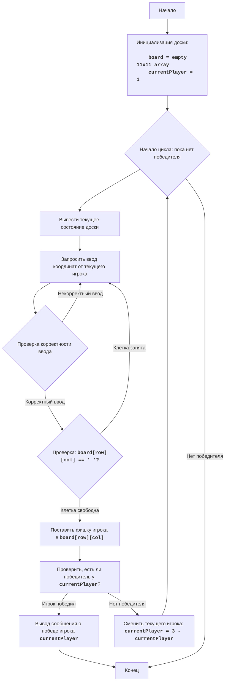

# HEX:

## Обзор

Игра HEX - это логическая игра, в которой два игрока поочередно размещают свои фишки на шестиугольной сетке, стремясь соединить противоположные стороны доски. Цель каждого игрока — создать непрерывную цепь своих фишек, соединяющую их противоположные стороны доски. Игроки ставят свои фишки на шестиугольные клетки, пока один из них не сможет соединить свои стороны. В данной версии игра реализована для двух игроков: '1' и '2'

Правила игры:
1. Игроки по очереди ставят свои фишки (символы '1' и '2') на шестиугольную доску.
2. Цель первого игрока (символ '1') - соединить левую и правую стороны доски своими фишками.
3. Цель второго игрока (символ '2') - соединить верхнюю и нижнюю стороны доски своими фишками.
4. Игрок, первым достигший своей цели, выигрывает.
5. Игра продолжается до победы одного из игроков.

Алгоритм:
1. Инициализация:
   1.1. Создать пустую игровую доску 11x11 (массив строк).
   1.2. Установить текущего игрока на 1.
2. Основной игровой цикл:
    2.1. Вывести текущее состояние доски.
    2.2. Запросить у текущего игрока координаты (строка, столбец) для размещения фишки.
    2.3. Проверить ввод: если ввод не корректный, вернуться на шаг 2.2.
    2.4. Если выбранная клетка занята, вернуться на шаг 2.2.
    2.5. Поместить фишку текущего игрока на выбранную клетку.
    2.6. Проверить, выиграл ли текущий игрок.
         2.6.1. Если игрок 1 выиграл, вывести сообщение о победе.
         2.6.2. Если игрок 2 выиграл, вывести сообщение о победе.
         2.6.3. Если нет, перейти на шаг 2.7.
    2.7. Сменить текущего игрока.
3. Завершение игры:
    3.1. Вывести сообщение о победе.
    3.2. Конец игры.
 
**Блок-схема:**

**Legenda**:
    Start - Начало игры.
    InitializeBoard - Инициализация игровой доски (пустой 11x11 массив) и установка текущего игрока на 1.
    LoopStart - Начало цикла игры, который продолжается, пока не будет выявлен победитель.
    DisplayBoard - Вывод текущего состояния игровой доски на экран.
    GetInput - Запрос у текущего игрока координат (строки и столбца) для размещения фишки.
    ValidateInput - Проверка корректности введенных координат.
    CheckCellEmpty - Проверка, свободна ли выбранная клетка на доске.
    PlaceMove - Размещение фишки текущего игрока на выбранной клетке.
    CheckWin - Проверка, есть ли победитель после размещения фишки.
    OutputWin - Вывод сообщения о победе, если победитель определен.
    SwitchPlayer - Смена текущего игрока на противоположного.
    End - Конец игры.

## Содержание

- [Обзор](#обзор)
- [Функции](#функции)
    - [`print_board`](#print_board)
    - [`get_move`](#get_move)
    - [`check_win`](#check_win)
    - [`play_hex`](#play_hex)

## Функции

### `print_board`

**Описание**: Выводит текущее состояние доски.

**Параметры**:
- `board` (list of list of str): Игровое поле, представленное в виде двумерного массива строк.

**Возвращает**:
    - None

### `get_move`

**Описание**: Запрашивает у игрока координаты для хода.

**Параметры**:
- `board` (list of list of str): Игровое поле, представленное в виде двумерного массива строк.
- `player` (str): Символ текущего игрока ('1' или '2').

**Возвращает**:
- tuple (int, int): Кортеж, содержащий координаты (строку, столбец) выбранной ячейки.

**Вызывает исключения**:
- ValueError: Возникает, если ввод не соответствует формату (например, "A1") или координаты неверные.

### `check_win`

**Описание**: Проверяет, выиграл ли игрок.

**Параметры**:
- `board` (list of list of str): Игровое поле, представленное в виде двумерного массива строк.
- `player` (str): Символ текущего игрока ('1' или '2').

**Возвращает**:
    - bool: True, если игрок выиграл, иначе False.

### `play_hex`

**Описание**: Основная функция игры.

**Параметры**:
    - None

**Возвращает**:
    - None