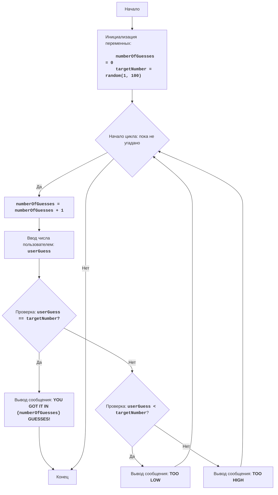

# Игра "Больше-Меньше"

## Обзор

Данный модуль реализует простую игру "Больше-Меньше", в которой компьютер загадывает случайное число от 1 до 100, а игрок пытается его угадать. После каждой попытки компьютер сообщает, было ли введенное число больше или меньше загаданного. Игра продолжается до тех пор, пока игрок не угадает число.

## Оглавление

1. [Обзор](#обзор)
2. [Игровой процесс](#игровой-процесс)
3. [Описание кода](#описание-кода)
    - [Импорт модуля random](#импорт-модуля-random)
    - [Инициализация переменных](#инициализация-переменных)
    - [Основной игровой цикл](#основной-игровой-цикл)
    - [Обработка ввода пользователя](#обработка-ввода-пользователя)
    - [Проверка угадывания числа](#проверка-угадывания-числа)
    - [Завершение игры](#завершение-игры)
4. [Блок-схема](#блок-схема)
5. [Правила игры](#правила-игры)

## Игровой процесс

1. Компьютер выбирает случайное целое число от 1 до 100.
2. Игрок вводит свои предположения о загаданном числе.
3. После каждой попытки компьютер сообщает, было ли введенное число слишком низким или слишком высоким.
4. Игра продолжается до тех пор, пока игрок не угадает загаданное число.

## Описание кода

### Импорт модуля `random`

```python
import random
```

Импортирует модуль `random`, который используется для генерации случайного числа.

### Инициализация переменных

```python
numberOfGuesses = 0
targetNumber = random.randint(1, 100)
```

- `numberOfGuesses = 0`: Инициализирует переменную `numberOfGuesses` для подсчета попыток игрока и устанавливает ее начальное значение в 0.
- `targetNumber = random.randint(1, 100)`: Генерирует случайное целое число в диапазоне от 1 до 100 (включительно) и сохраняет его в переменной `targetNumber`, которая будет загаданным числом.

### Основной игровой цикл

```python
while True:
    numberOfGuesses += 1
    try:
        userGuess = int(input("Введите ваше предположение: "))
    except ValueError:
        print("Пожалуйста, введите целое число.")
        continue
    if userGuess == targetNumber:
        print(f"Вы угадали число за {numberOfGuesses} попыток!")
        break
    elif userGuess < targetNumber:
        print("Слишком низко")
    else:
        print("Слишком высоко")
```

-   Бесконечный цикл, который продолжается до тех пор, пока игрок не угадает число (не выполнится `break`).
-   `numberOfGuesses += 1`: При каждой итерации цикла увеличивает счетчик попыток на 1.

### Обработка ввода пользователя

```python
try:
    userGuess = int(input("Введите ваше предположение: "))
except ValueError:
    print("Пожалуйста, введите целое число.")
    continue
```

- Блок `try-except` обрабатывает возможные ошибки ввода. Если пользователь введет не целое число, программа не упадет, а выведет сообщение об ошибке.
- `userGuess = int(input("Введите ваше предположение: "))`: Выводит приглашение для пользователя ввести число и пытается преобразовать введенный текст в целое число. Результат сохраняется в `userGuess`.

### Проверка угадывания числа

```python
if userGuess == targetNumber:
    print(f"Вы угадали число за {numberOfGuesses} попыток!")
    break
elif userGuess < targetNumber:
    print("Слишком низко")
else:
    print("Слишком высоко")
```

-   `if userGuess == targetNumber:`: Проверяет, равно ли введенное пользователем число (`userGuess`) загаданному числу (`targetNumber`).
    -   `print(f"Вы угадали число за {numberOfGuesses} попыток!")`: Если числа равны, выводит поздравление и количество попыток.
    -   `break`: Выходит из цикла `while True`, завершая игру.
-   `elif userGuess < targetNumber:`: Если введенное число меньше загаданного, выводит сообщение "Слишком низко".
-   `else:`: Если введенное число не равно и не меньше загаданного числа, значит оно больше, поэтому выводится сообщение "Слишком высоко".

### Завершение игры

Цикл `while True` продолжается, пока пользователь не угадает число. Когда пользователь угадывает число, выполняется `break`, и программа завершает выполнение цикла, а, следовательно, и игры.

## Блок-схема



Легенда:

-   **Start** - Начало программы.
-   **InitializeVariables** - Инициализация переменных: `numberOfGuesses` (количество попыток) устанавливается в 0, а `targetNumber` (загаданное число) генерируется случайным образом от 1 до 100.
-   **LoopStart** - Начало цикла, который продолжается, пока число не угадано.
-   **IncreaseGuesses** - Увеличение счетчика количества попыток на 1.
-   **InputGuess** - Запрос у пользователя ввода числа и сохранение его в переменной `userGuess`.
-   **CheckGuess** - Проверка, равно ли введенное число `userGuess` загаданному числу `targetNumber`.
-   **OutputWin** - Вывод сообщения о победе, если числа равны, с указанием количества попыток.
-   **End** - Конец программы.
-   **CheckLow** - Проверка, меньше ли введенное число `userGuess` загаданного числа `targetNumber`.
-   **OutputLow** - Вывод сообщения "TOO LOW", если введенное число меньше загаданного.
-   **OutputHigh** - Вывод сообщения "TOO HIGH", если введенное число больше загаданного.

## Правила игры

1.  Компьютер выбирает случайное целое число от 1 до 100.
2.  Игрок вводит свои предположения о загаданном числе.
3.  После каждой попытки компьютер сообщает, было ли введенное число слишком низким или слишком высоким.
4.  Игра продолжается до тех пор, пока игрок не угадает загаданное число.