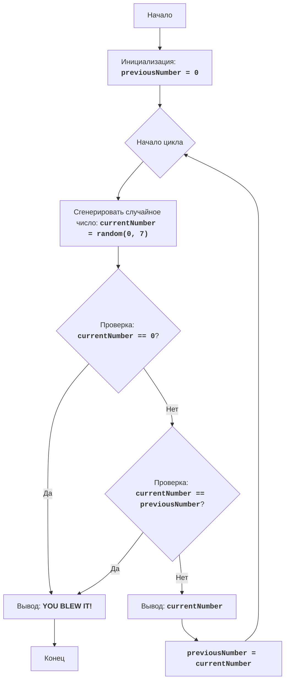

# ZOOP

## Обзор

Игра "ZOOP" - это простая текстовая игра, в которой игрок пытается сгенерировать последовательность случайных чисел, в которой не будет двух одинаковых чисел подряд. Игра продолжается до тех пор, пока игрок не сгенерирует последовательность, нарушающую это правило, или не решит прекратить игру.

## Содержание

- [Обзор](#обзор)
- [Функции](#функции)
- [Описание алгоритма](#описание-алгоритма)
- [Блок-схема](#блок-схема)
- [Объяснение кода](#объяснение-кода)

## Функции

В данном файле нет отдельных функций, весь код находится в глобальной области видимости.

## Описание алгоритма

1.  Установить предыдущее число (`previousNumber`) в 0.
2.  Начать цикл:
    2.1 Сгенерировать случайное число от 0 до 7 (`currentNumber`).
    2.2 Если сгенерированное число равно 0, перейти к шагу 4.
    2.3 Если сгенерированное число равно предыдущему числу, перейти к шагу 4.
    2.4 Вывести текущее сгенерированное число.
    2.5 Установить предыдущее число равным текущему числу.
3. Повторять шаги с 2.1 по 2.5
4. Вывести сообщение "YOU BLEW IT!".
5. Конец игры.

## Блок-схема

**Легенда:**

*   `Start` - Начало программы.
*   `InitializePreviousNumber` - Инициализация переменной `previousNumber` (предыдущее число) значением 0.
*   `LoopStart` - Начало основного цикла игры.
*   `GenerateRandomNumber` - Генерация случайного числа `currentNumber` в диапазоне от 0 до 7.
*   `CheckQuit` - Проверка, равно ли сгенерированное число `currentNumber` 0.
*   `OutputBlowIt` - Вывод сообщения "YOU BLEW IT!", если игрок проиграл.
*  `End` - Конец программы.
*   `CheckSame` - Проверка, равно ли сгенерированное число `currentNumber` предыдущему числу `previousNumber`.
*   `OutputCurrentNumber` - Вывод текущего сгенерированного числа `currentNumber`.
*   `SetPreviousNumber` - Установка значения переменной `previousNumber` равным значению переменной `currentNumber`.

## Объяснение кода

1.  **Импорт модуля `random`**:
    -   `import random`: Импортирует модуль `random`, который используется для генерации случайных чисел.
2.  **Инициализация `previousNumber`**:
    -   `previousNumber = 0`: Инициализирует переменную `previousNumber` нулем. Эта переменная будет хранить предыдущее сгенерированное число.
3.  **Бесконечный цикл `while True:`**:
    -   Этот цикл продолжается, пока не будет выполнена команда `break` внутри цикла.
4.  **Генерация случайного числа**:
    -   `currentNumber = random.randint(0, 7)`: Генерирует случайное целое число в диапазоне от 0 до 7 (включительно) и сохраняет его в переменной `currentNumber`.
5.  **Проверка на окончание игры**:
    -   `if currentNumber == 0:`: Проверяет, равно ли сгенерированное число 0. Если да, это означает, что игрок захотел закончить игру.
    -   `print("YOU BLEW IT!")`: Выводит сообщение, что игра закончилась.
    -   `break`: Выходит из цикла, завершая игру.
6.  **Проверка на повтор**:
    -   `if currentNumber == previousNumber:`: Проверяет, равно ли текущее сгенерированное число предыдущему сгенерированному числу.
    -   `print("YOU BLEW IT!")`: Выводит сообщение, что игра закончилась.
    -   `break`: Выходит из цикла, завершая игру.
7.  **Вывод текущего числа**:
    -   `print(currentNumber)`: Выводит сгенерированное число на экран.
8.  **Обновление `previousNumber`**:
    -   `previousNumber = currentNumber`: Сохраняет текущее сгенерированное число в переменной `previousNumber`, чтобы оно могло быть проверено на следующей итерации цикла.