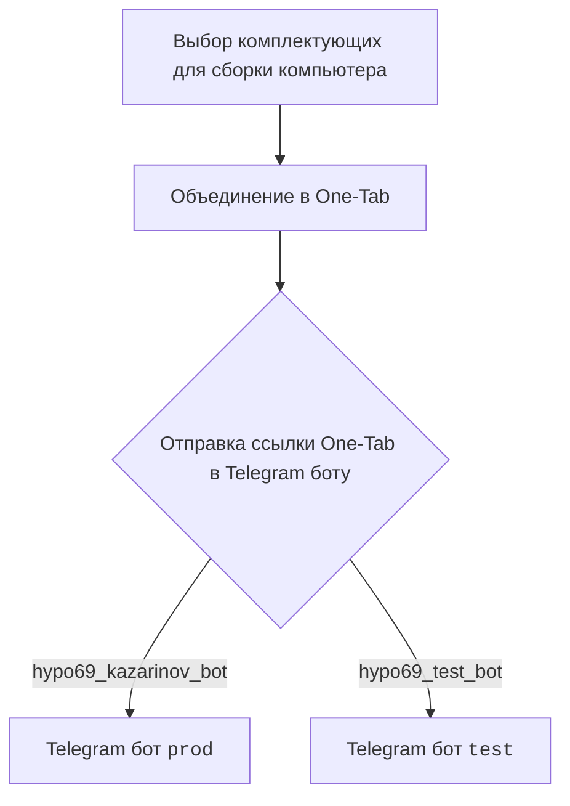
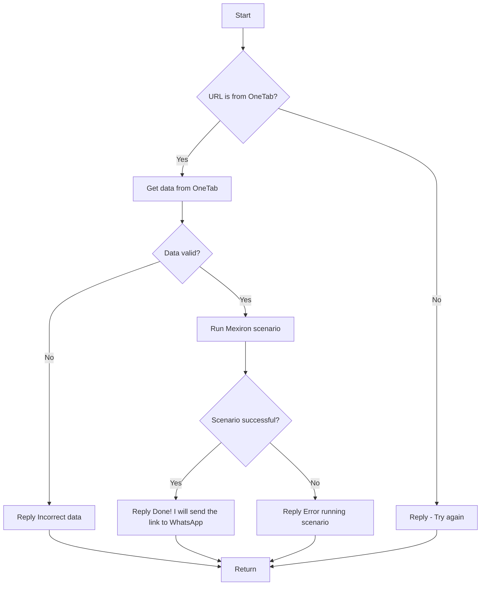

# Название модуля: src.endpoints.kazarinov

## Обзор

Данный модуль предназначен для создания прайслиста для Казаринова, а также включает в себя обработку сообщений от Telegram ботов и запуск соответствующих сценариев.

## Оглавление

1. [Обзор](#обзор)
2. [Диаграмма взаимодействия](#диаграмма-взаимодействия)
3. [Сценарий обработки сообщений](#сценарий-обработки-сообщений)
4. [Ссылки](#ссылки)

## Диаграмма взаимодействия

### Клиентская сторона

### Серверная сторона

## Сценарий обработки сообщений

1.  **`kazarinov_bot.handle_message()`** вызывает **`kazarinov.scenarios.run_scenario()`** для запуска соответствующего сценария.
2.  Проверяется, является ли URL от OneTab.
3.  Если URL от OneTab, данные извлекаются и проверяются на валидность.
4.  В случае некорректных данных, отправляется ответ об ошибке.
5.  При валидных данных запускается сценарий Mexiron.
6.  В зависимости от успешности выполнения сценария, отправляется соответствующее сообщение пользователю.

## Ссылки

*   [Казарионв бот](https://github.com/hypo69/hypo/blob/master/src/endpoints/kazarinov/kazarinov_bot.ru.md)
*   [Исполнение сценария](https://github.com/hypo69/hypo/blob/master/src/endpoints/kazarinov/scenarios/readme.ru.md)