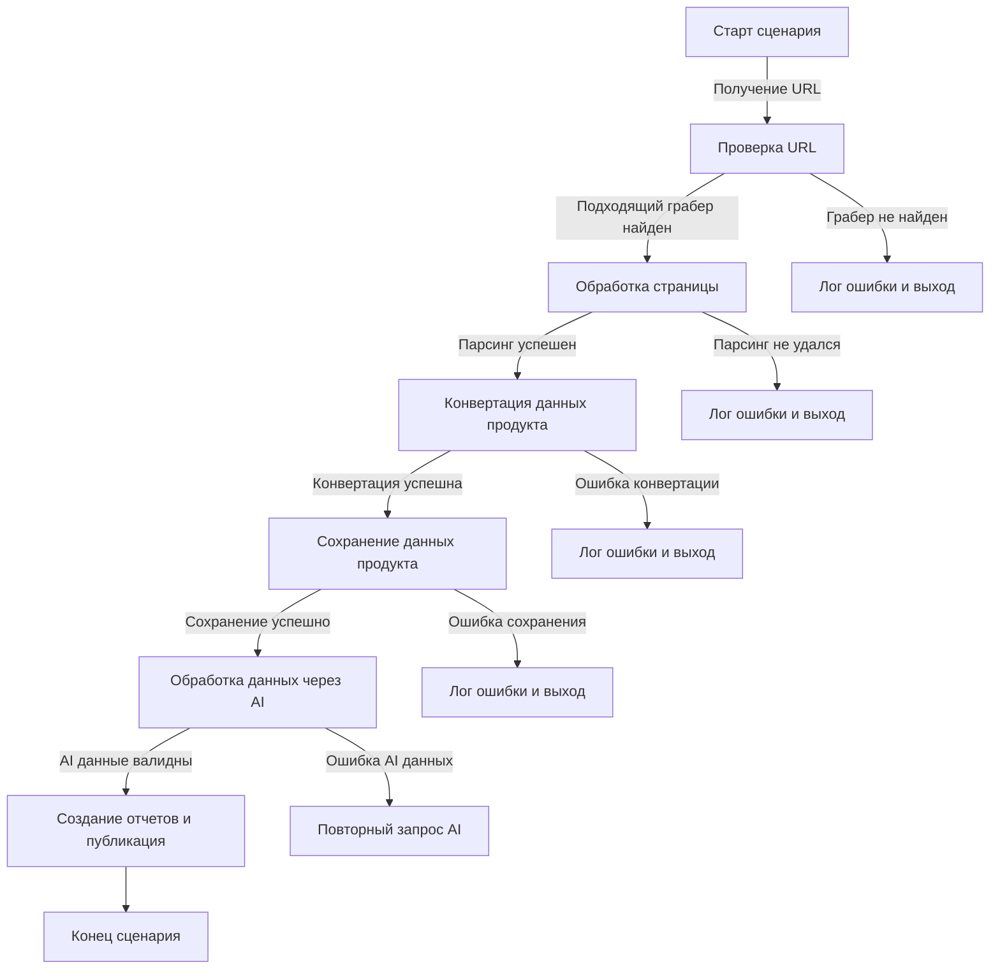

# Сценарий обработки прайс-листа

## Обзор

Данный сценарий описывает обработку данных прайс-листа с сайта. Сценарий включает в себя этапы получения URL, проверки URL, обработки страницы, парсинга, конвертации данных, сохранения данных, обработки данных через AI и создания отчетов.  Каждая стадия сопровождается проверками на ошибки и соответствующими действиями.

## Диаграмма потока

## Этапы сценария

### Получение URL

(Описание процесса получения URL, например, из базы данных, файла и т.д.)

### Проверка URL

(Описание проверки валидности URL, наличие доступности и актуальности)

### Обработка страницы

(Описание обработки страницы с использованием парсера, получение html кода и т.д.)

### Парсинг

(Описание парсинга HTML страницы для извлечения данных о товарах, например, названий, артикулов, цен и т.д.)

### Конвертация данных продукта

(Описание конвертации данных, полученных с сайта, в структурированный формат, например, в словарь или JSON.)

### Сохранение данных продукта

(Описание сохранения данных в базу данных или в файл.)

### Обработка данных через AI

(Описание обработки данных через AI для анализа, предсказания, или другой задачи.)

### Создание отчетов и публикация

(Описание генерации отчетов на основе обработанных данных и публикация отчета)

### Ошибки и выход

(Описание обработки ошибок на каждой стадии сценария, например, логгирование и выход из сценария при возникновении проблем.)